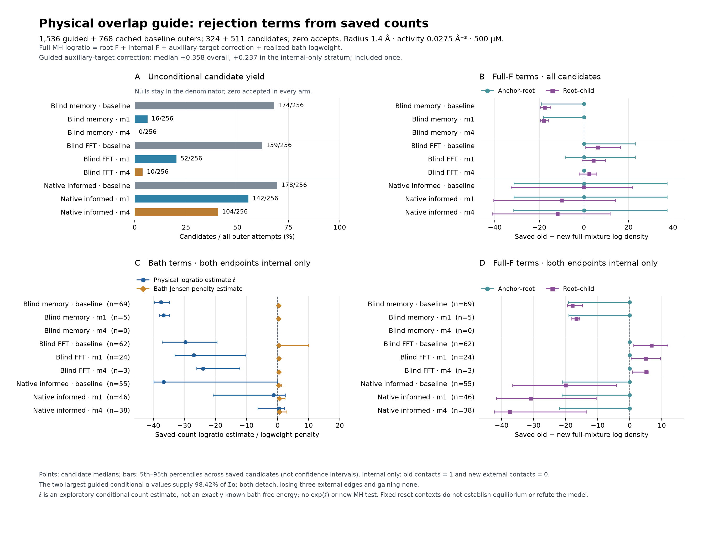

# Overlap-guided dimer proposals: physical replay

**Zero accepts in 1,536 guided outer attempts.** The guide improves overlap
retention, but this fixed comparison does not demonstrate useful docking or
reorganization. It is a sampling limitation at the diagnostic conditions, not
evidence that the physical model cannot assemble.

The figure retains nulls in the candidate-yield denominator. Points in the
term panels are candidate medians and bars are 5th–95th percentiles, not
confidence intervals. Candidate sets differ between arms.

The replay uses every completed [passive proposal](auxiliary-overlap-probe.md):
324 candidates and 1,212 nulls, with one independently seeded many-body bath
path and MH decision per candidate. The 768 original factorized baseline
decisions are reused exactly, including all 257 nulls and zero accepts. The
whole N=264 source configuration resets after every outer attempt. These are
eight prescribed source/anchor contexts, sharing four selected dimers; they
are not eight independently drawn equilibrium configurations or trajectories.

## Results

Each entry below includes 256 outer attempts. The CPU column includes saved
standalone proposal cost and all-row physical replay work. Shared setup and
serialization are reported separately at campaign level. Historical baseline
timings are reused, not simultaneous timing replicates.

| Atlas | Method | Candidates | Accepts | Summed conditional acceptance probability | Proposal + replay CPU (s) |
|---|---|---:|---:|---:|---:|
| Blind memory, 64 slots | Baseline | 174 | 0 | 1.08e−16 | 27.32 |
| Blind memory, 64 slots | m=1 | 16 | 0 | 2.64e−22 | 4.29 |
| Blind memory, 64 slots | m=4 | 0 | 0 | 0 | 2.08 |
| Blind FFT, 512 slots | Baseline | 159 | 0 | 0.001999 | 29.07 |
| Blind FFT, 512 slots | m=1 | 52 | 0 | 0.000296 | 11.59 |
| Blind FFT, 512 slots | m=4 | 10 | 0 | 0.000062 | 4.07 |
| Native-informed, 178 components | Baseline | 178 | 0 | 1.08e−8 | 28.52 |
| Native-informed, 178 components | m=1 | 142 | 0 | 0.000139 | 27.92 |
| Native-informed, 178 components | m=4 | 104 | 0 | 0.031902 | 21.15 |

The sum is over `min(1, exp(log_ratio))` **conditional on these saved proposals
and bath clouds**, with zero contribution from proposal nulls. It is not an
equilibrium mass, future event-rate estimate, independent replication count or
ESS. New guided arms sum to only 0.032399, so zero realized accepts is
unsurprising. All observed accepted-contact and exchange counts remain zero.

For native-informed candidates, baseline → m=4 changes median bath logweight
from −38.86 to −5.15. This is consistent with the substantial improvement in
internal guidance-count retention. The corresponding median full-density
proposal correction changes from −13.86 to −29.06; median total MH logratio
remains −41.38. These are separate marginal medians, not quantities to add.
The auxiliary correction itself has median 0.053 in that arm.

The two largest conditional acceptance probabilities, 0.02347 and 0.00842,
come from the same embedded-dimer context with different proposal slots. Both
destinations lose three external contact edges and gain none. They supply
**98.42%** of the guided sum. This observed improvement concerns proposed
detachment, not successful docking or native reorganization. Neither was
accepted. No native classifier was run or used for selection.

The subsequent saved-count decomposition separates the root docking term from
the internal pair term. In the stratum with only the internal contact at both
endpoints, native-informed m=4 has 38 candidates: median estimated physical
bath logratio +0.368, root-F correction +0.001, and internal-F correction
**−37.440**. Baseline native-informed has 55 such candidates, with median bath
estimate −36.727 and internal-F correction −19.982. This isolates an internal
proposal-density problem after overlap retention improves; it does not measure
a thermodynamic entropy difference between basins.

The bath estimate is \(\hat\ell=z[G/\lambda-L/(\lambda+z)]\), with estimated
conditional variance \(z^2[G/\lambda^2+L/(\lambda+z)^2]\). It relies on the
intended Poisson thinning law. Its nonnegative difference from the realized
bath logweight estimates a correlated Jensen penalty, distinct from the
auxiliary-threshold correction. For those 38 native m=4 candidates this
penalty's median is 0.607. No plug-in exponential or replacement acceptance
decision is computed. These exploratory comparisons describe different
surviving candidate sets, not paired causal effects or exact bath free energies.

## Physical kernel and validation

The conditions are the archived growth diagnostic: repaired tetramers,
**depletant radius 1.4 Å, activity 0.0275 Å⁻³, 500 μM**, with auxiliary bath
intensity λ=64z=1.76 Å⁻³. The original 1.5 Å / 0.035 Å⁻³ / approximately
106.8 μM decision conditions remain separate.

Each candidate uses the validated fair-order two-singleton path. Its copied
intermediate is used to construct the second cloud; it is not filtered as a
physical endpoint. Independent leg clouds supply the two count factors. Only
the old and complete final configurations must satisfy the hard domain. The
one final log acceptance ratio is

\[
\log F(X)-\log F(Y)
+m\{\log(K_X+1)-\log(K_Y+1)\}
+\log W_1+\log W_2.
\]

The wrapper checks the separate cached full-F and auxiliary terms, and their
sum, before drawing a bath. Missing or doubled auxiliary corrections fail.
An MH uniform is recorded for every outer, including nulls; no rejected
candidate is retried. A resource or arithmetic failure would stop the fixed
allocation with its partial trace, not become an ordinary rejection. All
attempts completed within the predeclared caps.

Six Rust controls and thirteen Python controls pass. The bounded gate/path
functions retain the previously validated code. Independent auditing checks
the cached source, complete corrections, counts, path order, copied states,
MH decisions, all rejections and 522 frozen files. It reuses the separately
bound passive geometry/density audit. It **does not reconstruct unlogged
Poisson point positions or prove floating-point correctness**. The corrected
[hard-sphere stationarity reference](auxiliary-overlap-sphere-control.md) also
passes; its deliberately omitted-correction control detects a large bias.

The new replay generated 135,366,547 raw points and 2,795,984 retained counts.
Whole-process replay plus the saved standalone proposal cost was 72.884 CPU
seconds; the separate audit took 5.242 CPU seconds. No new baseline bath,
proposal draws, sequential state updates or production executable changes
were made.

The [completed review](../results/auxiliary-overlap-physical-20261003/completed-review.json)
binds the [analysis](../results/auxiliary-overlap-physical-20261003/analysis.json),
[protocol](../results/auxiliary-overlap-physical-20261003/protocol.json),
[test receipt](../results/auxiliary-overlap-physical-20261003/common/tests-passed.json)
and complete ledgers. SHA256 values:

- Analysis: `2d091e2241202cc38555b3914a7cb3244a1bcb8c55b9d4758d0dbe72eff65c55`.
- Completed review: `2e5b59aac3de15b21d3e98e8f834c73317a9eae1ab430402be34d209e5d2ebe5`.

The [saved center diagnosis](dimer-center-overlap.md) is complete. Memory's
128 centers all lie below half the source count on its frozen cloud; FFT has
eight core-valid centers reaching the source count. All sixteen learned FFT
draws in the directly matched saved prefix collide despite valid centers,
including three draws from high-count centers. Finite-cloud counts and this
stopped prefix do not bound Gaussian success probabilities.

The [source-mixture inspection](../results/auxiliary-overlap-physical-20261003/source-mixture-coverage.json)
reuses audited edge scores from all 768 baseline outers. At all four source
pairs, the FFT learned component contributes more than 0.9999999998 of the
source mixture density. Memory is numerically dominated by the uniform
defensive component; the native-informed fraction varies strongly by pair.
Thus the FFT library has both useful centers and measured source support,
making a controlled covariance-width comparison a useful next candidate. Its
actual corrected physical performance still has to be measured; narrower
kernels can improve geometry while worsening density ratios.

The [decomposition review](../results/auxiliary-overlap-physical-20261003/saved-count-decomposition-review.json)
retains all 2,304 outers, 835 candidates and 1,469 nulls. It authenticates 72
input/source files and the figure; an initial receipt-hash transcription
failure and the plot layout revision are preserved separately. The methods are
[`diagnose_auxiliary_overlap_physical.py`](../tools/diagnose_auxiliary_overlap_physical.py),
[`plot_auxiliary_overlap_physical.py`](../tools/plot_auxiliary_overlap_physical.py),
and [`diagnose_dimer_source_coverage.py`](../tools/diagnose_dimer_source_coverage.py).

Another longer assembly run with this kernel is not justified by this pilot.
Finite-system stability and template-free assembly remain unresolved.
