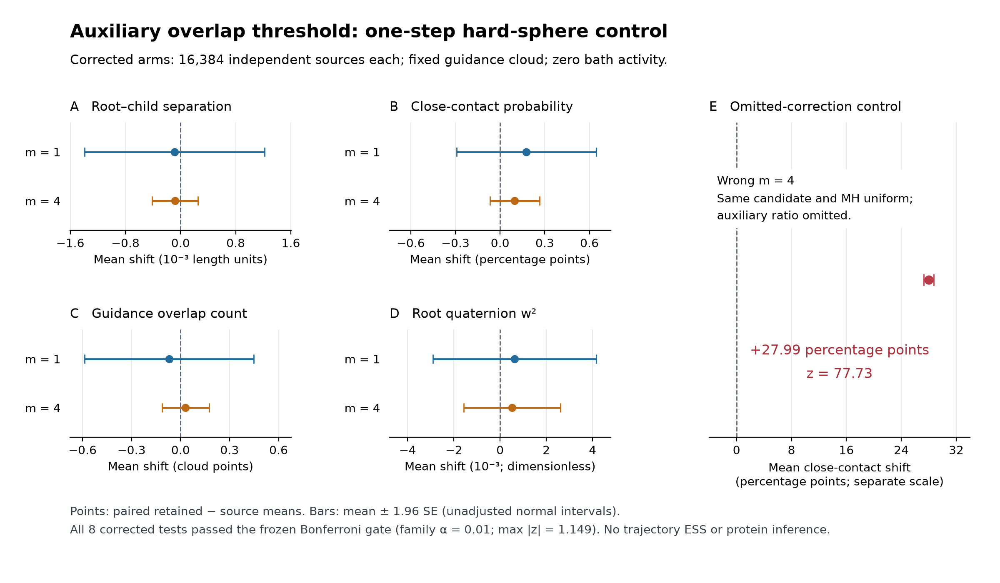

# Auxiliary overlap threshold: hard-sphere control

The corrected one-step sphere reference passed all eight prespecified paired
tests at Bonferroni family α = 0.01; the largest pooled |z| was 1.149. Independent
reconstruction passed **3,451,219 arithmetic and trace checks**. Omitting the
auxiliary correction in the matched m = 4 negative control increased
close-contact probability by **0.279907 ± 0.003601 SE** (27.99 percentage points;
z = 77.73). This supports the implementation on this reference problem, within
the finite sample sensitivity of these observables.



Points are pooled mean **retained minus source** shifts, including null and
rejected moves. Bars are mean ± 1.96 paired SE, using the sample variance across
16,384 independent sources per arm. These unadjusted normal intervals illustrate
uncertainty; the pass criterion uses the separately frozen eight-test Bonferroni
gate. Close contact means separation < 0.6; w is the scalar component of the
root quaternion. Lengths use the reference model's simulation units.

The [frozen protocol](../results/auxiliary-overlap-sphere-control-20261003/protocol.json)
uses four independent panels of 4,096 sources and one proposal per source in
each corrected arm, for 32,768 decisions. The source construction first draws
a root uniformly in [-1,1]³, a root–child separation uniformly in volume over
[0.1,0.9], and independent Haar rotations. Rejecting the entire source on a
final hard failure against the fixed spherical anchor gives the target ensemble.
Core and exclusion radii are 0.05 and 0.45. This conditioning is part of the
reference target; it is not an unconditioned radial equilibrium law.

The guidance cloud is a **fixed point-mass law**: grid points 0.1(i,j,k),
i,j,k ∈ {-4,…,4}, inside the closed root sphere of radius 0.45. Its root-frame
coordinates stay fixed through retries. Each move draws k as the maximum of m
unbiased integers from 0 through the source overlap count. Caps are root = 8,
internal = 8 and joint = 1, in root-first order. The full proposal density is
constant here, so the nontrivial MH correction is
m log[(K_source + 1)/(K_candidate + 1)]. See the
[threshold derivation](auxiliary-overlap-threshold.md) for its target and
normalizer cancellation. Bath activity is zero: this is **not Poisson depletion
physics**, and no physical bath clouds were generated.

| Descriptive outcome, per 16,384 sources | Corrected m = 1 | Corrected m = 4 |
|---|---:|---:|
| Feasible candidates | 13,602 | 12,387 |
| Accepted moves | 6,952 (42.43%) | 2,521 (15.39%) |

Stronger m is not automatically better: it raises the threshold toward the
source count and strengthens the compensating correction, which can reduce
proposal success and acceptance. The lower accepted fraction here is
descriptive, not an efficiency ranking. These independent one-step panels are
not trajectories and supply **no ESS, mixing, protein acceptance, or protein
thermodynamic conclusion**. The audit reconstructs geometry, recorded latent
draws, retries, corrections and retained rejections; it does not replay the PRNG
or prove general continuous-state or floating-point correctness.

The [completed receipt](../results/auxiliary-overlap-sphere-control-20261003/completed-review.json)
binds the [saved analysis](../results/auxiliary-overlap-sphere-control-20261003/analysis.json),
raw ledger and frozen inputs; 497 frozen files were verified. SHA256 values are:

- Analysis: `c96a6d32f00fe2d6e23034049b48899f94442f3e2db29e5995d3b269512b52cd`.
- Completed receipt: `491242b900cba99df10ecc877694eefa43cc339bcac6ce3821958b47bf652df9`.

Reproduce only the figure from the frozen data with
[`plot_auxiliary_overlap_sphere_control.py`](../tools/plot_auxiliary_overlap_sphere_control.py):

```sh
cd /home/xvg/tetramer-mc
/home/xvg/protein-nucleation/.venv/bin/python -B \
  tools/plot_auxiliary_overlap_sphere_control.py \
  --analysis results/auxiliary-overlap-sphere-control-20261003/analysis.json \
  --output docs/figures/auxiliary-overlap-sphere-control.png
```

The plotter verifies both SHA256 values and reads saved summary statistics; it
does not sample, rebuild, or rerun the arithmetic audit.
