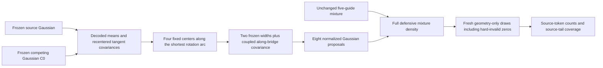

# A frozen geometry probe between source and competing contacts

The completed multicage importance study found much more competing-contact
mass after adding a second proposal center, while all contact convergence
checks still failed. Its saved poses contain source-token intersection counts
0–4 or 16; there are no counts 5–15, even when additional neighbors are allowed.
The fitted source and partial-contact means are 3.8994 Å and 7.1697° apart.
Reweighting the observed poses cannot directly investigate that missing region.

This probe adds Gaussian proposals between those two means. It tests whether
the interpolation neighborhood contains intermediate source-contact signatures
and additional source-tail poses. Neither a hard-free path nor a connected
physical basin is assumed. This is a geometry-only calculation in the existing
500 μM frozen environment, with mobile label 77 and 263 fixed tetramers. The
original decision conditions remain radius 1.5 Å, activity 0.035 Å⁻³ and finite
systems near 106.8 μM. Source-contact signatures are not native registry labels.

## Construction

The two endpoints are the decoded means of the existing full-covariance source
guide and partial-contact guide C0. Original source-reference coordinates,
contact definitions and all five existing proposal files remain unchanged.

Both charts use translation and left Cayley rotation coordinates in the same
anchor frame. For an old Gaussian mean `(m_t, ℓu_m)`, the centered coordinate
derivative has translation block I and rotation block

\[
J_R=\frac{I+[u_m]_\times}{1+|u_m|^2}.
\]

Indeed, the Cayley coordinate of `C(u_m+δ) C(u_m)⁻¹` is
`(I+[u_m]×)δ/(1+|u_m|²+δ·u_m)`. The full matrix
`J=diag(I,J_R)` gives `Σ′=JΣJᵀ`, including translation–rotation cross blocks.
This is a first-order covariance choice for a new Gaussian. It is not an exact
Gaussian pushforward through a nonlinear chart transformation.

Let endpoint centers be `(t_F,R_F)` and `(t_C,R_C)`, expressed in the unchanged
anchor frame, and let `ω=Log(R_C R_Fᵀ)`. For
`α∈{0,1/3,2/3,1}`, the new center is

\[
t_\alpha=(1-\alpha)t_F+\alpha t_C,
\qquad R_\alpha=\exp(\alpha[\omega]_\times)R_F.
\]

Quaternion signs do not affect this construction. An exactly half-turn pair is
rejected because its shortest arc is ambiguous. No additional rotation of the
covariance axes is needed: both left tangent blocks use the same anchor axes.

Each center receives two standard-deviation widths `b∈{1,4}`. Define

\[
v=(t_C-t_F,\;\ell\omega/2),\qquad
\Sigma_{\alpha,b}=b^2[(1-\alpha)\Sigma'_F+\alpha\Sigma'_C]
                 +(1/6)^2vv^T.
\]

The rank-one term couples translation and rotation along the bridge, with a
parameter standard deviation of half the center spacing. The interpolated
endpoint-covariance term is **multiplied by 16 when b=4**. The added rank-one
term is unchanged between widths. Even endpoint bridge proposals differ from their original
guides because this term is present.

Each new chart has mean zero and its own center. Existing Cholesky sampling and
the exact Cayley-to-Haar Jacobian evaluate its normalized proposal density.
No Gaussian is conditioned on hard validity. Hard-invalid attempts remain
zeros in every region estimator; orientation and direction are not redrawn.

## Fixed allocation

There are two arms and four independent populations per arm, with 2,048
attempts in each population: **16,384 attempts total, 72 generating strata**.
Each generating runner has density `r_j=0.5U+0.25G+0.25g_j`. U is the existing
uniform proposal and G is the unchanged context proposal.

| Runner | Current multicage baseline | Bridge arm |
|---|---:|---:|
| Full covariance | 384 | 192 |
| Diagonal covariance | 384 | 192 |
| Broadened full covariance | 256 | 128 |
| C0 | 512 | 256 |
| C1 | 512 | 256 |
| Each of eight bridge runners | 0 | 128 |
| Total per population | 2,048 | 2,048 |

The bridge law is `Q_bridge=0.5Q_baseline+0.5 mean(r_bridge)`.
Both complete proposals retain **50% uniform** and 25% context components.
Pointwise, `Q_bridge≥0.5Q_baseline`; this does not guarantee better observed
ESS or runtime. Every estimate uses the complete arm density, not merely the
runner that generated a draw, and the unconditional population denominator.

Centers, widths, allocations and independent streams are frozen before any
geometry sampling. Previous draws are not pooled into this comparison. The
campaign uses at most four new workers, one thread each. It generates no
depletant clouds and changes no assembly kernel. The independent geometry
panel consists of 512 predeclared all-attempt positions at stride 32.

## Diagnostics and interpretation

The report records exact source-token intersection counts 0–16 across all
neighbor sets and separately for the original exact neighbor set `{16,217}`.
Counts 8–15 are the primary intermediate-contact diagnostic; counts 5–15 are
secondary. Source A_T coverage is also resolved in the original full chart's
radial bins `[24,48)`, `[48,96)` and `[96,∞)`. Validity, wall/core rejection,
hard-only region weights, contribution concentration and cost are reported by
population, center and width. Hard-invalid draws have their own category.

The exploratory geometry admission criterion requires primary intermediate
hits in at least three of four bridge populations and at least 20 hits in
total. The all-neighbor result and exact-A subset remain distinct. This is a
coverage criterion, not a free-energy convergence gate. A failure means this
particular interpolation neighborhood was unhelpful; it does not prove that
the missing regions or native assembly are impossible.

Only after geometry review may a separately frozen physical allocation be
considered. Weighted refitting of previously observed tails remains a possible
control, with whole populations split into training and held-out sets. It does
not replace this direct test of the unsampled intermediate region.

## Validated and frozen implementation

The builder and its 15 synthetic controls are
[`prepare_context_bridge_guides.py`](../tools/prepare_context_bridge_guides.py)
and [`test_context_bridge_guides.py`](../tools/test_context_bridge_guides.py).
Tests cover the finite recentering identity and its numerical derivative,
noncommuting anchor/center rotations, quaternion signs, retained cross blocks,
the factor-16 covariance scaling, positive definiteness, density/Jacobian
reconstruction, the defensive bound, unchanged old laws and all-attempt counts.
They passed in 0.289 test-process CPU seconds under a one-thread
20 CPU-second, 60-second wall and 2 GiB limit. No geometry or physical queries
were performed. Both owned host process groups were confirmed absent.

The immutable guide manifest is
`results/context-bridge-frozen-guides-20261006/result/mixture-manifest.json`,
SHA-256 `16ba2bc211cc9b5e97843f86d82c9faec4ed42af4896cb7aaaacb165e9aa867e`.
It archives the five unchanged old guides, eight bridge guides, endpoint
derivatives/covariances and source snapshots. Its recipe hash is
`c9d3a4d5b6c8468a617c44d003a1c89b1fbed703ee0506048b9f0fbd2151e27a`.
Metadata construction completed and its two host groups drained; the protected
assembly binary remained unchanged. Geometry sampling is a separate stage.

## Completed geometry result

The frozen pilot completed all **16,384 attempts in 72 strata**. The independent
audit reconstructed every proposal and all 13 Gaussian density terms, retained
all hard-invalid zeros, and passed the 512 predeclared independent geometry
checks. **Neither arm produced a valid pose with 5–15 retained source tokens**:
the primary 8–15 and secondary 5–15 counts were zero in each of the four
populations, both across all neighbor sets and in the exact-A subset. The
predeclared intermediate-coverage criterion therefore failed.

| Outcome | Baseline | Bridge |
|---|---:|---:|
| Attempted poses | 8,192 | 8,192 |
| Hard-valid poses | 2,007 | 1,720 |
| Wall-invalid poses | 2,706 | 2,723 |
| Core-invalid poses with valid wall | 3,479 | 3,749 |
| Valid intermediate signatures, 5–15 tokens | 0 | 0 |
| Complete A_T signatures | 347 | 210 |
| Geometry producer CPU seconds | 296.23 | 739.31 |

Wall failure leaves the core test unevaluated; it is not counted as a core
collision. The bridge arm uses 52 generating strata versus 20 for the baseline,
so its timing includes more repeated atlas construction and fixed-source
checks. These static campaign costs are not a measurement of production
sampler speed.

The direct Gaussian branches diagnose why interpolation was unhelpful. The
following counts pool the four independent populations and include only draws
from each named bridge Gaussian, excluding that runner's uniform and context
branches. Their denominators are the actual branch selections, not the full
population denominators used for all importance estimates.

| Center α | Standard-deviation width b | Direct attempts | Hard-valid | Wall-invalid | Core-invalid with valid wall | Source-token counts among valid poses |
|---|---:|---:|---:|---:|---:|---|
| 0 | 1 | 130 | 12 | 0 | 118 | 16: 12 |
| 0 | 4 | 131 | 1 | 0 | 130 | 16: 1 |
| 1/3 | 1 | 124 | 1 | 0 | 123 | 16: 1 |
| 1/3 | 4 | 127 | 0 | 0 | 127 | None |
| 2/3 | 1 | 133 | 4 | 0 | 129 | 3: 4 |
| 2/3 | 4 | 129 | 3 | 0 | 126 | 3: 2; 4: 1 |
| 1 | 1 | 151 | 46 | 0 | 105 | 2: 2; 3: 44 |
| 1 | 4 | 128 | 5 | 0 | 123 | 3: 5 |

The interior proposals overwhelmingly collide with the frozen neighborhood.
The observed valid poses retain either the complete source signature or only
a few source tokens. This does not establish a topological separation of the
physical configuration space: only eight fixed Gaussian neighborhoods were
sampled, the surrounding tetramers could not move, and contact signatures are
discrete predicates. A curved route, collective rearrangement or a different
proposal could behave differently.

### A_T tail discovery remains unconverged

The broad endpoint guide found one complete A_T pose in population 2,
`bridge_a0_b4`, source-branch ordinal 57. Its squared radius in the original
full chart is **122.106**, while its squared radius in the generating bridge
chart is 4.643. This pose contributes **87.90% of the pooled bridge A_T
hard-volume estimate** and 96.69% within its own population.

| A_T hard-volume diagnostic | Baseline | Bridge |
|---|---:|---:|
| Mean mass in the unchanged pose measure | 1.6805 × 10⁻¹¹ | 5.5555 × 10⁻¹⁰ |
| Between-population relative standard error | 30.84% | 87.94% |
| Per-population importance ESS range | 2.40–17.71 | 1.07–7.92 |
| Largest pooled contribution | 30.41% | 87.90% |

The apparent 33-fold mass increase is **not a converged volume ratio**. It
exposes inadequate source-tail coverage by the existing full chart; it does
not establish an equilibrium population or free-energy difference. These
weights contain no depletion estimator. The remaining contribution is not
controlled well enough for a thermodynamic conclusion, and no additional
physical scoring was launched. Neither failed interpolation nor the rare
complete-signature hit establishes finite-system assembly or instability.

## Completed audit and failure provenance

The geometry controller and all 72 jobs completed without retries or
replacement draws. All **77 owned process groups**—controller, four drivers and
72 job processes—were checked absent on the host. Admission reconstructs the
exact PID/birth-time set from those receipts, rather than checking its size
alone. The protected production binary remained unchanged. The final audit
used 35.349 CPU seconds under its frozen 120 CPU-second, 240-second wall,
4 GiB, one-thread cap, and its two process groups also drained.

The original audit stopped after 11 completed strata and 100 panel checks on
a near-zero Cholesky entry. Rust reported `0.0020065241592116274`, while NumPy
reported `0.002006524159211579`: an absolute difference of about 4.86 × 10⁻¹⁷.
The original comparison had zero absolute tolerance and a 2 × 10⁻¹⁴ relative
tolerance. The corrected source-factor check uses the same 2 × 10⁻¹⁴ absolute
and relative tolerance as the existing atlas check, and additionally checks
`L Lᵀ` against the pinned covariance. Pose, log-density and region tolerances
were unchanged; covariance and proposal files were unchanged.

Fourteen synthetic auditor controls passed, including acceptance of this
roundoff case and rejection of a materially wrong factor and a mismatched
covariance. The failed audit and its drained prefix remain in
`results/context-bridge-guide-independent-audit-20261006/`. The successful
version is in `results/context-bridge-guide-independent-audit-20261006-v2/`.
Its full recheck used the same **512 unique saved poses**, repeating the first
100 checks: 612 panel checks across both audit attempts. It generated **zero
new sampled poses and zero clouds**, and regenerated no physical rows.

An earlier metadata wrapper was rejected before creating an execution claim
or starting a child because it used an unsupported workflow phase. Its plan
and failure note remain in
`results/context-bridge-geometry-preparation-20261005/`; the corrected metadata
wrapper completed in `results/context-bridge-geometry-preparation-20261006-v2/`.
This was not a scientific job failure or a replacement sampling attempt.

The decisive artifacts and exact SHA-256 bindings are:

| Artifact | SHA-256 |
|---|---|
| Geometry controller manifest, `context-bridge-guide-geometry-20261006/controller-manifest.json` | `78655e6fe9b1b8afaa2f280de943d63add31af4085a22ced747e387ab8766c98` |
| Geometry 77-group drain, `context-bridge-guide-geometry-20261006/host-drained.json` | `ebfa804c2797178cd1901dc698f1e819ef8fd084a9d0c3fffe7eaea4843de3b6` |
| Failed audit two-group drain, `context-bridge-guide-independent-audit-20261006/host-drained.json` | `15d9507a32c833c799529e75d116445d89ccbcaaf8b916aaa8dee15fcffbdc45` |
| Fourteen-control report, `context-bridge-audit-validation-20261006-v2/report.json` | `ac6edfe67eed4e9b3667765eb06cea87681b321725ef4dd28e4eeb5235e29412` |
| Successful audit plan, `context-bridge-guide-independent-audit-20261006-v2/execution-plan.json` | `782f076d8859092e040b364116eafde2df01ecc309ffd450045506f9068e28ba` |
| Successful audit report, `context-bridge-guide-independent-audit-20261006-v2/result/report.json` | `491eefb3108ce7d0cd41940be036be0141b668295c35654f015fcbe7803d8e7e` |
| Successful audit two-group drain, `context-bridge-guide-independent-audit-20261006-v2/host-drained.json` | `fe2d16aba5cb00088b6f1296d8672c3955887143240f548a2145320103e556f2` |

All artifact paths in this table are relative to `results/`. The report retains
per-population raw counts, all-attempt denominators, per-component and branch
failure partitions, the exact 0–16 token histograms, and full-chart A_T tail
contributions. No depletant clouds were generated by this geometry campaign or
its audits.
