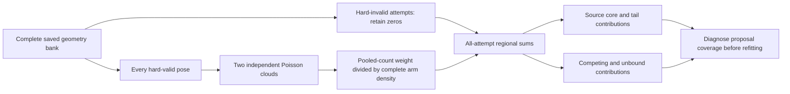

# Does the discovered contact tail carry depletion weight?

The [geometric bridge pilot](context-bridge-guides.md) found a pose far outside
the original source Gaussian that dominates its estimated source-contact
volume. That estimate contains no depletion weight. Before changing the
proposal again, this extension scores the **complete saved bank** at depletant
radius 1.5 Å and activity 0.035 Å⁻³. It generates no new poses.

This remains one mobile tetramer against 263 frozen neighbors from a historical
500 μM configuration. It is a conditional diagnostic, not the all-mobile
106.8 μM finite-system assembly experiment. The source-contact pattern A_T is
not an independent native-registry classification.

## Why missing intermediate signatures are not a transport obstruction

A direct reversible endpoint proposal does not trace the interpolation between
its endpoints. For an involution T on the extended state z, with target density
ρ, the acceptance ratio is

\[
R(z)=\frac{\rho(Tz)|\det DT(z)|}{\rho(z)},\qquad
\alpha(z)=\min(1,R(z)).
\]

Provided the reverse support, auxiliary densities and Jacobian are accounted
for, hard exclusion constrains the endpoints. It does not require a hard-free
continuous interpolation. State-dependent selection probabilities belong in
ρ or the proposal ratio; they cannot be omitted on this argument. A move that
actually uses a path has its own additional requirements.

Consequently, the bridge's lack of configurations retaining 5–15 contact tokens
does not invalidate direct source-to-competing transport. It shows that this
particular interpolation proposal did not cover those signatures. Those
signatures are discrete observations, not a proven reaction coordinate or a
necessary route between environments.

## Frozen scoring allocation

Retain both original arms, all four populations per arm, all 72 generating
strata and all **16,384 attempted poses**. The denominator remains **2,048**
per population. Score every one of the **3,727 hard-valid poses** with two
independent clouds, giving **7,454 clouds**. The 12,657 hard-invalid attempts
remain explicit zero contributions. No successful subset is redrawn or
renormalized.

Each cloud uses the existing intensity λ=2.24 Å⁻³, certified geometric envelope
and validated saved-pose scorer. The saved envelopes predict approximately
781.9 million raw Poisson points. This is an expectation, not a realized count
or permission to clip an oversized cloud. Existing limits retain one million
points per cloud, two million per pose, and the corresponding full job budget;
cap failures preserve their prefixes without replacement.

At most four new workers run, each with one thread and limits of 600 CPU
seconds, 1,200 wall seconds and 4 GiB per job. They share the machine with the
existing campaigns and remain below the eight-scientific-worker limit.

For lower overlap bound L, independent overlap counts K₀,K₁, and full arm
proposal density q, use the same pooled-count estimator as the completed
multicage study:

\[
Y=\frac{e^{zL}(1+z/(2\lambda))^{K_0+K_1}}{q(x)}.
\]

The arithmetic mean of the individual cloud estimators is a secondary control.
Every q includes the uniform and context components plus all thirteen chart
densities, with each chart's own Haar Jacobian. All region estimates use the
unconditional attempted-draw denominator. Retain source-token regions,
other contacts and unbound configurations exactly as in the original bank;
do not change regions after seeing the physical scores.

## What the result can establish

The extension was chosen after inspecting the bank's geometric results. Its
cloud law has the stated conditional expectation at every saved pose, but this
is **exploratory reuse of a selected bank**, not a fresh confirmation of a guide
chosen without those observations. Population errors and importance ESS are
descriptive diagnostics here; they cannot retrospectively open a production
gate or guarantee coverage of unseen regions.

Compare the hard-volume and physical-weight fractions of A_T in the unchanged
original-chart radial bins 0–6, 6–12, 12–24, 24–48, 48–96 and 96–∞, where the
coordinate is squared Mahalanobis radius. Report dominant row identities,
between-population discrepancies, both cloud estimators and all remaining
region contributions. This distinguishes a geometrically large but physically
suppressed tail from a physically important tail missing from the current
proposal.

The failed geometric bridge criterion stays failed. A useful physical tail
would motivate a separately frozen guide and fresh independent validation;
small observed tail weight would redirect the proposal effort. Neither result
alone decides finite-system assembly or instability.

## Completed result: the observed geometric tail is physically suppressed

The saved pose that contributed **87.90% of the bridge arm's A_T hard-volume
estimate contributes only 0.1683% of its A_T depletion-weighted estimate**.
Its identity is `bridge-pop2-bridge_a0_b4`, ordinal 57, with original-chart
squared radius **122.106**. This is a statement about this observed pose and
bank, not a bound on unobserved physical tails.

The largest observed physical A_T contribution instead comes from
`bridge-pop2-broad_full`, ordinal 50, at squared radius **15.048**. It contributes
**25.99%** of pooled bridge A_T physical weight, compared with only 0.0998% of
its hard-volume weight. The physical and geometric rankings therefore differ
substantially. Broadening or refitting solely to the hard-volume leader would
prioritize a pose that carries little observed physical weight.

| Bridge A_T row | Original-chart r² | Pooled hard-volume share | Pooled physical-weight share |
|---|---:|---:|---:|
| Broad endpoint tail, `bridge_a0_b4`, population 2, ordinal 57 | 122.106 | 87.90% | 0.1683% |
| Physical leader, `broad_full`, population 2, ordinal 50 | 15.048 | 0.0998% | 25.99% |

The two saved poses also differ in overlap itself. Their pooled hit counts
are 14,470 and 12,951, with zero certified lower volumes. The fixed-pose score
`z*(L+S/(2λ))` is 113.0469 versus 101.1797: an observed **11.867 kBT** advantage
for the physical leader. The Poisson-counting standard-error plug-in for this
difference is 1.294 kBT. These are two outcome-selected poses with the same
complete source-contact signature, not a basin free-energy comparison or a
selection-adjusted confidence interval. The calculation and original input
hashes are preserved in
[`saved-point-overlap-comparison.json`](../results/context-bridge-physical-independent-audit-20261006/saved-point-overlap-comparison.json)
(SHA-256 `a844411f2975236c44ee6ae0f4c2203fe89a5fef4ff07870129b5d601f9c13d6`).
The positive Poisson importance estimator remains unchanged; these scores are
not exponentiated to replace it.

The original-chart interval **24 ≤ r² < 48** still carries 10.73% of the
bridge arm's observed physical A_T weight. Suppression of the most distant
observed pose does not justify truncating the chart or discarding its tails.
All original region and radial-bin definitions remain unchanged.

### Regional weights remain unconverged

These are unnormalized region weights in the unchanged fixed-context physical
measure. RSE is the standard error of four population masses divided by their
mean. Because this bank was selected after inspection, these errors are
exploratory diagnostics, not fresh confirmatory intervals.

| Region | Baseline mean weight | Baseline RSE | Bridge mean weight | Bridge RSE |
|---|---:|---:|---:|---:|
| Complete source contact A_T | 1.4237 × 10³⁷ | 17.15% | 1.7130 × 10³⁷ | 24.07% |
| Contacts excluding A_T | 2.1066 × 10¹⁶ | 18.20% | 6.8965 × 10¹⁶ | 29.38% |
| Other-contact region | 1.2331 × 10¹² | 99.97% | 9.6594 × 10⁸ | 58.24% |
| Unbound region | 5.3434 × 10⁸ | 3.22% | 5.4110 × 10⁸ | 0.55% |

The other-contact row is a subset of contacts excluding A_T, not an additional
disjoint contribution to that row. The complete report also retains the
partial-A, B and remaining-domain partitions.

A_T's proposal-arm mean ratio is 1.203 (log difference 0.185), but its pooled
importance ESS is only **23.65** for the baseline and **10.51** for the bridge,
with largest pooled physical contributions of 15.43% and 25.99%, respectively.
Agreement of these two means does not satisfy the concentration or precision
requirements.

The estimated competing-contact weight changes by **3.27-fold** between arms
(log difference 1.186), about 2.32 combined standard errors. Its 18–29% RSE and
proposal sensitivity remain unresolved. The other-contact region is even less
stable. Observed A_T dominance cannot certify equilibrium occupancy while
those contributions and unobserved physical tails remain uncontrolled. No
confirmatory convergence gate is admitted by this exploratory extension.

The immediate sampling priority is **coverage of competing environments and
the remaining contact region**, with physical weights guiding any subsequent
fit. The result does not support naive source broadening based on hard volume
alone. Any fitted guide still needs a normalized density, its defensive
component, and a separately frozen evaluation on fresh independent
populations. No fit or new pose search was performed for this extension.

The failed geometric bridge criterion remains failed: there were no valid
5–15-token signatures in either arm. This does not obstruct a direct reversible
endpoint transport and does not decide finite-system native assembly or
instability. The current conclusion remains an unresolved sampling and
coverage limitation in a fixed neighborhood.

## Execution, controls and audit provenance

All **72 physical jobs** completed without retries, replacement clouds or
omitted valid poses. They scored **3,727 saved poses with 7,454 clouds**, drawing
and processing **781,897,230 points**. All **16,384 attempted-pose denominators**
were retained, including 12,657 hard-invalid zeros. There were no new pose
draws. Producer CPU time was **257.971 seconds**; controller wall time was
**272.962 seconds**, including setup and lifecycle verification.

The **22 synthetic controls** passed before materialization. They cover the
complete 15-term proposal density, all-attempt denominators, all valid regions
and zero-volume envelopes, fresh seed roles, pooled-count versus arithmetic
weights, source-tail partitions and the exploratory-scope contract. The
unchanged validated scorer was used. The physical controller, four drivers
and 72 worker identities were verified absent on the host: **77 drained
process groups**, with the protected production binary unchanged.

The independent physical audit passed in **8.200 CPU seconds** under its
120 CPU-second, 240-second wall, 4 GiB, one-thread limit. It checked the complete
saved bank, physical journals, fresh cloud roles and full proposal densities,
and reconstructed the primary pooled-count weights and secondary arithmetic
control. Its driver and audit process also drained. The audit made **zero new
geometry queries, cloud draws or pose draws**. Audit correctness does not imply
convergence of the regional weights.

The first metadata wrapper for this final audit failed preflight because its
terminal path was outside the allowed driver-root namespace. Neither the
freezer nor the audit ran under that rejected plan. The unused plan and
`wrapper-preflight-failure.json` are preserved in
`results/context-bridge-physical-audit-preparation-20261006/`; the corrected
metadata wrapper is in
`results/context-bridge-physical-audit-freeze-execution-20261006/`.
No physical calculation was retried because of that metadata error. The earlier
geometry audit's Cholesky roundoff correction and repeated saved checks are
recorded in [the bridge geometry provenance](context-bridge-guides.md).

| Artifact, relative to `results/` | SHA-256 |
|---|---|
| `context-bridge-physical-validation-20261006/report.json` | `60a1f5f8affa4db0ad48dfe8afd6e02fcd685f7c0dfa4eec7f7b47422258751c` |
| `context-bridge-guide-physical-20261006/controller-manifest.json` | `c8d064d4c53becd61263bd86e67e11f0f494c617c1c613c94c206ad4c3830679` |
| `context-bridge-guide-physical-20261006/controller/receipt.json` | `f342fe580d8d4eba3494a59fa45f61957e4a70f778280cd47679c825894bdee2` |
| `context-bridge-guide-physical-20261006/host-drained.json` | `eba440ff64a61bd18fbbf5d638c1a885f0f9b4b38b311b27f9609f24a6f733e5` |
| `context-bridge-physical-audit-preparation-20261006/wrapper-preflight-failure.json` | `031b479cdf8318b6168395573aa0791bae48380d67eb204cf36e91045aff5c59` |
| `context-bridge-physical-independent-audit-20261006/execution-plan.json` | `6cea62a6ad13c203d2679311087fe8c7478e387b68f013e7444d6829901c4f55` |
| `context-bridge-physical-independent-audit-20261006/result/report.json` | `604c95db356a564d9515c33072b0e75e324f49179651a6c9bd2e61929004aa8a` |
| `context-bridge-physical-independent-audit-20261006/host-drained.json` | `cdce7eedeec3115d9068c3bf889f4f2be4992ded8cfd906cd3eeafaff62a8660` |
