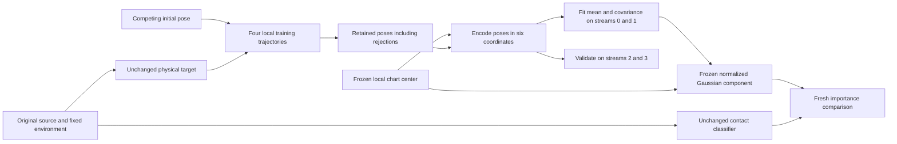

# Separately centered competing-contact guides

The [broader-source comparison](context-broadened-guide.md) left competing
contact weights concentrated in approximately one to four effective
importance contributions per population. Pooling the existing Poisson
counts removed some auxiliary noise but did not resolve this coverage
problem. Important competing poses lie far outside the fitted source
Gaussian; increasing that Gaussian's width is an inefficient way to
describe another basin.

This stage constructs local proposals around two competing contact
environments. The physical model, 263 fixed tetramers, mobile label 77,
anchor 16 and original source-contact definitions remain unchanged. It
uses radius 1.5 Å and activity 0.035 Å⁻³ in the historical 500 μM frozen
environment. It is a conditional proposal experiment. Finite-system
assembly near 106.8 μM requires the separate physical checks in the main
plan.

## Three distinct pose roles

The original source pose defines the contact reference. The training
initial pose determines where a local chain starts. The Gaussian chart
center determines its coordinate system. Changing either of the latter
must not redefine the contact regions or the physical target.



For poses relative to the same unchanged anchor, write the chosen center
as (t_c,R_c). Coordinates are ξ=(t−t_c,ℓu), where the Cayley rotation of u
is RR_c⁻¹. Sampling ξ=μ+Lη with η standard Gaussian and LLᵀ=Σ gives

\[
t=t_c+\xi_t,\qquad R=\operatorname{Cayley}(\xi_r/\ell)R_c.
\]

Relative to translation volume and normalized Haar measure, the density is
the six-dimensional Gaussian density divided by

\[
J(\xi)=\frac{1}{\pi^2\ell^3(1+|\xi_r/\ell|^2)^2}.
\]

Relocating the chart is a proper rigid-coordinate transformation and adds
no further volume factor. A Gaussian mean shift within the original
Cayley chart is a different operation; it cannot relocate that chart's
rotation singularity. The Gaussian map and physical kernels are reused.

## Configuration and reference preservation

`examples/context_source_guide.rs` accepts an optional field:

```json
{
  "chart_center": {
    "schema": "source-chart-center-v1",
    "frame": "saved-spherical-center",
    "pose": {
      "position": [0.0, 0.0, 0.0],
      "orientation": [1.0, 0.0, 0.0, 0.0]
    },
    "provenance": "Frozen selected-pose artifact and row identity"
  }
}
```

This object belongs inside `source_chart`; the numbers above are only a
format example. Actual positions and quaternions use the saved physical
sphere-center frame. Display-origin offsets are not applied. The field
is included in configuration hashes and echoed in the proposal manifest.
When absent, serialization and the original source-centered behavior are
preserved. The independently implemented Python density resolves the
same chart center. Original source validity and patch-reference checks
continue to use the original source metadata.

## Training allocation

Seeds are selected from the completed pilot, using the pooled-count
importance contribution outside A_T and unbound regions. Selection is
pilot-informed training, not fresh validation. The highest contribution
starts the first cage. The second is the highest remaining contribution
whose full contact-token Jaccard distance from the first is at least 0.5;
stable stratum and ordinal identifiers break ties.

The selected poses are `baseline-pop1-diagonal/1815`, a partial source
contact with neighbors {16,217}, and `baseline-pop1-full/1483`, with
neighbors {16,56}. Their contact-token sets are disjoint. The first is
8.28° from the original source orientation, so its large standardized
distance is not evidence for a Cayley singularity. The second is about
94.17 Å and 70.16° from the first.

Each seed gets four independent local-only trajectories, each with 2,304
cycles of five elementary attempts. The first 256 cycles are designated
warmup and the remaining 2,048 supply 10,240 retained states per stream.
All rejected states remain in the trajectories. Translation and rotation
proposal sizes are 0.2 Å and 1°, matching the prior local controls.
Streams 0 and 1 train one Gaussian per cage; streams 2 and 3 are held out.
The predeclared covariance regularization is reported explicitly.

The total allocation is eight chains and 92,160 attempted moves, with at
most four new workers and one thread per worker. Per-chain limits are
600 CPU seconds, 1,200 wall seconds, 4 GiB and two billion test points.
Failed prefixes are retained without replacement. Training does not
establish equilibrium or a region normalizer. Movement, contact residence,
autocorrelation, between-stream differences and held-out likelihood must
be reported; a constant observable cannot establish an independent-sample
count.

The fitted proposal must be frozen before a fresh importance comparison.
That comparison retains the uniform defensive component and evaluates
the complete mixture density. The physical target and region definitions
must be the same in every arm. Improved training likelihood or accepted
move throughput alone cannot establish physical convergence or assembly.

## Correctness of the frozen guide

Training changes a proposal, not the physical distribution. Once a chart's
center, mean and covariance are frozen, it is a normalized density on
translation times normalized rotational Haar measure. The omitted Cayley
seam has Haar measure zero. The physical wall and hard-core predicates
still contribute zeros to the importance estimator; draws are not
conditioned on passing them.

For fixed stratum fractions a_j and normalized runner densities q_j,
use q(x)=sum_j a_j q_j(x). With n_j=N a_j independent draws from each
q_j and an unbiased nonnegative depletion estimator W_hat(x),

\[
\mathbb E\!\left[\frac1N\sum_j\sum_{i=1}^{n_j}
 \frac{\mathbf1_R(X_{ji})\mathbf1_{\rm valid}(X_{ji})
       \widehat W(X_{ji})}{q(X_{ji})}\right]
=\int_R\mathbf1_{\rm valid}(x)W(x)\,dx.
\]

This identity uses the complete mixture density and the unconditional
draw count. Separate chart Jacobians are already included in each q_j;
there is no further Jacobian at the mixture level. Freezing a guide
allows this argument conditional on the training record. Reusing the
same record as evaluation draws would require a different argument.

The new chart-center implementation passed 16 Rust tests and 13 Python
tests covering independent coordinate/density reconstruction, a
noncommuting rotation, the Haar Jacobian, invalid centers and legacy
behavior. The isolated build is
`results/source-chart-center-guide-build-20261005`; its example binary
SHA-256 is
`2dacc7ebe2530b2c0cac94dbbaeb339afd40bea4c87c6e3c45545fb68b948549`.
The production assembly executable remains unchanged.

## Completed local training

All eight predeclared chains completed without replacement: 92,160 attempts,
1,108.33 total sampling CPU seconds and 297.86 seconds controller elapsed
time. All 13 owned controller, driver and sampler process groups were
confirmed drained. The existing growth and contact-weight campaigns were
left running.

The partial-source-contact chains accepted 135–187 of 11,520 attempts
each; the different-neighbor chains accepted 504–547. These counts show
that the training record contains motion; they do not measure equilibrium
contact exchanges or justify an independent-sample count. Fitting and
contact diagnostics retain every rejection.

The frozen training manifest is
`results/context-competing-cage-local-training-20261005/controller-manifest.json`,
SHA-256 `f2951a70ca0bf2b6f4af9104e11c8476e97e4c5248fd20ebf3a083065f6386c8`.
Its controller receipt is
`6f96b08eb947e221e57b79bfb7562cbb49d6e89bfafa19860954bd567d48c815`;
the host drain receipt is
`5dfa13595cb6a5dedbe5bf4fed66c73b9f83b87b791e8ddbc6e9afefe61036f5`.

## Held-out results

The [fit report and method](competing-cage-covariance.md) retain all 92,160
states and pass ten additional synthetic controls. Both empirical
covariances have rank six, with only about one millionth of their scaled
variance introduced by regularization. However, the nominal 95% Gaussian
region covers 39.3% of held-out residence states for the partial-contact
cage and 86.0% for the different-neighbor cage. Apparent per-stream vector
ESS is only 4.5–9.5 and 7.9–16.3, respectively. The guide is normalized;
the short local record is not a converged equilibrium basin model.


The top panels project the fixed training covariance and each held-out
stream's moments onto the two leading scaled training directions. The
ellipses are Gaussian moment summaries, not measured density contours.
The bottom panels evaluate all six coordinates. They expose between-stream
disagreement that a training likelihood alone would miss. These held-out
results do not change the fitted parameters.

The next proposal comparison keeps the old broadened law Q and adds the
two frozen cage runner laws r_0 and r_1 as
Q_new = 0.5 Q + 0.25 r_0 + 0.25 r_1. Each runner already contains 50%
uniform draws, so the full proposal retains 50% uniform coverage and
Q_new >= 0.5 Q pointwise. This bounds the importance-weight inflation of
an already covered pose by two; it does not guarantee improved realized
ESS or CPU efficiency. Fresh physical evaluation, including the complete
remaining contact region, must establish any improvement.

## Contact audit

All eight independent observers completed and their 13 owned process
groups drained. They audited all 92,160 attempts, including 81,920
production endpoints, using a cache of 2,761 distinct poses. Classification
used 18,168 body-pair queries and 57.08 observer CPU seconds. No additional
poses or depletant clouds were generated.

| Production contact diagnostic | Partial-contact start | Different-neighbor start |
|---|---:|---:|
| Distinct full fingerprints per stream | 2–4 | 8–15 |
| Dominant fingerprint occupancy | 85.85–99.92% | 44.07–61.51% |
| Instantaneous fingerprint passages | 4–23 | 94–154 |
| Changes of neighbor environment | 0 | 0 |

Neighbor ESS is undefined because the observed neighbor sets are constant.
Fingerprint ESS is especially unreliable for rare minority observations:
one stream has only eight minority endpoints and four passages but a
sample-centered apparent ESS of about 1,640. That number cannot establish
contact-sampling efficiency. Conversely, no observed environment exchange
does not establish that exchanges are physically absent or that both
environments should have comparable equilibrium occupancy.

The observer's neighbor-defined A/B labels are not the finer A_T mass
regions or a native-registry classifier. Full patch tokens are archived;
source-patch completeness was not separately reduced in this audit.
The exact metrics are
`results/context-competing-cage-observers-20261005/contact-summary.json`,
SHA-256 `138258bada2425794d0d601b686b070bd9f28e0806e9bccb3da6473db04c594e`.
All observer inputs and the protected assembly binary remain unchanged.
