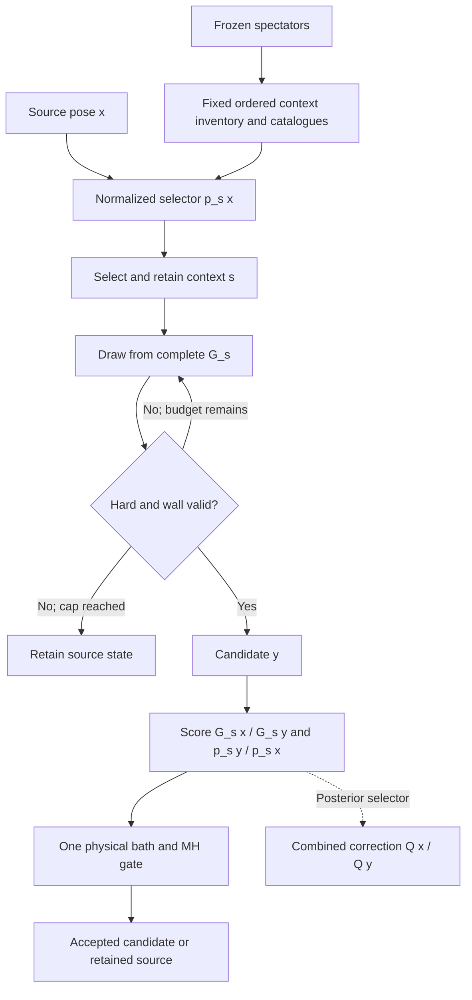

# Reversible context selection before a singleton redraw

These are prospective kernels. The finite-state checks and the separate Lean
bridge do not measure protein sampling or change the production sampler.
The passive fusion diagnostic is motivating a bounded alternative-neighbor
screen before selecting an implementation.

Freeze the spectators `S = X_-i`. Each retained ordered neighbor context `s`
defines a normalized full density `G_s = 0.5 U_s + 0.5 M_s`, with respect to
translation and normalized Haar measure. `U_s` includes its fixed anchor frame;
`M_s` includes every single and fused component and its coordinate Jacobian.
Let `H` denote all hard-core and wall constraints against those spectators.
Choose the context once, retry only independent raw draws from its complete
`G_s`, and keep the first hard-valid draw within a fixed cap `K_s`. A failed cap
is a self-loop. Never retry the bath/MH decision.



Writing `Z_s = integral_H G_s`, explicit capped histories give off-diagonal
proposal density

\[
p_s(x)\,G_s(y)\,1_H(y)\,a_s,
\qquad a_s=\sum_{r=0}^{K_s-1}(1-Z_s)^r.
\]

The geometric sum is a polynomial, including `Z_s=0` and `K_s=0`; no division
by a zero feasible mass is required. On positive forward support, the complete
proposal correction is

\[
\frac{G_s(x)p_s(y)}{G_s(y)p_s(x)}.
\]

For spectator-only selection `p_s=w_s`, selection cancels. For a cheap local
selector the normalized forward and reverse probabilities must both be scored.
A positive prior floor keeps reverse selection possible; a declared zero reverse
probability instead gives an MH rejection. This is distinct from retrying until
a favorable context is found. The production primitive returns an immediate
self-loop when the selected `G_s(x)` is zero.

For the posterior selector, define

\[
Q(x)=\sum_s w_sG_s(x),\qquad p_s(x)=w_sG_s(x)/Q(x).
\]

The retained-context forward numerator is `w_s G_s(x) a_s G_s(y)` divided by
`Q(x)`; the reverse has the identical numerator divided by `Q(y)`. Hence the
correction is `Q(x)/Q(y)`, even for unequal context feasible masses or caps.
At `Q(x)=0` this kernel is defined as a self-loop. Its coverage and irreducibility
must be assessed separately. Evaluating `Q` requires the complete declared bank
at both endpoints. A bank selected from the current moving pose is not fixed
spectator context without an additional selection argument.

A distinct correct control draws independently from `Q`, redrawing the context
from `w_s` on every raw trial. Its common cap factor also cancels. Redrawing from
the source posterior on each failed trial is different: its feasible mass
depends on the source, so the `Q(x)/Q(y)` correction alone generally fails.

## Independent exact checks

`tools/test_context_selector_balance.py` uses only Python's standard library
and exact rational arithmetic. It recursively enumerates all raw histories up
to three attempts on four toy states, one hard-invalid. It checks row sums,
failed-cap mass, retained MH rejections, accepted-flow symmetry, and direct
matrix stationarity for prior, local, posterior-retained, and independent-Q
selectors. Fixtures include unequal feasible masses and physical occupancies,
zero weight/density/feasible mass/cap, and zero target probabilities. The toy
matrix makes the hard-invalid source absorbing solely to complete a zero-target
row; production treats an invalid source as a fatal input.

Negative controls omit the local selection ratio or redraw the posterior context
after failure. Both are normalized Markov chains but fail the intended balance
and stationary-distribution checks. A one-attempt control isolates the latter
defect to reselection after rejection. Another check composes two invariant
kernels: the composition preserves the target without requiring sweep-level
detailed balance. The same distinction applies to deterministic alternating
single-coordinate kernels.

Run from the repository root with one thread:

```sh
OPENBLAS_NUM_THREADS=1 OMP_NUM_THREADS=1 MKL_NUM_THREADS=1 \
  python3 -B -m unittest discover -s tools -p test_context_selector_balance.py -v
```

This suite has no production imports, geometry, random draws, or scientific
inputs. A passing result concerns these finite-state identities only.
All eight tests passed with unchanged test-source bytes; see the
[validation receipt](../results/context-selector-balance-validation-20261004/validation.json).

## Prospective nearby-anchor control

This extension is **not implemented or measured**. The decision to implement it
awaits the bounded alternative-anchor constructor diagnostic: passing the mean
distance/angle screen alone does not establish a usable fused component.

The smallest arm would retain the other mobile particle as primary neighbor,
rank its spectator neighbors by center distance with label tie-breaking, and
choose uniformly from at most eight within a frozen separation cutoff. Exclude
the moving particle from every ranking and eligibility input. The inventory and
selection probability are then identical at both move endpoints, so selection
adds zero log correction. An empty inventory is a recorded self-loop. Do not
reselect after zero source density, exhausted geometric trials or MH rejection.

Reuse `cluster_phase::anchor_pool` for ranking and factor the existing
`FixedLabelUpdates::two_neighbor_singleton` body into an explicit-anchor helper.
The old method would continue passing its original anchor. A new benchmark arm,
for example `singleton_two_neighbor_nearby`, would pass the selected anchor while
preserving the physical target and original diagnostic/classifier context.
The selected anchor also changes the defensive cube's body frame: both density
evaluations and the new journal contract must reflect that change.

Initially rebuild the inventory and catalogue on every attempt. The other
mobile particle is a spectator for this elementary move but can change during
the next local update. All spectators also affect fitted-center core screening;
unchanged selected anchors alone are not a valid catalogue cache key. Only
immutable atlas constants and permanently fixed spectator data can be reused
without further dependency tracking.

Keep the four local attempts in `[0,1,0,1]` order, then the singleton on
`(block-1)%2`, with the existing proposal sizes, cap, mixture and depletion
settings. Give neighbor selection its own named RNG stream; keep proposal,
bath and acceptance streams unchanged. Record eligibility, selected labels and
probability, cube frame, catalogue counters, all attempts and full CPU. Reuse
the frozen initial preparations. Compare contact-sampling efficiency and
environment exchanges, not accepted-move counts alone. This control tests
spectator-neighborhood choice; it does not provide posterior source matching.

## Remaining implementation obligations

- Preserve the spectator snapshot, ordered labels, all mixture terms and each
  cap's source independence; use the same context for forward and reverse laws.
- Score selection normalizers and physical-pose densities exactly as implemented;
  do not hide nonfinite terms or change the defensive frame while scoring.
- Preserve every attempt, hard rejection, cap failure and MH self-loop. Numerical
  or decoder failure is fatal and recorded, not another sampling rejection.
- Add the proposal correction once to the validated auxiliary bath construction
  and make one physical MH decision. The finite toy uses exact target weights;
  it does not itself validate the Poisson bath or floating-point implementation.
- Freeze learned maps during evaluation. Fresh reversible auxiliary contexts
  here do not implement adaptive learning or justify uncorrected map updates.

No result here implies equal directional transition rates, fast mixing, unseen
basin coverage, or favorable physical assembly weights.
