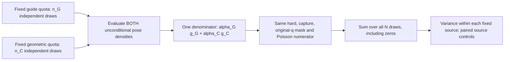

# Fresh deterministic-mixture integration of the original shoulder

This calculation estimates the **same full region `1<original q<2`** with
two frozen proposal laws and fixed sampling quotas. It is an independent
importance integrator, not a Markov-chain kernel or an equilibrium
trajectory. The AB fixed neighbors, capture sphere, hard protein shape,
depletant radius 1.5 Å, activity 0.035 Å⁻³, and normalized SO(3) Haar measure
remain unchanged.

The two component laws are:

- `g_G`: the existing normalized guide law,
  `0.25 g_product + 0.75 [0.95 GMM + 0.05 g_cube]`. Its product cover is
  constructed at `q_max=2`; the frozen GMM contains the weighted and
  geometry Gaussians with their already specified probabilities.
- `g_C`: uniform sampling in the latent six-ball of the complete Cayley
  moment cover constructed at `q_max=2`, divided by its exact pose
  Jacobian. This is the full shoulder cover, not the later `q_max=1.1`
  focused reference.

Each population takes exactly `n_G` and `n_C` unconditional draws. Put
`N=n_G+n_C`, `alpha_j=n_j/N`, and

`g_bar(x)=alpha_G g_G(x)+alpha_C g_C(x)`.

This full summed density is used for **every** draw, whichever component
generated it. Internal guide family and GMM labels remain random draws
under `g_G`; they are not additional fixed-quota strata.

## Expectation and coverage

Write `I(x)` for the original region, capture, and hard-validity indicator,
and `Wbar` for the average of the independent positive Poisson cloud
weights. With `E[Wbar|x]=exp[z C(x)]`, define

```
Z_ji = I(X_ji) Wbar_ji / g_bar(X_ji),
Q_hat = (1/N) sum_j sum_i Z_ji,
X_ji independently distributed as g_j.
```

The physical overlap `C` uses the union of all AB neighbor exclusion
regions. It is not replaced by a sum of pair overlaps. Then

```
E[Q_hat]
  = sum_j alpha_j integral g_j(x) I(x) exp[z C(x)]/g_bar(x) dx
  = integral I(x) exp[z C(x)] dx
  = Q.
```

This requires `g_bar>0` almost everywhere where the target is positive.
Either component's complete geometric support suffices here. The
constructors' numerical guard scope remains the one documented in
[rms-quaternion-cover.md](rms-quaternion-cover.md): a conservative
floating-point margin, not a formal interval certificate. The covariance,
relative-rotation convention, exact Jacobian, original metric, and both
physical neighbors must be independently checked.

Neither proposal is conditioned on successful hard contacts or region
membership. Failed draws remain zero in their original quota. If an
implementation ever permits numerical nulls, it must account for their
unconditional probability as zero outcomes; retrying silently would
change the proposal law. The present finite Cayley chart has no
representability nulls.

Frozen models and quota choices may be selected using earlier information,
but all primary MIS populations must be fresh and independent conditional
on that frozen protocol. The current sequentially chosen guide, wide-cover,
and focused-cover campaigns should remain separate. Replacing their
denominators retrospectively with a mixture selected using those same
outcomes is not justified by the expectation calculation above.

The raw kernels can retain their current own-component densities. For a
valid recorded contribution `Y_own=I Wbar/g_j`, reconstruct

`log Z=log Y_own+log g_j-log g_bar`.

This reuses the **same** cloud numerator without new insertions. It is
valid for the fresh prespecified MIS campaign, whose final estimator law
was fixed in advance. Every probability in `g_G`, the Cayley Jacobian,
and `alpha_j=n_j/N` must enter the reconstructed density. Source counts
cannot be replaced by equal mixture weights when the quotas differ.

## Fixed-quota variance

Let `mu_j=E_j[Z]` and `sigma_j^2=Var_j(Z)`, where the variance includes
both pose and cloud randomness. Independence gives

```
Var(Q_hat) = sum_j n_j sigma_j^2 / N^2.

V_hat = sum_j n_j s_j^2 / N^2,
s_j^2 = [sum_i Z_ji^2 - n_j Zbar_j^2]/(n_j-1).
```

For `n_j>=2`, `V_hat` is an unbiased variance estimator when the second
moments exist. All source-specific zeros enter `n_j`. Each stratum needs
its own moments; treating the combined rows as iid mixture draws adds
selection randomness that the fixed quotas have removed.

For example, the expectation of the pooled iid variance estimate obeys

```
E[s_pooled^2/N]
  = Var(Q_hat) + sum_j alpha_j (mu_j-Q)^2/(N-1).
```

The extra term is generally nonzero. This is an expectation statement,
not a claim that every realized iid error estimate is an upper bound.
Conversely, subtracting differences between the *randomly selected*
internal cover/GMM/cube families would remove real variance and is wrong.
Only the two enforced top-level quotas supply this stratification.

The specified compact geometric covers give a positive lower bound on
`g_bar` throughout the target. A finite bound `Cmax` on overlap volume and
positive auxiliary intensity also bound the Poisson second moment by
`exp[(2*z+z^2/lambda)*Cmax]`. Thus finite variance follows for the stated
model and validated supports, although this worst-case bound is much too
loose to establish useful finite-budget precision.

Kish weight ESS can remain a concentration diagnostic, but its usual iid
conversion to standard error does not apply to this estimator. Report
fixed-quota variance, independent-population agreement, individual maximum
weight fractions, and precision per CPU separately. A fixed-quota
estimator can even be exact in a finite example while pooled weight ESS
suggests uncertainty.

For several independent populations with identical quotas, average their
`Q_hat` values and use their sample variance divided by the population
count as a separate uncertainty diagnostic. Pooling the source-specific
moments across these populations also gives a valid fixed-quota estimate
because the same `alpha_j` applies. Four populations provide a useful
control, but not a strong test for unvisited tails.

## Separating Poisson-cloud variance

For two independent clouds at one pose, use the same full denominator in
both contributions:

```
Z_1 = I W_1/g_bar,   Z_2 = I W_2/g_bar,
Z = (Z_1+Z_2)/2,
v_cloud = (Z_1-Z_2)^2/4.
```

Conditional on the pose, `v_cloud` is unbiased for the variance of the
two-cloud mean. The cloud contribution to `Var(Q_hat)` therefore has
unbiased estimate

`V_cloud_hat = sum_all_rows v_cloud / N^2`.

The residual `V_hat-V_cloud_hat` estimates the pose contribution. It can
be negative at finite sample size; do not clip it and present the clipped
number as an unbiased decomposition. For `r>1` independent clouds, the
corresponding row estimate is
`sum_a (Z_a-Zbar)^2/[r(r-1)]`.

Different source-specific cloud laws would still give the correct mean
if each conditional numerator is unbiased. Their variances would need to
be handled separately. The proposed controls keep the same two clouds,
Poisson intensity/activity ratio 64, and geometric envelope settings.
If comparing physical and hard-region normalizers from the same poses,
their covariance likewise uses the sum of **within-source** sample
covariances weighted by `n_j/N^2`.

## Component controls share samples with MIS

The fresh source draws also give the conventional controls

`Q_G=(1/n_G) sum_G U_Gi`, `Q_C=(1/n_C) sum_C U_Ci`,
where `U_ji=I Wbar_ji/g_j`.

These source controls target the same full original shoulder and use their
own unconditional denominators. The guide and cover controls are
independent of each other conditional on the frozen protocol. Neither is
independent of `Q_hat`, which reuses its poses and clouds.

For the paired difference `D_G=Q_hat-Q_G`, define

```
H_Gi = Z_Gi - U_Gi/alpha_G,
H_Ci = Z_Ci,
D_G = (1/N) [sum_G H_Gi + sum_C H_Ci].
```

Its variance estimate is the same fixed-quota formula applied to `H`,
`sum_j n_j s_H,j^2/N^2`. An equivalent covariance calculation uses
`Cov(Q_hat,Q_G)=Cov_G(Z,U_G)/N`, estimated with the within-guide sample
covariance. For the cover comparison, exchange the two source labels.
Independent-population scatter of the paired differences supplies another
check. Adding the MIS and component variances as if they were independent
would be wrong. Do not confuse the source controls `Q_j` with the partial
MIS sums: those partial sums generally do not each have expectation `Q`.

The source-stratum difference has a fixed sign, because
`g_bar >= alpha_G g_G`. In particular,
`H_G = -Z_G alpha_C g_C/(alpha_G g_G) <= 0`, while `H_C=Z_C>=0`.
The implementation can therefore accumulate the absolute source-stratum
contributions in logarithms, then subtract the two accumulated totals.
Their within-stratum variances are unchanged by these signs. This avoids
subtracting two nearly equal per-row weights or pretending the two full
estimates are independent.

## Independent reference controls

Useful controls before protein production are:

1. A finite state space with exactly enumerable pose and auxiliary laws.
   Verify the mean, fixed-quota variance, variance estimator, and paired
   cloud decomposition against exact enumeration. Unequal source means
   must expose the difference from the pooled iid error.
2. Identical proposal components. The mean reduces to ordinary importance
   integration; independent fixed-quota variance remains unbiased even
   though its particular realized estimate need not equal the pooled
   sample-variance estimate.
3. Disjoint-support components with positive total target support. Fixed
   quotas can give an exact integral when each within-component weight
   is constant, while an iid row formula incorrectly reports noise.
4. A sphere/zero-activity known-volume reference, then positive ideal
   depletion with an independent analytical overlap integral. Keep hard
   and capture rejections in both quota counts. Also preserve the control
   where a non-anchor second neighbor creates all physical interactions.
5. Independent full-density checks on poses from **both** sources,
   including the geometric cover, GMM, cube/Haar term, and Cayley support.
   The chosen source label must not change the denominator at a fixed pose.
6. Both allocations and independent populations must give the same physical
   normalizer within adequate uncertainty. Agreement of acceptance or
   proposal speed alone is not relevant to this integration test.

The finite-state mathematical fixtures in
`tools/test_deterministic_mis_math.py` require no protein kernel or random
simulation. They supply independent expected values for implementation
checks; they do not verify the Rust geometry or numerical proposal laws.
For the exact four-draw fixture, the normalizer is 3, true and estimated
fixed-quota variance are both `1/2`, pooled iid variance has expectation
`7/12`, and the cloud contribution is `5/16`. The paired MIS-minus-guide
control has variance `7/8`, with covariance `3/16` between the two
estimators. These values catch normalization, stratification, and
shared-sample covariance errors without Monte Carlo noise.

`tools/test_shoulder_mis_moments.py` applies the actual `LogMoments`,
`quota_summary`, mixture-density, and signed-difference helpers to all
4,096 outcomes of that independent fixture. It checks each realized mean,
variance estimate, cloud contribution, and paired difference, as well as
their exact expectations. Further controls exercise unequal quotas,
identical and disjoint proposal supports, implicit zero-count padding,
merging within sources, and common log-weight shifts of ±700. These
controls validate the numerical moment implementation; they do not turn
an observed standard error into a bound on unseen protein weight.

## Allocation pilot and cost control

The completed frozen-guide confirmation cost about `0.00568148` CPU
seconds per unconditional guide draw. The complete Cayley reference cost
`0.000138322`, about 41.1 times less per draw. Their observed full-shoulder
valid fractions were 0.136272 and 0.00307465. These are measured costs and
geometry frequencies, not an assumption of converged physical moments.

| Quotas per population | Guide fraction | Forecast CPU, four populations | Forecast valid guide / cover poses |
| --- | ---: | ---: | ---: |
| 4,096 guide + 65,536 cover | 1/17 | 129.35 s | 2,233 / 806 |
| 4,096 guide + 16,384 cover | 1/5 | 102.15 s | 2,233 / 202 |
| 5,120 guide + 20,480 cover | 1/5 | 127.69 s | 2,791 / 252 |
| 16,384 guide + 65,536 cover | 1/5 | 408.60 s | 8,931 / 806 |

The retrospective allocation diagnostic at
`runs/ab-shoulder-mis-allocation-forecast-20260920/forecast.json` evaluates
the required within-source variances under each proposed denominator.
For cover/guide quota ratios 1, 4, 16, and 64, its observed precision per
CPU is respectively 0.977, 0.914, 0.730, and 0.412 times guide-only. At
ratio 16, adding cover draws costs about 39% more for only about 1.35%
estimated variance reduction at fixed guide count. The evidence therefore
does not support a large allocation sweep or an expected speed advantage.
Unknown tails can change this result; the forecast is an allocation
diagnostic and does not pool the historical physical estimates.

The selected fresh control is consequently one bounded set of four
populations with **16,384 guide plus 65,536 cover draws each**. Its
purpose is to test the common normalization with a complete independent
proposal and compare MIS with its paired source controls. A second
allocation is warranted only if the new evidence calls for one. The
forecast cost is about 409 CPU seconds, before additional cross-density
evaluation and analysis; measure those costs explicitly.

Freeze the quotas and seeds before outcomes, and assess
variance-times-CPU together with
coverage and population agreement. The textbook allocation proportional
to source standard deviation divided by square-root cost cannot be
applied directly here: changing the quotas also changes `g_bar` and hence
each source variance. The pilot is an empirical allocation comparison,
not a proof of optimality or convergence.

## Implementation and reproducible controls

`tools/run_shoulder_mis_campaign.py` freezes the two component laws, shape,
physical configuration, complete cover, executables, quotas and distinct seeds
in one sealed manifest before execution. The established Rust kernels generate
their original unconditional draws and Poisson weights. No target is changed
by combining them in `tools/analyze_shoulder_mis.py`.



The density evaluator checks all source-generated poses and independently
cross-checks the full guide density on every nonzero pose. Source-only weights
are reconstructed and checked against the original kernel summaries. Invalid
poses remain zeros in each fixed quota and every reported q band. The combined
weight file records only nonzero rows; its normalizer still uses all prescribed
draws. The analyzer separately reports generation cost, density-evaluation CPU,
and complete audit CPU, so additional Python evaluation work is not mistaken
for a sampling speedup.

For a fresh full-shoulder campaign:

```bash
python tools/run_shoulder_mis_campaign.py \
  --out runs/fresh-shoulder-mis --populations 4 \
  --n-guide 16384 --n-cover 65536 --workers 8 \
  --guide-seed-base 99731010 --cover-seed-base 99831010 \
  --prepare-only

python runs/fresh-shoulder-mis/provenance/runner.py \
  --execute-prepared runs/fresh-shoulder-mis

python runs/fresh-shoulder-mis/provenance/analyze_shoulder_mis.py \
  --root runs/fresh-shoulder-mis
```

Choose new seeds when creating another independent campaign. Prepared execution
verifies the manifest seal and every archived input. It rejects restarted or
partially populated output directories rather than replacing selected outcomes.

The actual density helper passes an independent sphere test with translated,
noncommuting coordinate frames and full translation–rotation covariance. The
test generates both laws independently and compares the corrected integral with
normalized-Haar radial quadrature and the analytic depletion lens. It also
checks unconditional zeros, the Cayley seam and the half-open cube boundary.
Those tests are in `tools/test_shoulder_mis_density.py`.

Two actual-protein operational controls precede production. The original open
shoulder smoke audits 8,704 draws with maximum source-density error 1.42e-14;
the inclusive-native compatibility smoke audits 1,152 draws and exercises the
legacy schema3 guide path, with error 2.49e-14. Both preserve the full AB shape,
window, bath and capture metadata. Their weights are not physical convergence
evidence. The controls are archived in `runs/shoulder-mis-protein-smoke-20260920`
and `runs/shoulder-mis-native-compatibility-smoke-20260920`.

## Completed fresh campaign and independent raw-row audit

`runs/shoulder-mis-4x16384g-65536c-l64-20260920` completed the four
prespecified populations: 65,536 guide and 262,144 cover draws in total.
The two-source mixture weights are therefore 0.2 and 0.8. Of all 327,680
draws, 9,898 contribute: 9,108 from the guide and 790 from the cover. Every
other draw remains zero in its source denominator. The physical target is
still the open original shoulder `1<q<2`, with full AB interactions,
1.5 Å depletants, activity 0.035 Å⁻³, and capture radius 18 Å.

| Estimate from the fresh samples | log Q | Observed relative SE | Generation CPU |
| --- | ---: | ---: | ---: |
| Fixed-quota MIS | 25.110867 | 22.696% | 415.30 s |
| Guide component control | 25.109221 | 22.805% | 379.64 s |
| Cover component control | 25.806954 | 99.201% | 35.65 s |

The MIS estimate exceeds its paired guide control by only **0.1647%**, or
**0.585 paired standard errors**. Their observed correlation is 0.999928,
so an independent-error comparison would be inappropriate. The guide and
cover controls remain independent of each other. Adding the cover draws
costs **9.392%** more generation CPU and reduces the estimated variance by
only **0.622%** at the fixed guide count. Relative variance times generation
CPU is 21.393 for MIS versus 19.743 for the guide, giving observed relative
efficiency **0.923**. Using one common normalizer scale instead of each
estimate's own mean gives 0.920; either convention shows no efficiency gain.

The primary analysis costs another 12.91 CPU seconds, including its 3.12
seconds of vector density evaluation. These are nested costs and must not
be added twice. The comparison above uses generation CPU alone; including
the extra MIS analysis cannot improve its measured efficiency. The separate
independent audit is verification work, not production sampling throughput.

This result does not establish normalizer convergence. MIS has observed
weight ESS 19.41, a largest contribution of 21.17%, and independent-population
relative SE 26.88%. Its four population log estimates are 24.84488,
24.67405, 25.69929, and 24.87045. The paired-cloud diagnostic attributes
33.43% of the observed estimator variance to Poisson noise; the remainder
is the estimated pose contribution. The hard-region integral is better
resolved: log Q₀ = −8.885842 with 3.408% observed relative SE.

The cover control is especially dominated by a single draw, contributing
99.20% of its estimated normalizer. At that pose (`r03`, cover draw 1147,
original q = 1.05938), the full guide density is about 100,972 times the
cover density. The common denominator consequently reduces its contribution
to 0.00788% of the MIS estimate. This is consistent with a useful guide
density at a rare, high-weight contact; it does not diagnose a missing guide
mode. A pointwise density ratio neither measures the integrated probability
of its neighborhood nor certifies that all important neighborhoods have been
sampled.

The following disjoint bands use the same full-N denominator, with all
out-of-band draws retained as zeros:

| Original q interval | MIS log Q | Observed relative SE |
| --- | ---: | ---: |
| 1–1.1 | 24.874905 | 28.409% |
| 1.1–1.25 | 23.378710 | 18.810% |
| 1.25–1.5 | 21.626732 | 26.356% |
| 1.5–2 | 19.160978 | 30.690% |

Internal band boundaries are assigned to the upper band; the overall
endpoints remain open. The observed results support retaining the guide
for efficiency and using geometric references as coverage controls. They
do not establish precise physical shoulder mass or resolve previously
observed high-weight tails.

The independent audit is reproducible with:

```bash
python tools/audit_shoulder_mis_independently.py \
  --root runs/shoulder-mis-4x16384g-65536c-l64-20260920 \
  --out runs/fresh-independent-mis-audit
```

Its completed artifact is
`runs/shoulder-mis-independent-audit-20260920/analysis.json`. The helper
checks the sealed manifest, every archived input, all eight raw file hashes,
distinct seeds, every original-q/capture predicate and every unconditional
source density. It reconstructs full covariance quadratics with SciPy
rotations and the direct normalized-Haar Cayley Jacobian, then computes
zero-padded NumPy means, within-source variances, and paired covariances.
It imports neither `shoulder_mis.py` nor its primary analyzer. Maximum
source log-density disagreement is 1.92×10⁻¹³ and original-q disagreement
1.78×10⁻¹⁴; all reported primary moments agree. The kernel's archived hard
flags are retained: this audit does not rerun atomic overlap geometry,
draw new depletants, refit proposals, or pool earlier campaigns.
