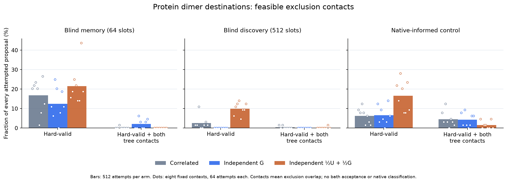

# Dimer destinations: source coverage and feasible contacts

This passive screen asks whether putting a uniform component **inside** the
joint proposal repairs poor source coverage while retaining feasible contact
destinations. It tests a frozen saved growth state; it generates no depletant
clouds, physical acceptances, equilibrium samples or assembly trajectories.

The two-sphere comparison measured a lower auxiliary cost, but the first
protein probe found a severe source-tail penalty in a historical 96-component
atlas. That isolated, hand-picked dimer does not establish coverage of the
current blind atlas or of aggregate-embedded environments. This new comparison
uses a predetermined panel and complete attempted-draw denominators.

## Fixed comparison

The source is the archived sweep-7400 state with 264 rigid tetramers at
**1.4 Å, 0.0275 Å^-3 and 500 μM**. It is a growth diagnostic, distinct from the
original physical decision conditions of 1.5 Å, 0.035 Å^-3 and approximately
106.8 μM. Poses are already in the sphere-centered frame.

The panel contains four moving pairs, two whole components and two pairs
embedded in larger components. It retains event 1 from each archived reset
phase only when that event has two members, deduplicates pairs, and selects lexicographically
from distinct parent components within each stratum. Each pair receives two
fixed anchors: its nearest spectator and its nearest distinct spectator outside
the parent component. The complete eligible table and all source witnesses are
retained. Neither acceptance outcomes nor native labels select the panel.
This is a small deterministic panel, not a random sample of equilibrium
neighborhoods.

Three frozen proposal sources are compared:

- The 64-slot all-slot contact-memory export, with no native-label filtering.
- The 512-slot FFT/depletion discovery model used by the live blind growth run:
  1,024 stored Gaussian components and 2,048 reciprocal branches.
- The native-informed coverage atlas as a positive control.

Each uses three laws: the existing involutive map at correlation 0.7, a learned
independent redraw, and a defensive independent redraw. There are **64 attempts
per law, atlas and context**, totaling **4,608**. Each attempt starts from the
same archived source. No invalid attempt is replaced, and no result changes the
fixed allocation.

For each relative tree edge h, the defensive density is

\[
F(h)=\tfrac12 U_{160}(h)+\tfrac12 G(h).
\]

U is uniform in the relative translation cube [-160,160]^3 ų and normalized
Haar orientation. This fixed cube contains all old panel edges; the Gaussian
part retains its tails outside it. Both mixture terms enter every old and new
density. The independent proposal correction is the product of the two old F
values divided by the two new F values. The child is decoded relative to the
**new** root. The learned-only independent arm isolates the uniform component
from the change in correlation. Replacing G by F in the old correlated map's
correction alone would describe a different, incorrect generator.

## What the screen measures

Every finite endpoint receives full atomic hard-core and wall checks, and an
instantaneous exclusion-contact fingerprint including the moving pair and all
physical spectators. Core-invalid and wall-invalid endpoints remain in the
ledger. The analysis reconstructs tree coordinates, complete densities and
proposal corrections independently, and reports results by source environment
and proposal branch as well as in aggregate.

A better proposal factor is not a physical acceptance probability or an upper
bound on it. Binary exclusion contact is not overlap volume or native registry.
Preserving these contacts does not establish preservation of many-body solvent
weight. The experiment can identify destination-feasibility and source-coverage
failures before paying for a bath calculation; it cannot decide thermodynamic
stability or contact ESS per CPU.

The labels are fixed for each diagnostic cell, so its selection correction is
zero. Integrating a deforming dimer into production with configuration-dependent
eligibility or anchor selection still requires the corresponding reversible
selection law. The production oligomer kernels are unchanged.

## Completed result

All **4,608** proposals completed once in **6.602 CPU seconds**. The independent
Python audit passed **841,701 checks**, including every atomic hard-core,
exclusion-contact and wall predicate, in 108.095 CPU seconds. All endpoints were
finite; 475 were hard-valid. No Poisson clouds or physical decisions were made.

Each table entry uses all **512 attempted proposals** in that atlas/law arm.
“Both edges” means a hard-valid endpoint with exclusion contact root–child AND
root–fixed-anchor. It is an instantaneous geometric diagnostic, not native
registry or an accepted attachment. The plot's dots expose the eight fixed
contexts; these are not eight independent equilibrium populations.

| Proposal atlas | Correlated: valid / both edges | Independent G: valid / both edges | Defensive: valid / both edges |
|---|---:|---:|---:|
| Blind memory, 64 slots | 86 / 1 | 64 / 11 | 110 / 0 |
| Blind discovery, 512 slots | 13 / 2 | 0 / 0 | 51 / 1 |
| Native-informed | 32 / 23 | 34 / 22 | 85 / 8 |

The defensive component improves source coverage, but **153 of its 246 valid
endpoints have no exclusion contacts at all**. Of the blind discovery model's
51 valid defensive destinations, 45 arose from two uniform branches. The
learned-only independent arm has internal core collisions in 479/512 rows and
fixed-anchor collisions in 485/512; these categories overlap. Its zero valid
endpoints are an observation in this allocation, not a proof of zero feasible
proposal mass.

Among hard-valid endpoints, median joint log proposal corrections change from
−1,625.83 to −16.39 for correlated versus defensive memory proposals, and from
−2,098.00 to +24.61 for the corresponding discovery proposals. The native
control changes from −46.47 to +0.007. These compare different endpoint laws;
they are not paired physical free-energy differences or acceptance gains. In
particular, favorable proposal factors for destinations that lose contacts may
be offset by unfavorable depletion factors.

The native-informed atlas produces more feasible two-edge contacts in this
panel. The geometry-only products still have both steric and source-coverage
limitations. Neither result establishes finite-system thermodynamic stability,
native-blind assembly, or model failure.

## Numerical audit and provenance

The covariance map and scorer currently refactor an exported covariance using
different arithmetic. The independent audit reconstructs both versions. Their
complete log densities agree at the old panel edges to 4.55e-13 or better.
Across the new endpoints, the largest map/scorer difference is 9.30e-8 for the
native atlas, 4.55e-12 for discovery, and zero for the diagonal memory atlas.
Large absolute differences in negligible-weight, extremely remote native
component tails are retained separately. These observed differences do not
explain the steric or source-tail failures, but do not prove exact coefficient
closure. A shared prepared-factor/density path would remove that avoidable
implementation distinction before broader kernel promotion.

The largest independently reconstructed logged density error is 2.55e-11;
the joint proposal-factor error is 5.17e-12. One geometry witness lies within
1e-8 Å of an examined threshold; it remains in the record and its predicates
agree. There were no geometry mismatches or relaxed acceptance tolerances.

The first audit stopped during metadata authentication: Python 3.13's changed
built-in floating-point summation differed from Python 3.9 preparation by at
most 1.42e-14 in 14 redundant coordinates. Explicit ordered summation reproduces
all frozen panel fields **bitwise**. The separately frozen recovery retains the
original failed output and changes no proposal, source, threshold, allocation,
density or geometry check. All 15 analysis/panel/helper tests pass; the Rust
example's two contract tests pass. No proposal was rerun.

Artifacts are under
[`results/dimer-destination-probe-20261002`](../results/dimer-destination-probe-20261002):

- [Audited summary](../results/dimer-destination-probe-20261002/audited-summary.json)
  and [complete recovered audit](../results/dimer-destination-probe-20261002/analysis-recovered.json).
- [Original numerical-factor report](../results/dimer-destination-probe-20261002/factor-quantification.json)
  and [metadata recovery receipt](../results/dimer-destination-probe-20261002/analysis-recovery-receipt.json).
- Config SHA256: `0bde358181834b1848b2b6dbebe84d1b7747bb9faeb6d7a0ac5ce79b3b018237`.
- Protocol SHA256: `6c266e7040ab00c7d03d3d10175b702f8918d49ac15eb0ee8426a26f29ada62e`.
- Executable SHA256: `e78afd8f6b32555db49c2c7922ef3f5227e8fe71664853946a2ff756621778a2`.
- Attempt ledger SHA256: `b8ccd1f1ad2930ffd8ae77daffda2e51ba65185ae1d9699bf1d360960bf159a0`.
- Recovered audit SHA256: `fb3a2d8d09d7e7afd858787039362530490a0cbe211f6b373b09f39c2652d6e2`.

The [plot generator](../tools/plot_dimer_destination_probe.py) requires a
completed passing audit and authenticates the plotted configuration. Its
[derived counts](assets/dimer-destination-probe.json) bind both source files.

## Next construction to assess

The evidence favors feasibility conditioning over promoting the raw independent
product. A minimal candidate retains fixed labels and spectators, and conditions
the **whole joint independent draw** on a hard-valid endpoint with an internal
dimer exclusion contact. For a source already in that set, the predicate and
proposal law are identical in reverse, so a fixed finite cap of redraws has a
common success prefactor that cancels. The remaining proposal ratio is the same
complete joint F ratio. Sources outside the set receive a self-loop in this
particular channel; other kernels supply their transitions. Every raw failed
trial and every outer rejected state must be retained.

This construction needs implementation and balance/reference checks; it is not
a result of this screen. It would avoid paying for bath evaluations on many
contact-free destinations but cannot guarantee external registration or a
speedup per CPU. Adding a requirement to contact a particular external anchor
would further restrict the source set and cannot silently create an attachment
kernel from sources outside that set. Configuration-dependent pair and anchor
selection remains a separate production obligation.

The [one-step sphere control](dimer-one-step-stationarity.md) also retains a
predeclared stationarity rejection for the defensive/world-bath combination.
That unresolved validation flag and the original contact-weight convergence
gates remain in force. The newly measured protein feasibility does not override
either, and no production assembly kernel was changed.
