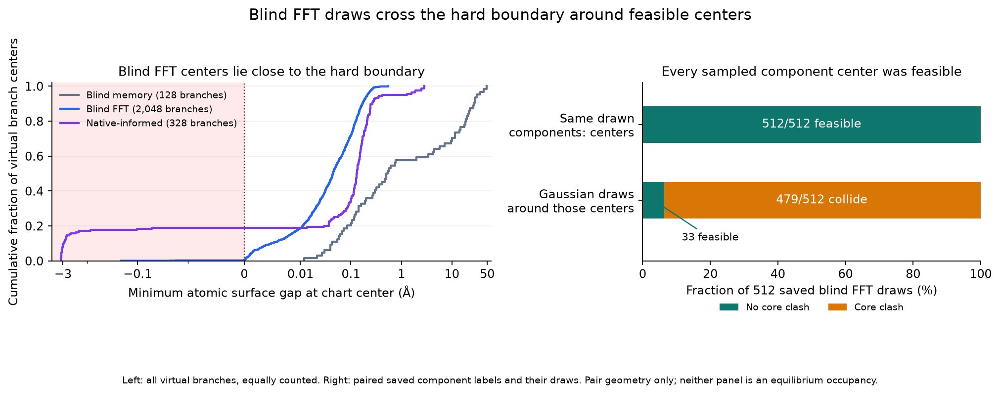

# Protein atlas centers and saved internal collisions

The current native-blind FFT atlas has core-valid centers for 2,042 of its 2,048 virtual branches. In the earlier passive independent-G screen, all 479 internally colliding draws came from branches with core-valid centers. Clashing centers therefore do not explain those observed failures. Geometry-aware proposal widths or an exactly corrected support condition deserve the next investigation; this audit does not identify a particular covariance direction or quantify its causal contribution.

The left panel counts all virtual centers without mixture weighting; the right panel joins each saved draw to its own selected center. [Figure data and input hashes](assets/dimer-mean-clearance.json) preserve the distinction between these measures.

The deterministic audit evaluated every stored component at standardized latent zero, including every active reciprocal branch. This means the actual prepared map's decoded Gaussian center, including the stored nonzero chart mean, rather than simply the reference pose. One tetramer remained at identity and the second took that relative pose. There were no spectators, wall, stochastic queries, fitting, native-label filters, Poisson clouds or state updates.

| Frozen atlas | Stored / virtual branches | Core-valid centers | Weight of colliding center labels | Median minimum clearance |
| --- | ---: | ---: | ---: | ---: |
| Native-blind memory, all 64 slots | 64 / 128 | 128 / 128 | 0% | 0.520509 Å |
| Native-blind FFT, 512 slots | 1,024 / 2,048 | 2,042 / 2,048 | 0.284515% | 0.043864 Å |
| Native-informed coverage | 178 / 328 | 266 / 328 | 7.707073% | 0.131043 Å |

The weights are sums of normalized mixture **labels whose centers collide**, not collision probabilities under the Gaussian mixture and not equilibrium weights. Center counts likewise describe a complete deterministic list, not sampled proposal success. Here “core-valid” only concerns this isolated pair. It does not establish wall or surrounding-environment validity, or even exclusion contact.

For FFT, the fifth-percentile clearance is 0.001481 Å, and the maximum is 0.547883 Å. The provenance's 1,024 initial virtual branches all have core-valid centers. Six of the 1,024 refined virtual branches collide: forward and reciprocal branches of stored components 303, 381 and 925. Their worst clearance is −0.212806 Å. The other 99.715485% of normalized center-label weight is core-valid. The current atlas contains 512 slots, each with an initial and refined stored component; it is distinct from the historical 96-component blind atlas and the separate “converged” FFT model.

The saved-draw join uses all 512 previously audited FFT independent-G attempts, across the eight fixed source/anchor contexts. It joins the child edge's recorded `target_label.branch` to the exact center branch. Internal root–child overlap is invariant under the root's rigid placement, so this comparison isolates changes within the drawn relative chart from external crowding.

| Child-edge center | Sampled internal core-valid | Sampled internal core collision |
| --- | ---: | ---: |
| Core-valid center | 33 | 479 |
| Colliding center | 0 | 0 |

Thus every recorded internal collision is an excursion away from a feasible center. This is an exact classification of these retained draws. It neither estimates collision mass for an individual chart nor separates translation, rotation, correlation and curvature effects. It also does not explain the independent root–anchor collision category, which can overlap the internal category. Full Gaussian tails remain in the atlas; reducing or truncating them would require a newly defined proposal with its exact density correction. No atlas was altered here.

The atom-level calculation uses all 4,004 atoms and their actual four radius classes. For each moving atom, an exact KD-tree nearest-center query within each fixed-radius class finds that class's smallest surface gap; minimizing across classes and moving atoms gives the global minimum. The winning pair's distance is then evaluated directly. Strict negative clearance means overlap. All 2,504 frozen queries completed once, with no errors and no values within 10⁻⁸ Å of zero, in 18.44 CPU seconds. All 1,238 reciprocal pairs agreed on the overlap predicate; their largest clearance difference was 3.20×10⁻¹⁴ Å.

The FFT fit manifest binds the model and component-to-slot mapping. Its covariance rule keeps the full Gaussian and regularizes empirical covariance in baseline-whitened coordinates; the recorded translation/angular baseline scales are 1 Å / 3°, shrinkage 0.25 and variance floor 0.01. Its normalization preflight does not assert center hard validity. The manifest and fit metrics also contain stale equal-slot-mass wording: the actual `slot_allocation`, stored weights and `weight_activity=0.005` describe tempered search-score weights. The audit uses the stored normalized weights.

Reproducible artifacts are [the frozen query/config receipt](../results/dimer-mean-clearance-20261002/freeze.json), [all center rows](../results/dimer-mean-clearance-20261002/execution/queries.jsonl), [the complete analysis](../results/dimer-mean-clearance-20261002/execution/analysis.json), [the terminal receipt](../results/dimer-mean-clearance-20261002/execution/terminal.json), and [the provenance and saved-draw join receipt](../results/dimer-mean-clearance-20261002/postprocess.json). The join retains [all 512 rows](../results/dimer-mean-clearance-20261002/saved-draw-center-join.jsonl), binding the prior independently audited destination ledger. No proposals or geometry were rerun for that join.

| Binding | SHA-256 |
| --- | --- |
| Shape | `c7442034e7ffa4627b67c57a81117f0e9bc2d389ecf956a83dac2a5e915554c9` |
| Memory model | `b6d06b0a076d7f3cd4f591d116a77799b2dc4caa3ea6c21081ad5da8a45b3e9b` |
| FFT model | `c460dc61fb7bf9e76f1d4dca77987b5886ea82cdda5d703ea5de6a25733fcb08` |
| Native-informed model | `feb4011c622c3104bbe909a29685bd7f077e28f0c847f630c69d8fa87939c20e` |
| Frozen query list | `ba4342de8f281297b90e45c0176acae0401d215594b4c5f22562e7d4d110e2b9` |
| Frozen geometry method | `11be5b062e64f851577e63cd13d5b2abaa63b0f263000ba49b0314b712ec92b1` |
| Center ledger | `89f320d5ada106505fd02bee240ad406d30e88099d95013f3f99cdd4244748bd` |
| Center analysis | `1079c4945ca4543e0ce7a73a4d9e18ebb667fae575381d2950e8b6ff029ee9e7` |
| Prior destination ledger | `b8ccd1f1ad2930ffd8ae77daffda2e51ba65185ae1d9699bf1d360960bf159a0` |
| Prior recovered independent analysis | `fb3a2d8d09d7e7afd858787039362530490a0cbe211f6b373b09f39c2652d6e2` |

The current source closure includes the [prepared-factor density correction](docking-factor-closure.md); the earlier destination executable predates that scoring correction, while its generation map is unchanged. Both historical closures remain intact. The current [reusable auditor](../tools/audit_dimer_mean_clearance.py) accepts a frozen config and complete query list, verifies file/method hashes, requires a new output directory, and uses one worker with configured CPU/wall limits. It adds allocation, center, pose and weight validation to the preserved dated method. Three small tests verify heterogeneous-radius gaps against exhaustive pairs, reciprocal invariance, and rejection of filtered/reordered/noncenter queries. Future runs must freeze the new tool's own hash and independently authenticate their decoder; the tool does not infer how an arbitrary supplied pose was generated.

This diagnostic supports investigating geometrically appropriate widths or exact feasibility conditioning before another protein physical test. It does not establish a favorable Metropolis ratio, bath acceptance, equilibrium sampling, assembly or the resolution of the retained stationarity-control discrepancy.
