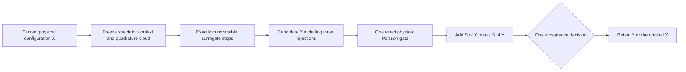

# Reorganizing contacts through a corrected surrogate chain

The completed two-root control does not justify more root-selection tuning.
Across eight chains, it accepted 54 of 36,864 collective attempts, versus 106
for the eight cached `m4` controls. Full sampling costs were 1,539 and 1,694 CPU
seconds. Neither patch efficiency nor external-contact occupancy improved
consistently across streams. The new chains completed no returns to a nonempty
external contact environment; `m4` completed two. These are conditional tests
at 1.4 Å, activity 0.0275 Å⁻³, with two mobile and 262 frozen tetramers.

The separate completed native-registry audit covers 128 earlier chains and
524,288 production endpoints. It finds no direct external native partner/motif
exchanges and no returns to a nonempty external native environment. The embedded
9/24 pair retains its source native attachments, while all its displaced starts
remain externally unbound. Thus neither contact motion nor attachment retention
has established equilibrium sampling. None of this refutes the finite-system
assembly target at 1.5 Å, 0.035 Å⁻³ and approximately 106.8 μM.

The next hypothesis is that several cheap, reversible steps guided by the
**whole overlap environment** can prepare a useful endpoint before paying for
one exact physical bath decision. This is a surrogate-transition construction,
as described in [Lykkegaard et al., Multilevel Delayed Acceptance MCMC](https://epubs.siam.org/doi/full/10.1137/22M1476770).
No new physical potential replaces the hard-shape/ideal-depletant target.



## Balance and support

For fixed context C, let the surrogate density be
\(s_C(X)=\mathbf1_D(X)\exp S_C(X)\), positive throughout the physically
allowed conditional domain D. A reversible random-scan inner kernel K targeting
s_C has reversible fixed powers K^m, including every inner rejection. Therefore
the outer proposal correction is **S_C(X)−S_C(Y)**. Combine this once with the
existing conditional-Poisson physical ratio and make one final decision.
The proof uses reversibility, not equilibration of the inner chain.

Each asymmetric atlas proposal must receive its own complete proposal
correction inside the inner MH decision. Adding that atlas factor again at the
outer decision is wrong. A deterministic ordered sweep is generally only
invariant; it cannot replace the reversible random-scan kernel in this argument.
Do not stop upon the first accepted inner move, keep the best intermediate, or
change the horizon according to the path. A state-independent distribution of
horizons or frozen clouds is permissible. Numerical failure is fatal, not a new
trial or unrecorded self-loop.

A minimal first control can carry a dimer rigidly during the inner chain,
preserving its internal pair geometry. That channel is reducible on its own;
existing outer local moves supply internal rearrangement. A later flexible
inner chain needs the validated two-singleton bath path, because a common-rigid-
subset bath gate cannot account for changes in the internal exclusion union.
No production inner-chain kernel has been implemented by the passive probe.

## Implemented conditional kernel

[`rigid_surrogate_chain.rs`](../src/rigid_surrogate_chain.rs) now supplies the
fixed-label, fixed-handle rigid-dimer kernel for conditional benchmarks. Each
inner step proposes an isotropic Gaussian displacement of the handle and an
independent isotropic Cayley rotation on the left. These proposals are symmetric
with respect to translation volume and Haar orientation measure. All steps use
the same scales. The carried member is reconstructed from the **outer source**
geometry each time, avoiding cumulative distortion of the rigid pair.

The score cloud, spectators, labels and handle are fixed for the whole outer
attempt. Inner hard failures and MH rejections count toward the fixed horizon.
The endpoint receives one rigid-union physical Poisson gate and the correction
`old_score - endpoint_score`. A returned identity is a self-loop without a bath
draw. The actual physical state changes only after that final decision. A failed
resource or geometry calculation leaves the original state and a fatal record;
it is not converted into a physical rejection.

The existing conditional runner adds three opt-in arms:

| Arm | Inner steps | Guidance strength |
| --- | ---: | ---: |
| `rigid_surrogate_1` | 1 | 1 |
| `rigid_surrogate_8` | 8 | 1 |
| `rigid_surrogate_flat8` | 8 | 0 |

Their explicit policy is
`{"schema":"rigid-surrogate-policy-v1","proposal_scales":{"source":"local"}}`.
This uses the same per-step translation and rotation scales as the four existing
local moves in each block. The eight-step arms have a larger possible net
displacement; that is precisely why the unguided eight-step control is included.
The arms reuse the original frozen 16,384-point clouds and prepared starts. They
do not query native labels or redraw a cloud based on the current contacts.

Each block journals the four local outcomes, a durable collective-attempt start,
the complete inner path and physical outcome, and the retained state. Checkpoints
bind the cloud, scales, fixed step count and random-stream roles. An incomplete
attempt is preserved and stops continuation; it is never silently retried.

The prospective comparison is 24 new chains: three arms, two preparations and
four streams, each with 512 warmup and 4,096 production blocks. Sixteen completed
local/`m4` controls are reused once, rather than counted anew for each arm. Arms
share preparation and stream families, so cross-arm comparisons are paired.
All observations include rejected endpoints. The primary diagnostics remain
external contact-fingerprint efficiency per total sampling CPU, completed
environment exchanges, and agreement across preparations. This allocation is
conditional on a frozen environment at 1.4 Å and 0.0275 Å⁻³; it cannot establish
assembly or instability under the original decision conditions.

The implementation validation is recorded in
`results/rigid-surrogate-validation-20261004-v3/validation.json`: six kernel
tests, one independent physical-reference test and all 17 runner tests pass.
The earlier two receipts are preserved: the first stopped at a test-fixture
literal compile error; the second detected that a tagged unit enum silently
ignored an unwanted scale override. Using an empty struct variant now makes
that override fail as intended. Neither failure launched protein sampling.

The physical reference draws 4 × 1,024 independent configurations of a rigid
two-sphere body near a third sphere. Uniform translation and Haar rotation,
direct hard/wall predicates, and an independent Poisson-void test give exact
physical sources. The void region is the moving **union** outside the spectator,
so this reference includes triple shielding rather than summing pair energies.
Of the 4,096 sources, 1,530 exercise triple coverage. Each source undergoes one
actual outer-kernel step in each arm. Twenty paired pose/contact/overlap moments
pass the predeclared six-standard-error checks. The wrong-sign correction
control gives mean overlap change 0.33653 with standard error 0.01446, a
23.3-standard-error discrepancy. This is a sensitive finite-allocation diagnostic,
not a proof of all observables, floating-point execution, or protein mixing.

Runner tests include disk continuation for every arm and both preparations,
unchanged initial local updates, raw-versus-retained quadrature normalization,
all-hard inner paths, identity endpoints, exhausted bath budgets, and preserved
incomplete journal tails. The production executable is unchanged; only the
isolated conditional example is built.

The twelve new Python checks also pass: seven independent journal/score/pose
audits and five campaign-allocation/provenance controls. Receipt:
`results/rigid-surrogate-python-validation-20261004/validation.json`.
The fixed 24-chain benchmark was launched with one worker at
`/vast/xvg/tetramer-mc-runs/rigid-surrogate-dimer-context0-20261004`.
Its protocol SHA256 is
`b63fcf01c3183ecb52015530410af93e6e664704eb795adad81e6f83dc838a47`;
execution-plan SHA256 is
`5be5ee73baa8b6d051c353ba2d480605638f0dbe23de33599e892aaf3465c8c0`.
The archived observer is admitted only after all 24 terminal contracts complete
and their processes are drained. No efficiency outcome is asserted at launch.

## A fixed-cloud many-body score

Let E0,E1 be the two identical inflated sphere unions of volume v, and S the
Boolean union of the fixed spectators' exclusion bodies. Exactly,

\[
V_{\rm int}+V_{\rm ext}
=2v-|(E_0\cup E_1)\setminus S|
=\frac12\sum_{i=0}^1\int_{E_i}
 \left[2\mathbf1_S(p)+\mathbf1_{S^c\cap E_{1-i}}(p)\right]dp.
\]

This identity accounts for multiply covered regions; summing pair overlap
volumes does not. Use fixed body-frame box samples, retaining only points in
the already-inflated body. With N **raw** box samples, each retained point has
weight w=V_box/N. Both mobile copies use the same frozen cloud. A point counts
two units when covered by any spectator, one when unshielded but inside the
other mobile body, and zero otherwise. The score is z w/2 times the total.
The unknown body volume is an irrelevant additive constant.

The body transforms move the quadrature nodes. This is a deterministic function
of X for each fixed cloud, so the outer correction remains valid even for poor
quadrature. Sharing a cloud between the copies changes variance. It does not
justify treating its realized score as the exact physical energy. Regenerating
points until they favor the current pose would change the construction.

[`depletion_surrogate.rs`](../src/depletion_surrogate.rs) implements this score
with conservative center-bound spectator pruning. It is a standalone proposal
building block, with no hard acceptance, RNG, atlas, native labels or production
integration. Spectator membership is Boolean and both mobile labels must be
excluded from the spectator list. The probe adds the depletant radius once.

## Validation and fixed diagnostic

Five Rust tests check sphere lens volumes, empty and zero-activity limits,
duplicate shielding, exact boundaries, frame transforms, label swaps, pruned
versus unpruned evaluation, and asymmetric unions against direct atom
enumeration. Nine Fraction-only finite-state tests verify the surrogate balance
construction and exhibit failures for wrong-sign, omitted or duplicated
corrections, ordered sweeps and early stopping. They are not Lean proofs or an
end-to-end certification of a future physical implementation.

Five CLI controls check raw-count normalization, null retention, progress
journaling, tampered inputs, refusal to overwrite output, and preservation of a
completed source score when a destination fails. Evidence is in
`results/dimer-surrogate-validation-20261004`,
`results/surrogate-inner-chain-balance-validation-20261004`, and
`results/dimer-surrogate-cli-validation-20261004`. Builds are isolated; the
running production executable is unchanged.

The saved-endpoint diagnostic fixes 16 production slots per chain:
block 513+256j, j=0,...,15, across all eight completed two-root chains. It
retains every slot, including proposal failures. The two raw-cloud prefixes
are 4,096 and 16,384 points; there are at most 512 pruned endpoint scores and
32 additional unpruned controls. No new pose or depletant cloud is sampled.
Every score call is recorded before execution, with completed results retained
on a later failure. Limits are one thread, 300 CPU seconds, 600 wall seconds
and 4 GiB, with no retry.

Compare ΔS against the saved bath-count statistic
\(z[N_g/\lambda-N_l/(\lambda+z)]\), whose conditional expectation is the physical
log-weight difference. The saved log acceptance factor is a different random
variable. The plug-in count variance is
\(z^2[N_g/\lambda^2+N_l/(\lambda+z)^2]\).
These comparisons reuse clouds that guided the original proposals, and the
prefixes are nested: this measures conditional consistency and cost, not an
independent quadrature-error guarantee. Any subsequent sampling test needs its
own fixed allocation and must measure retained-state contact efficiency and
initialization agreement, not accepted-move throughput alone.

Completed source analysis:
`/vast/xvg/tetramer-mc-runs/two-root-dimer-analysis-20261004/analysis/analysis.json`
(SHA256 `e8c7deff33ffbfd9dadf2211169383e86e9d63e94afd6e563aadbe9817389db2`).
Native audit:
`/vast/xvg/tetramer-mc-runs/conditional-native-registry-audit-20261004/analysis/summary.json`
(SHA256 `07f25356cff250001bbc64fe3eef5b800581883fca9da6ec45a8a366136b8d68`).
Saved probe plan:
`results/dimer-surrogate-saved-probe-20261004/plan.json`
(SHA256 `fbfc5955ed6c7383080ca9e9403795778a7be4719ec5b91f39110f468e488c8b`).

## Completed passive probe

All 128 fixed slots were retained: 36 supplied a candidate and 92 were proposal
self-loops. Both cloud sizes completed, including 16 case/prefix pruning checks.
There were 348 total score calls with the unpruned controls, taking 1.70 CPU
seconds. Every pruning control agreed exactly in integer score units.

| Raw box points | Mean CPU / endpoint score | RMS discrepancy | Median absolute discrepancy | Largest absolute discrepancy |
| ---: | ---: | ---: | ---: | ---: |
| 4,096 | 0.839 ms | 7.01 kBT | 3.32 kBT | 15.16 kBT |
| 16,384 | 1.551 ms | 3.25 kBT | 1.75 kBT | 11.14 kBT |

These are descriptive comparisons across the 36 supplied candidates, not 36
independent error measurements. Their saved Poisson reference has mean estimated
standard error 1.14 kBT. The larger prefix improves RMS discrepancy in seven of
eight chains, but the eighth worsens; its worst-chain RMS discrepancy remains
7.28 kBT. Mean score cost includes score progress journaling, but excludes cloud
construction and unpruned controls, which are recorded separately.

This supports a bounded trial of the corrected surrogate-chain construction.
It does not support omitting the physical correction or claim a sampling speedup.
Before production use, the inner-chain wrapper needs physical reference tests,
restart/failure validation and a fixed matched contact-efficiency benchmark.
The completed passive report is `results/dimer-surrogate-saved-probe-20261004/analysis.json`.

To reproduce the passive diagnostic with fresh outputs, build the standalone
example with an isolated Cargo target, prepare its fixed saved-slot manifest,
and pass the printed manifest SHA to the executable:

```sh
CARGO_TARGET_DIR=target-validation-two-root CARGO_BUILD_JOBS=4 \
  cargo build --offline --locked --release --example dimer_surrogate_probe
python tools/prepare_dimer_surrogate_probe.py \
  --root /vast/xvg/tetramer-mc-runs/two-root-dimer-context0-20261004 \
  --output results/surrogate-reproduction
# Use the SHA printed by the preparer; OUTPUT must not already exist.
target-validation-two-root/release/examples/dimer_surrogate_probe \
  results/surrogate-reproduction/plan.json PLAN_SHA results/surrogate-reproduction/execution
```

The executed campaign additionally used explicit CPU, wall-time and memory
limits recorded in its claim. This command is a saved-endpoint diagnostic,
not an assembly runner.
