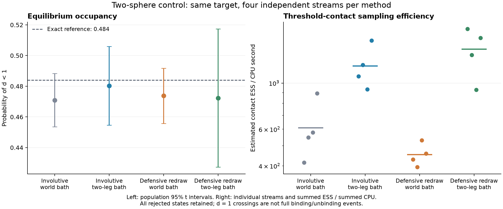

# Dimer tree control: a cheaper bath and a defensive proposal

Replacing the direct world-space auxiliary bath by the reversible two-singleton
path improves estimated threshold-contact ESS per CPU by **1.98×** for the
involutive proposal and **3.21×** for the defensive independent redraw in this
two-sphere control. Each individual 95% contact-occupancy interval includes the
analytic reference, with residual uncertainty detailed below.
These are provisional reference-system efficiency estimates, not a protein
assembly result. A later, separately allocated
[one-step stationarity control](dimer-one-step-stationarity.md) rejects the
defensive/world combination's primary contact-change test (family-adjusted
p=0.007979). Its cause remains unresolved; passing arithmetic audits and the
individual trajectory intervals do not override that flag.

The target, four-chart atlas, sphere parameters, integration domain, Haar
refresh schedule, activity 1.5 and auxiliary intensity 24 are identical to the
[original reference](dimer-tree-equilibrium-control.md). That completed reference
was reused. Twelve fresh streams add four populations for each new combination:
the original map with the path bath, and defensive independent redraws with
either bath. Each stream has 2,048 burn-in and 16,384 production attempts, frozen
before sampling: **221,184 additional attempts**, with no extension or retry.

## What changes

The [singleton path](../src/singleton_path.rs) draws a fair order coin. Each leg
changes one selected body's pose using the unchanged co-moving `RigidSubset`
gate. The intermediate copies endpoint poses exactly. Reverse order visits
the same intermediate; the two positive bath ratios telescope. An intermediate
may violate hard cores because it is used only for auxiliary bath algebra.
The final endpoint is checked, both independently drawn leg factors are summed,
and the original proposal correction enters **one** MH decision. No intermediate
hard rejection or physical acceptance is inserted.

The separate [defensive proposal](../src/defensive_dimer_proposal.rs) independently
draws both relative poses from F=0.5 U+0.5 G, with U uniform in the relative cube
[-2.5,2.5]^3 times normalized Haar orientation and G the frozen atlas. The full
product F ratio is used at both endpoints, irrespective of the drawn branches.
It is not a modification of the correlated map's density correction. The child
is reconstructed relative to the new root. Both kernels use fixed labels here;
state-dependent cluster/tree selection still needs its own balance argument.

## Results and retained limitations

The exact probability of d<1 is **0.484047109**. Table errors are independent
four-stream standard errors; figure intervals use Student t with three degrees
of freedom. All rejected production states enter the 1,024-step batch ESS.

| Proposal / auxiliary bath | Contact probability ± SE | Contact ESS / CPU s | Completed d=1 roundtrips | Raw points |
|---|---:|---:|---:|---:|
| Involutive / world (reused) | 0.47093 ± 0.00545 | 609 | 2,835 | 98,416,722 |
| Involutive / two-leg path | 0.48024 ± 0.00806 | 1,210 | 3,229 | 12,967,807 |
| Defensive redraw / world | 0.47377 ± 0.00565 | 453 | 1,477 | 61,278,329 |
| Defensive redraw / two-leg path | 0.47232 ± 0.01414 | 1,456 | 1,699 | 5,267,300 |

The raw-point reductions are 7.59× and 11.63×; the smaller ESS/CPU gains include
proposal construction, geometry, logging and finite sampling noise. These are
matched bath comparisons within each proposal family. The correlated and
independent proposal families have different move laws, so this control does
not establish a general advantage of independent redraw or preservation of
correlation. The four per-stream efficiency estimates are shown in the figure
to expose their spread. Roundtrips cross d=1; they are not full dissociation
events, since exclusion spheres still overlap for 1<=d<2.

All three new groups pass the monitored moment checks against three estimated
population SE except one post-refresh child quaternion component in the
defensive/world group: −3.59 population SE, but only −0.44 batch SE. That flag,
and all four original-reference flags, remain recorded. All four Poisson
contact means lie below the exact value, despite their individual intervals
covering it; the fixed allocation was not extended to remove this pattern.
An explicitly exploratory equal-stream pool of all sixteen Poisson streams gives
0.474316, 2.35 between-stream SE (2.31 combined batch SE) below the reference.
The new defensive/path group also differs by 0.03473 between contact-start and
dispersed-start means, about 2.01 combined batch SE; the original-map/path
difference is about 1.78 batch SE. These
[saved-result diagnostics](../results/dimer-tree-comparison-20261002/exploratory-diagnostics.json)
were not preregistered pass/fail criteria. They are residual uncertainty, not an
established bias or something dismissed as proven finite-sample noise.
Four-stream uncertainty and batch ESS estimates remain diagnostic, not
guarantees against subtle bias or unseen slow modes. The efficiency figures are
point estimates; there is no complete convergence certificate or strong claim
of initialization agreement.

The protein saved-state probe separately predicts much lower point cost for
these paths but exposes severe source-tail penalties in the historical blind
atlas. See the [protein cost/coverage report](dimer-tree-protein-cost-probe.md).
The subsequent [4,608-draw destination screen](dimer-destination-probe.md)
confirms that the defensive redraw improves source coverage, but most of its
hard-valid destinations lose all contacts. Its physical-sampling benefit remains
unmeasured. Physical protein
benchmarks and finite-system conclusions remain behind the original regional
weight and coverage checks.

## Validation and reproducibility

Seven defensive-proposal tests, six singleton-path tests and three example
contract tests pass. The tests include normalized cube/Haar and pure-Gaussian
limits, complete mixture ratios, deterministic draws/null retention, both
reversed path orders, invalid intermediate hard states, nonunit-proposal
accepted-flow balance and preservation of partial diagnostics on failure.
Six independent Python tests cover reference quadrature, density reconstruction,
MH/state continuity, repeated-state ESS, relative cube support, and deliberate
Poisson/path-record corruption.

The frozen Python auditor independently reconstructs every new trajectory row:
complete G or F densities, domain/core decisions, MH factors and acceptances,
state continuity, copied intermediates and aggregate leg counts. Its largest
log-density residual is **1.29e-14**. It does not replay raw point clouds or
certify floating-point geometry. The
[completed receipt](../results/dimer-tree-comparison-20261002/completed-review.json)
binds 87 archived source inputs, all twelve ledgers and the reused reference
artifacts. Source and dependency snapshots plus executable hashes support this
reproduction; they are not a claim to capture every compiler/system dependency.

- Plan SHA256: `74dfed84e003ae506e9f4ec7dcc030596d4101507a96cfe49965f64d0c1f25ef`.
- Config SHA256: `336d683ed0d40ec5f2b1491eb5dc2e0303c187f5eec9e0707f3ea7723e9efe62`.
- Executable SHA256: `a06ae487a8abe05f96e2f0b80b1106163aa9034f136f0f1df4e852e6096ca1bf`.
- Analysis SHA256: `9dfbb0642dfed5172c39e628fb53926eb1e31957dd2e03f09409eab212ef8935`.

The [vector plot](assets/dimer-tree-equilibrium-comparison.svg) is generated by
[`plot_dimer_tree_comparison.py`](../tools/plot_dimer_tree_comparison.py).
For a new development reproduction, use the isolated build command in the
original reference report with
[`examples/dimer-tree-comparison.json`](../examples/dimer-tree-comparison.json)
and a fresh output directory. The per-chain `proposal_kind` selects `tree` or
`defensive_independent`; `arm` selects `analytic`, `poisson` or `singleton_path`.
`uniform_probability` and `uniform_half_width` configure only the independent
defensive proposal. The original default is `tree`; its archived reference
source, binary and results are unchanged.

The existing conditional-Poisson and pair-flow Lean results supply the bath
algebra. For the path, independent leg counts sum to Poisson rates proportional
to summed gained/lost volumes, whose difference telescopes. Identifying the
implemented path/order reversal and geometry with those assumptions remains an
implementation obligation; these new Rust kernels have not received a separate
end-to-end Lean certification.

The original involutive map and all production kernels remain available and
unchanged in behavior. Neither new standalone building block is wired into the
running assembly simulations.
