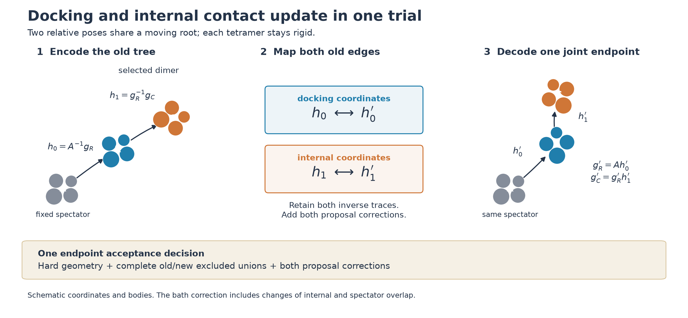

# Changing a dimer's internal contact while docking it

The existing oligomer kernels move a selected group by one common isometry.
Their two-contact charts describe alternative destinations for that one
six-dimensional rigid pose. They preserve the relative poses of its members.
Consequently, a selected misregistered dimer cannot correct its internal
registration and dock elsewhere in the same accepted trial. Single-particle or
differently selected subset moves can still rearrange it sequentially; this is
a limitation of the collective proposal, not a proof of a kinetic barrier.

The proposed extension uses two six-dimensional relative poses. It keeps every
tetramer's repaired atomic shape rigid. Only the arrangement **between**
tetramers changes. Its first implementation is a fixed-label proposal building
block, separate from production cluster selection and physical acceptance.



The [vector figure](assets/dimer-tree-proposal.svg) is generated by
[`plot_dimer_tree_proposal.py`](../tools/plot_dimer_tree_proposal.py). The bodies
and coordinates are schematic; the figure contains no simulation result.

## Two edges, one joint endpoint

Fix a spectator pose A, a selected root pose g1 and selected child pose g2.
Encode

\[
h_0=A^{-1}g_1,\qquad h_1=g_1^{-1}g_2.
\]

The first edge describes docking against the spectator; the second describes
the dimer's internal contact. Apply the existing posterior-source chart
involution independently to each edge, retaining both source/destination labels
and inverse Gaussian noises. Decode the joint endpoint as

\[
g'_1=A h'_0,\qquad g'_2=g'_1 h'_1.
\]

The child is placed relative to the **new** root. Changing only h0 gives a rigid
dimer move; changing h1 also changes its internal pose. Both may change before
one physical acceptance decision. There is no intervening accepted physical
configuration.

Let G0 and G1 be the normalized learned mixtures on the two relative poses.
They may be the same frozen geometry-only pair atlas. For a fixed spectator,
product center-volume and normalized orientation-Haar measure obey

\[
dg_1\,dg_2=dh_0\,dh_1.
\]

Conditioning on the root, left rigid multiplication preserves the child's
translation and orientation measure; applying the same argument to the root
establishes this triangular coordinate change. Its Jacobian is one in physical
pose measure. Each existing chart map still includes its own covariance and
Cayley/Haar Jacobian.

The posterior-source label law and the independent destination labels give

\[
\log R_{\rm proposal}
=\log G_0(h_0)-\log G_0(h'_0)
 +\log G_1(h_1)-\log G_1(h'_1).
\]

The expanded chart-Jacobian, auxiliary-noise and label factors must equal this
sum. Swapping both pairs of chart labels and applying both inverse noises
recovers the old edges, then the old world poses. At correlation zero, this is
a joint independent draw from the tree's product mixture. At nonzero
correlation it retains information from both old edges. The source/target
labels and noises remain random; the map conditional on that trace is
deterministic and invertible.

The prototype fixes all three labels. Their selection ratio is therefore one.
It uses the learned-only branch: the existing world-cube uniform redraw cannot
be copied into relative coordinates without checking its support and density.
Ordinary local and defensive uniform kernels can remain separate members of a
later reversible move mixture. This prototype does not remove them or claim
ergodicity by itself.

## Why the rigid-subset depletion gate is insufficient

Let B_X and B_Y be the Boolean unions of the selected tetramers' exclusion
regions, and E the fixed spectators' excluded union. Up to constants, the bath
weight is exp(-z |E union B|). Its ratio is

\[
\log\frac{W(Y)}{W(X)}
=-z(|B_Y|-|B_X|)
 +z(|E\cap B_Y|-|E\cap B_X|).
\]

The current `RigidSubset` gate cancels the first term because a common isometry
preserves |B|. That cancellation fails when the internal dimer pose changes.
With no spectators it returns zero, whereas two isolated spheres changing
their separation have a nonzero depletion free-energy difference. Thus the
joint map must **not** be connected to that gate unchanged.

A generic endpoint construction uses the full excluded unions
U_X=E union B_X and U_Y=E union B_Y. Choose a common, endpoint-symmetric cover D
of their symmetric difference. It can be refined geometrically; the retained
cover must contain every changed region. The ideal bath permeates the
protein-only wall, so D is not clipped to that wall.

Conditional on X, sample an auxiliary Poisson process in D with intensity
lambda+z in solvent-accessible space and lambda in excluded space, lambda>0.
Only changed points need to be retained. Let N_g count points in gained solvent
space U_X minus U_Y, and N_l those in lost solvent space U_Y minus U_X. Their
forward rates are respectively lambda and lambda+z. The combined physical and
auxiliary ratio is

\[
R_{\rm bath+aux}
=\left(1+\frac z\lambda\right)^{N_g-N_l}.
\]

To see the cancellation, write Delta V_f for gained minus lost solvent volume.
The physical ratio is exp(z Delta V_f); the reverse/forward Poisson density
ratio contains exp(-z Delta V_f) times the count factor. The unknown volumes
cancel in the **joint accepted flow**. This is not justification for inserting
an arbitrary noisy energy estimate into Metropolis acceptance.

Shielded points inside E contribute to neither count; each union is Boolean,
so triple and higher overlaps are counted once. A zero-volume changed set or
z=0 gives a unit bath factor. A useful implementation must check endpoint
hard cores, all spectators and the full atomic wall, and combine the bath,
proposal, selection and optional frozen-bias factors in one decision.

This general world-space cover may be much more expensive than the rigid
body-frame gate for large displacements. Correctness and that cost need separate
tests; the coordinate construction alone establishes neither acceptance gains
nor faster equilibrium sampling.

The existing Lean results
[`poisson_depletion_count_factor`](../formal/ReversibleSampling/ConditionalPoisson.lean)
and [`pair_flow_conditional_poisson_correct`](../formal/ReversibleSampling/PairFlowPoisson.lean)
already cover this Poisson algebra, including empty regions and singular
proposal pair flows. Here their bath observable is C(X)=-|U_X|, with
C(Y)-C(X)=|G|-|L|. No new core Poisson identity is needed. Identifying the
implemented joint proposal with the theorem's pair flow, measurable union
geometry, complete covers, exact thinning and floating-point execution remain
separate obligations. The prior checked theorem receipts are reused.

One possible later cost optimization is to reshape the dimer at its old root
and then carry the new internal geometry rigidly to the new root. A reverse
order coin makes the reverse path visit the same intermediate geometry. Use a
general world-coordinate gate on the reshaping leg and the existing co-moving
gate on the rigid leg, with independently sampled auxiliary clouds and one
final acceptance decision. The positive bath factors at the intermediate
configuration telescope; it need not satisfy hard-core constraints, which are
checked at physical endpoints. Reversal must exchange the actual legs and
their auxiliary traces, not just the coin. This is a design option, not an
implemented optimization or established speedup.

## Integration and validation boundary

The implementation is in
[`dimer_tree_proposal.rs`](../src/dimer_tree_proposal.rs) and
[`flexible_subset.rs`](../src/flexible_subset.rs). Seven proposal tests pass:
two-edge inverse reconstruction, reciprocal atlas branches, frame covariance,
fixed-seed reproducibility, null records, equality of the expanded and
product-mixture corrections including correlation 0 and 1, and an independent
12-by-12 finite-difference Jacobian check. Six bath tests pass: invalid inputs,
all endpoint checks, identity/zero activity, Boolean triple shielding,
endpoint-symmetric partial covers with brute-force witnesses, and analytic
isolated-sphere count means and accepted-flow balance. The latter uses 12,000
count draws in each direction. These tests do not establish equilibrium mixing.

```sh
CARGO_TARGET_DIR=target-validation-line-guide CARGO_BUILD_JOBS=4 \
  cargo test --offline --locked --test dimer_tree_proposal \
  --test flexible_subset -- --test-threads=1
```

All thirteen passed on 2026-10-02 (0.31 s and 2.04 s for the two test targets).
The first proposal-test run exposed an unnecessary weak fixture assertion about
different old densities at nearly identical old points. Replacing those inputs
with separated old points fixed that assertion; the required equal destination
at zero correlation already passed. No implementation or tolerance was changed
to clear it. Builds use the isolated validation target; the running production
executable and its behavior are unchanged.

Before protein trials, the combined kernel also needs an equilibrium reference,
beyond the individual map and gate checks. For equal
exclusion-sphere radius a, the pair overlap is
pi (4a+d) (2a-d)^2/12 for 0<=d<=2a and zero outside. The exact bath ratio for
two isolated hard spheres is exp(z [overlap(d_new)-overlap(d_old)]). Retaining
all rejected states, independently initialized equilibrium controls must agree
with that reference. A rigid-only or separately accepted edge-update control
then distinguishes a joint reorganization benefit from a larger proposal size.

Production integration requires its own subset-rate argument. The current
fixed-duration subset clock uses internal contact eligibility, and the rigid
charts also guard an unchanged rounded internal geometry key. A deforming
proposal cannot simply remove those guards: it needs endpoint-independent
selection, symmetric eligibility, or the complete reverse/forward rate ratio.
Dynamic tree selection likewise needs its label law accounted for. Closed-loop
contacts are physical constraints, not omitted just because a tree supplies
proposal coordinates. A trimer would add a third six-dimensional edge.

The eventual diagnostic is accepted simultaneous internal-basin and external
contact changes, then contact-environment ESS per CPU and initialization
agreement. It must compare frozen geometry-only and native-informed atlases
without native-label filtering. No proposal-only result, short trajectory or
fixed-scaffold integral decides finite-system native assembly.
