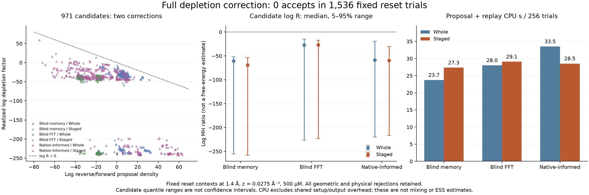

# Physical correction for staged dimer proposals

The [passive comparison](factorized-dimer-probe.md) improves destination
feasibility and proposal cost. This separate, frozen replay asks whether those
destinations survive the full many-body depletion correction. It is a reset-state
diagnostic, not a trajectory, an equilibrium measurement, or a native-assembly
test. The production sampler and ongoing growth jobs are unchanged.

**Completed result: zero accepted moves in all 1,536 outer trials.** The physical
runner and independent auditor both exited zero. All 971 candidate endpoints
received their single physical decision; all 565 geometric nulls were retained.
The staged move is not ready for a trajectory or production assembly comparison.

| Atlas | Whole → staged candidates | Whole → staged accepts | Median candidate log MH ratio, whole → staged | Proposal + replay CPU seconds, whole → staged |
|---|---:|---:|---:|---:|
| Blind memory | 169 → 174 | 0 → 0 | −60.82 → −69.43 | 23.72 → 27.32 |
| Blind FFT | 85 → 159 | 0 → 0 | −27.23 → −26.88 | 28.00 → 29.07 |
| Native-informed | 206 → 178 | 0 → 0 | −58.54 → −59.72 | 33.51 → 28.52 |

Every arm has 256 unconditional outer attempts. The candidate log-ratio summaries
condition on finding a candidate; the accepted counts do not. Medians of separate
log factors need not add to the median of their sum. Per-arm CPU includes saved
proposal work and all replay-row work; complete combined campaign CPU was
170.797 seconds, including shared setup/output overhead. The count/decision audit
used another 2.537 CPU seconds. There were 364,442,786 raw auxiliary points and
7,448,415 retained gained/lost points, within all fixed work caps.

Conditional on the realized poses and clouds, the sum of the 1,536 acceptance
probabilities is only 0.002007806. Thus zero accepts is unsurprising for these
independent MH uniforms. This is a conditional diagnostic for this fixed ledger,
not a converged estimate of a future acceptance rate. Two staged FFT candidates
contribute most of the sum. One preserves only the internal contact but loses
overlap; another gains an external contact and has a positive bath factor of
13.05, offset by a −20.21 log proposal correction. More geometric candidates per
CPU have not translated into demonstrated contact sampling.

## Why binary contact preservation was insufficient

The count record separates actual overlap change from auxiliary sampling noise.
Conditional on endpoints and the chosen path order, the intended cloud law is
\(G\sim\mathrm{Pois}(\lambda V_g)\),
\(L\sim\mathrm{Pois}((\lambda+z)V_l)\), independently on each leg. Therefore

\[
\widehat{\Delta\log\pi_{\rm bath}}
=z\sum_\ell\left(G_\ell/\lambda-L_\ell/(\lambda+z)\right),
\qquad
\hat v=z^2\sum_\ell\left(G_\ell/\lambda^2+L_\ell/(\lambda+z)^2\right).
\]

The first estimates the physical bath logratio; the second estimates its
conditional variance. These body-frame overlap differences telescope to the
change in the complete excluded union. They include shielding and multiple
overlaps. Intermediate contacts may increase variance without changing the
endpoint mean. The realized gate's log factor has downward expected-log bias;
its difference from this estimate is correlated and cannot be treated as an
independent noise sample or used to replace the acceptance rule.

The [saved-count diagnostic](../results/factorized-dimer-physical-20261002/count-diagnostic.json)
uses all 971 candidates, with no additional poses or clouds. Its median physical
bath logratio estimate is −38.21, with median conditional standard-error estimate
0.873 and median estimated auxiliary log penalty 0.384. This points to physical
overlap loss as the main problem in these proposals, rather than merely cloud
noise. These are descriptive conditional estimates, not equilibrium weights.

There is a particularly informative geometry-defined subset. Source pairs
13/215 and 18/234 have only their internal exclusion contact. Of their proposed
destinations, 374 likewise have no external contact. Both endpoints have exactly
the same contact fingerprint, yet 367 have negative estimated bath logratio.
The median is −36.57, corresponding to loss of about 1,330 ų of internal
exclusion overlap, while the median conditional standard-error estimate is
0.799. Maintaining a nonzero contact bit plainly does not maintain its overlap
volume. This is also why contact-fingerprint decorrelation alone will miss some
important internal rearrangements.

No finite-system stability conclusion follows. The next guide must preserve or
compensate substantial overlap while retaining its exact auxiliary and proposal
corrections. Simply retrying more binary-contact proposals or extending this
same reset campaign is not justified. The
[integration notes](factorized-dimer-integration-notes.md) retain the production
balance requirements for a later successful proposal.

## Fixed calculation

The replay consumes every saved outer row in immutable order: eight source
contexts, three atlases, 32 slots and two methods, totaling 1,536 decisions.
There are 971 candidate endpoints and 565 geometric nulls. No new poses are
drawn, no failed proposal is replaced, and no rejected physical decision is
retried. Each outer begins from the same archived 264-particle configuration.
Selected particles, anchor and all spectator poses match the passive audit.

These are the growth-diagnostic conditions: depletant radius 1.4 Å, activity
0.0275 Å⁻³ and concentration 500 μM. The original assembly decision conditions
remain 1.5 Å, 0.035 Å⁻³ and approximately 106.8 μM.

For every candidate, a fair coin chooses the order of two single-particle legs.
The first member moves to its final pose while the other remains at its source;
the second then moves in the copied intermediate environment. Spectators remain
fixed. The intermediate need not be hard-valid: it is an auxiliary path for
factoring the change of union volume. Both physical endpoints must pass the full
atomic core and wall predicates. Applying an intermediate hard filter would
change this path construction.

Each leg draws an independent implicit Poisson cloud, with auxiliary intensity
λ = 1.76 Å⁻³ = 64z. The production thinning law is reproduced in a local wrapper
that additionally enforces fatal resource limits. The two leg factors sum:

\[
\log W = \log(1+z/\lambda)
\sum_{\ell=1}^{2}(N_{\mathrm{gained},\ell}-N_{\mathrm{lost},\ell}).
\]

The one physical decision uses

\[
\log R = \log F_0(x_0)F_1(x_1)
       - \log F_0(y_0)F_1(y_1) + \log W,
\qquad \log U < \min(0,\log R).
\]

The full defensive mixture densities appear here; branch-only or selected
Gaussian densities would be incorrect. The fixed-context geometric conditioning
factors cancel as established in the
[factorized balance checks](factorized-dimer-balance-check.md). Label selection
and the tree-coordinate Jacobian are zero log corrections in this fixed-label
experiment. A configuration-dependent production selector would require a
separate balance argument.

Each outer has separately seeded gate and MH streams. Null proposals retain the
source and receive no bath. Their independently assigned MH variate does not
turn them into successful proposals. All rejected states, including every
spectator, are recorded. There is no sequential update between rows.

## Validation and limits

Four Rust controls compare the bounded wrapper with the unchanged singleton-path
sampler, exercise limit handling and the negative-infinite density case. Three
Python preparation tests check preservation of the cached ledger. Five further
Python test methods exercise the independent decision auditor, including count,
path-order, intermediate, density, state, seed, timing and rejection tampering.
The earlier passive audit independently checked all geometry and full proposal
density calculations.

A separate, clearly labeled synthetic 1,536-row fixture also passed the full
analysis pipeline and rejected an altered terminal count, a changed cache join
and a missing outer row. It used deterministic mock counts, never physical
clouds; its [receipt](../results/test-factorized-dimer-physical-synthetic-20261002/validation.json)
is separate from physical evidence.

The new auditor reconstructs both count factors, their sum, the full MH decision,
each retained state, cumulative counters and all 1,536 unconditional rows. It
also authenticates the passive audit, source states, compiled source comparisons,
cached row hashes and before/after input hashes. It does not regenerate cloud
locations or certify floating-point geometry or RNG quality. Those remain
implementation obligations, supported separately by the wrapper and reference
controls rather than by count arithmetic alone.

The predeclared caps are 20 million raw points per leg, 40 million per outer,
2 billion for the campaign and 1,200 CPU seconds. Exceeding a cap is fatal: the
planned count, processed prefix, partial counts and completed legs are retained;
no partial cloud supplies an MH factor. An incomplete allocation cannot be
reported as a complete rejection sample, and receives no replacement draws.

Timing includes the saved proposal cost and all physical replay work. Per-arm
timings exclude shared setup/output overhead; the complete campaign CPU is
reported separately, including setup from the first statement of `main` and
ledger flushing, but excluding final receipt serialization. Audit time is
separate. Neither accepted moves per CPU nor conditional acceptance probabilities
are effective independent contact samples per CPU.

## Reproduction records

The frozen packet is
[`results/factorized-dimer-physical-20261002`](../results/factorized-dimer-physical-20261002/).
It includes the protocol, all cached candidates and nulls, exact source and
binary bindings, the launch controller, exit records, full physical ledger and
independent audit. The protocol was frozen before any bath was drawn.

- Prelaunch SHA-256: `fa5088eb4f8394cbbbf2911f540fb8d8d4dc4bd508d13a452d40453b8b6a03fc`
- Cached ledger SHA-256: `c69f110739a567c409b135487d7a9ed5a686bd6ecc193eff4fb2d2133c651bfe`
- Executable SHA-256: `e1d62990825e659212a19f4271c0e2358e47374655cb8c30e5b2153e1cdfa437`

The executable is a bounded example, not an assembly runner. A future trajectory
comparison must retain local and collective schedules, rejected states,
initialization controls and native-blind coverage, and measure completed contact
exchanges and contact-fingerprint ESS. These reset trials alone cannot establish
assembly or refute the physical model.
