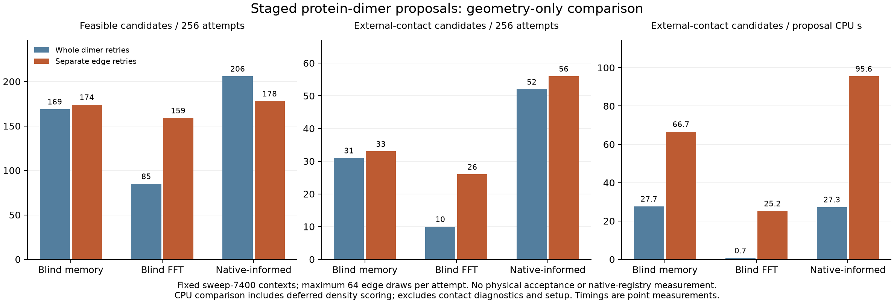

# Factorized protein-dimer proposal comparison

The staged sampler produces feasible destinations with fewer raw edge draws and
less proposal CPU in all three frozen atlases. This is a **passive proposal
result**: no depletant bath, physical acceptance, native-registry classifier or
state update was applied. The original finite-system assembly question remains
unresolved. The subsequent [physical replay](factorized-dimer-physical.md)
completed with zero accepts in 1,536 trials: the geometric improvement does not
yet yield useful physical sampling.

## Frozen comparison

The [factorized kernel](factorized-dimer-implementation.md) and whole-joint capped
kernel were evaluated on the same eight saved sweep-7400 contexts, with three
frozen atlases and 32 independent outer slots per context and method. These are
purposive environments from the 264-tetramer growth configuration at 500 μM,
depletant radius 1.4 Å and activity 0.0275 Å⁻³. They are distinct from the original
physical decision conditions, 1.5 Å, 0.035 Å⁻³ and approximately 106.8 μM.

Both methods use the same independent edge density

\[
F(h)=0.5\,U_{160}(h)+0.5\,G(h),
\]

where the uniform part is a relative translation cube times normalized Haar
measure and the learned part is the complete frozen singleton atlas density.
The selected root, child, anchor and fixed spectators are identical in both
methods. Their internal tetramer shapes remain unchanged.

Whole-joint sampling retries both edges together, up to 32 times. Factorized
sampling uses root-first order, a cap of 32 on each edge and a joint cap of one:
root validity is checked against fixed spectators and the wall; the internal
edge is checked for core clearance and exclusion contact; the assembled endpoint
then receives the complete geometry check, including the child's wall. An
exhausted first stage skips the second. A failed assembled endpoint is retained
without another joint draw. Both methods therefore permit at most 64 raw edge
draws per outer trial, although their expected work differs.

There were exactly **1,536 method trials**, with independent method RNG streams
and a separately frozen execution-order coin for each context and slot. They do
not share raw prefixes. All failures and consumed raw edges were retained. The
realized total was 41,628 edges, below the predeclared maximum 98,304; the
allocation was not extended. All eight source contexts were eligible.

## Feasibility and cost

Each entry below has the same unconditional denominator, 256 outer trials.
"Whole → staged" compares whole-joint retries with factorized retries.

| Frozen atlas | Feasible candidates | Raw edges | Proposal CPU, seconds | Feasible candidates per CPU gain |
|---|---:|---:|---:|---:|
| Blind memory, all 64 slots | 169 → 174 | 10,040 → 2,567 | 1.120 → 0.495 | 2.33× |
| Blind FFT, 512 slots | 85 → 159 | 13,582 → 5,202 | 14.162 → 1.030 | 25.72× |
| Native-informed, 178 components | 206 → 178 | 8,382 → 1,855 | 1.904 → 0.586 | 2.81× |

The staged native-informed arm produces fewer feasible candidates per outer
trial, despite its lower work per candidate. Its separate edge successes can
still fail when assembled, and this comparison permits no retry after that
final failure. Staged final failures numbered 79, 53 and 78 in the table's atlas
order; internal-edge exhaustion numbered 3, 44 and 0. There were no root-stage
exhaustions.

**The CPU comparison combines two implementation changes.** The factorized
sampler computes full mixture densities only after finding a feasible assembled
endpoint. The existing whole-joint baseline scores every complete raw pair
before testing its geometry. Thus the gain, especially for the larger FFT atlas,
is not an isolated measure of factorized conditioning. Raw edge counts help
separate reduced geometric search from this deferred-scoring benefit.

Proposal timing includes each call's source checks and density evaluation. It
excludes serialization, setup and the extra contact-fingerprint diagnostics.
Across all arms, proposal calls used 19.297 CPU seconds; the entire passive
process used 21.222 CPU seconds. The independent Python audit used 366.103 CPU
seconds. Timing values are single-run measurements, without timing uncertainty
estimates, and do not include any physical bath cost.

## What the contacts mean

Every feasible candidate retains an internal exclusion contact between the two
selected tetramers. This need not connect that dimer to its surroundings. An
**external-contact candidate** has at least one exclusion contact between either
selected member and a fixed spectator. "Both intended contacts" additionally
requires the chosen root–anchor exclusion contact alongside the internal one.
Neither definition measures native registry, contact free energy or bond
persistence. Even the native-informed atlas is scored here only by these
geometric predicates.

| Frozen atlas | Candidates with any external contact | Candidates with both intended contacts | External-contact candidates per proposal CPU gain |
|---|---:|---:|---:|
| Blind memory | 31 → 33 | 22 → 20 | 2.41× |
| Blind FFT | 10 → 26 | 8 → 7 | 35.75× |
| Native-informed | 52 → 56 | 41 → 49 | 3.50× |

The majority of feasible endpoints have no external contact. The blind FFT
staged arm increases the count with some external contact, but not the count
with the designated root–anchor contact. Thus its increased feasibility alone
does not demonstrate improved targeted docking. These are candidates per
unconditional trial or per proposal CPU, not accepted moves or contact ESS.

The full proposal correction also remains relevant. Median log reverse/forward
ratios were −18.27 → −18.69 for blind memory, +5.84 → +6.57 for blind FFT, and
−12.86 → −13.86 for the native-informed atlas. Those medians describe the
feasible-candidate sets, not equilibrium distributions or complete physical MH
ratios. They exclude the depletion contribution.

## Independent checks and provenance

The frozen auditor passed **2,122,664 checks**, independently reconstructing every
consumed raw edge from its saved branch and latent variates, all strict stage
predicates, first-success stopping, frame recovery, final endpoint geometry and
complete old/new product-mixture densities wherever candidate density
diagnostics were recorded. The largest full correction discrepancy was
1.45 × 10⁻¹¹; the largest learned log-density discrepancy was 3.27 × 10⁻¹¹. No strict predicate or frame mismatch occurred. Numerical/frame
errors would terminate with the partial ledger, rather than count as retries.
Near-threshold margin flags are available for audited complete candidates;
rejected staged edges have strict predicate checks but not a complete margin
witness report. These checks do not certify exact floating-point geometry.

Validation included one Rust runner allocation/RNG test and nine independent
Python tests, repeated from the frozen audit directory. The underlying module
suite separately passed eight factorized, eight capped and seven defensive
proposal tests. The receipt verifies 507 frozen source/input files, nine
historical source inputs and 39 bound outputs from previous result receipts.
The earlier stationarity rejection and the subsequent independently matched
control remain distinct, unchanged evidence.

The frozen run is
[`results/factorized-dimer-probe-20261002`](../results/factorized-dimer-probe-20261002/).
Useful records are its [`analysis.json`](../results/factorized-dimer-probe-20261002/analysis.json),
[`completed-review.json`](../results/factorized-dimer-probe-20261002/completed-review.json)
and [`prelaunch.json`](../results/factorized-dimer-probe-20261002/prelaunch.json).
The detached proposal process's OS exit code was not directly retained; its
explicit completed terminal record and all attempted rows were authenticated.
The independent auditor exited zero.

- Analysis SHA-256: `3facf648519de1e32433c0d1514f66b47716bc65400c804b87414bba22e9a450`
- Completion receipt SHA-256: `738c91a6d4a588626ce62fe567238db1ebf46683a474ad3684738795d1a98a1a`
- Attempt ledger SHA-256: `a3f17e8677410ac69009ce4c686113bb828e6c2fb48b2f80721535f144025ded`

## Next physical test

The saved 971 feasible candidates received one independently drawn two-leg
implicit bath and one full physical MH decision, while all 565 failed outer
trials retained their source state. The [completed replay](factorized-dimer-physical.md)
preserved all 1,536 unconditional trials and accepted none. Loss of overlap and
proposal-density penalties remain the bottleneck. No production integration or
trajectory extension is justified by this passive speedup alone.
