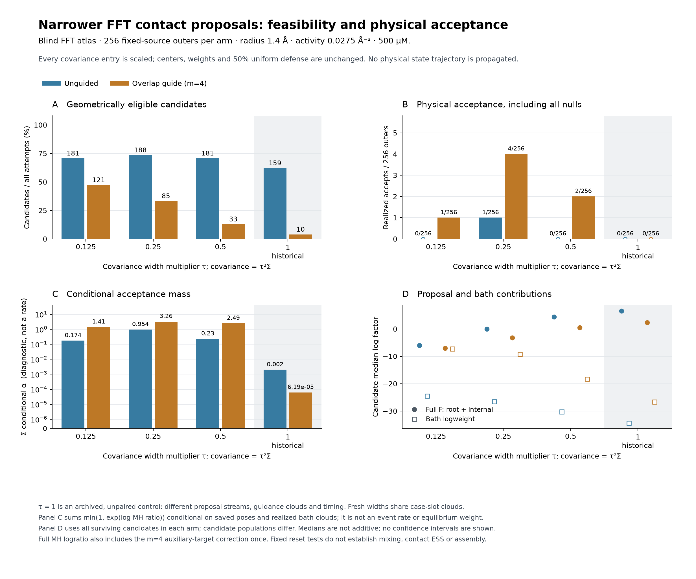

# FFT proposal width control

**Narrower FFT kernels produced eight accepted moves, including one docking
event.** The new external contact is not native; the same event changes an
existing native internal motif. This is a useful proposal result, while
equilibrium assembly and contact mixing remain unresolved.

Each table entry has 256 outer attempts, including proposal nulls. The τ=1
rows reuse historical decisions and are not paired with the fresh draws.

| Width τ | Method | Candidates | Accepted | Accepted external gains | Proposal/replay CPU proxy (s) |
|---|---|---:|---:|---:|---:|
| 0.125 | Unguided | 181 | 0 | 0 | 34.92 |
| 0.125 | m=4 guide | 121 | 1 | 0 | 26.22 |
| 0.25 | Unguided | 188 | 1 | 0 | 36.09 |
| 0.25 | m=4 guide | 85 | 4 | 1 | 19.27 |
| 0.5 | Unguided | 181 | 0 | 0 | 33.18 |
| 0.5 | m=4 guide | 33 | 2 | 0 | 9.20 |
| 1, historical | Unguided | 159 | 0 | 0 | 29.07 |
| 1, historical | m=4 guide | 10 | 0 | 0 | 4.07 |

All eight accepts start from whole-dimer contexts; none starts from the
embedded contexts. Seven retain only their internal exclusion contact at both
endpoints. One gains external edge `[18,104]` without losing an exclusion
contact. Thus neither accepted throughput nor this single docking event
establishes reorganization of an embedded aggregate.

The independent frozen native observer was applied to the source and **every
accepted endpoint**, including global catalogue-cycle consistency. All retain
157 registered native edges and a largest certified native component of 20;
none introduces cycle frustration. The docking event changes `[18,234]` from
motif 7 to motif 6, both in the C4 family. Its new `[18,104]` contact fails native
entry. The reported one gained and one lost native *label* are a replacement
on the same pair, not a net native bond gain. Labels were evaluated only after
MH decisions; they did not filter the atlas or the proposal allocation.

The saved decomposition explains why some moves now succeed. In the
internal-only stratum, guided τ=0.25 has median internal-F correction −1.82
and estimated bath logratio −3.14, whereas guided τ=0.5 has +1.15 and −7.17.
These are separate medians from different surviving candidate sets, not an
additive MH decomposition or equilibrium free energies. The docking event's
actual root-F correction is −31.34, internal-F correction −2.35, auxiliary
correction −0.052, and realized bath logweight +35.41: total log MH ratio +1.668.
The gained many-body overlap offsets a substantial docking density penalty.

Narrowing has a cost: at τ=0.125, the embedded `[8,255]` source pair becomes
97.3% uniform contribution to the defensive density. At τ=0.25 and 0.5, all
four internal source pairs remain learned-dominated. Root density remains
uniform-dominated in seven of eight contexts at those two widths. This favors
testing τ=0.25 further, but eight accepts do not identify an optimal width or
prove a speedup in independent contact sampling.

The saved FFT library has useful high-overlap centers and appreciable source
density at the four selected internal pair poses, but the inspected learned
draws frequently collided. That motivates changing covariance width without
discovering or selecting any new centers.

For each six-dimensional Gaussian, the transformation is

\[
\Sigma_\tau=\tau^2\Sigma,\qquad
x_\tau=\mu+\tau L\xi,\qquad \tau\in\{1/8,1/4,1/2\}.
\]

Every covariance entry is scaled, including translation–rotation correlations.
All 1,024 base components, 2,048 reciprocal branches, weights, nonzero means,
anchors and angular coordinate conversion remain fixed. The runtime rebuilds
the covariance factors without adding floors or jitter. Both tree edges use
the same new proposal. This is a whole-proposal width control; it does not
isolate internal width from root docking width.

The normalized proposal remains a 50/50 mixture of the learned distribution
and the existing uniform translation/Haar-orientation distribution. All
forward/reverse densities use the complete mixture and the implemented
coordinate Jacobians, not the chosen component alone. The previous capped
proposal and auxiliary-threshold balance arguments apply unchanged. Smaller
covariance can improve collision avoidance while worsening source coverage
and the density correction, so geometric yield alone is insufficient.

The fixed allocation is eight source/anchor contexts × 32 slots × three
widths × two methods (unguided and m=4 overlap guidance): **1,536 outers**.
Each case/slot has one independent fixed-size root-exclusion cloud, shared
across all six arms. Same-width methods share raw proposal prefixes. Different
widths can stop at different root draws, so internal draws are not assumed to
match across widths. The old τ=1 data are a historical, unpaired reference.
All nulls and rejected draws remain in the denominator. Unguided overlap
counts are unmeasured, not zero.

Conditions are the archived growth diagnostic: **1.4 Å, 0.0275 Å⁻³,
500 μM, N=264**. These remain separate from the original assembly decision
conditions of 1.5 Å, 0.035 Å⁻³ and approximately 106.8 μM.

The [predeclared allocation](../results/fft-width-probe-design-20261003/allocation.json)
also fixes one physical replay per saved outer after its independent audit
passes. Each replay resets the same complete source configuration. These
dependent, prescribed contexts are not an equilibrium population, a
trajectory, or a contact-ESS measurement.

Implementation: [`fft_width_probe.rs`](../examples/fft_width_probe.rs),
[`prepare_fft_width_probe.py`](../tools/prepare_fft_width_probe.py) and
[`analyze_fft_width_probe.py`](../tools/analyze_fft_width_probe.py).
The existing physical replay wrapper supports the unguided zero-auxiliary
control and the new frozen allocation; the many-body bath/path functions
remain unchanged. Production assembly kernels and the production executable
are untouched.

Validation comprises 3 Rust width tests, 5 preparation tests, 8 independent
auditor tests, and 7 Rust plus 16 Python physical-replay controls. All pass.
The independent protein proposal audit passes **1,241,235 checks** on all
1,536 outers and 28,397 raw edges. The physical audit verifies every reset,
count factor, complete correction, MH decision and retained state, with 536
frozen inputs. It reuses the unchanged validated Poisson geometry kernel;
unlogged point positions are not independently regenerated.

The campaign generated 4,194,304 guidance raw points and 348,700,509 physical
bath raw points. Actual passive plus physical execution cost was 160.978 CPU
seconds; independent audits cost 333.576 and 2.769 seconds. The table's
production-equivalent proxy charges cloud setup to guided arms and excludes
extra source-density/contact reporting work. Summed conditional acceptance
probability is 8.52565, evaluated on these saved candidates and bath clouds;
it is not an equilibrium mass or an event-rate estimator.

The next justified step is a **held-out contact-reorganization benchmark** of
the τ=0.25 guided proposal, including rejected states, competing/embedded
environments and patch-contact decorrelation per CPU. A short assembly run
alone would not resolve those questions. The original thermodynamic decision
also still requires the independent contact-weight/SMC reconciliation.

Audited artifacts:

- [Proposal review](../results/fft-width-probe-20261003/completed-review.json):
  `98dcec7bde436f93e92b93aeda3a3472e2c408e2d57b99fdc3a5f9ac87eb3bf1`.
- [Physical review](../results/fft-width-physical-20261003/completed-review.json):
  `2de887cb76c91040a29f8f20f94b79a56696ba3d41b51dacdb3905057d3b0f93`.
- [Saved-factor decomposition](../results/fft-width-physical-20261003/saved-count-decomposition.json)
  and [native endpoint labels](../results/fft-width-physical-20261003/accepted-native-analysis.json).
- [Plot receipt](../results/fft-width-physical-20261003/plot-receipt.json).

The initial plot layout is archived; its correction changed no numerical data.
The first native-analysis invocation stopped on an import-closure path error
before any classifier queries or output bindings; the corrected invocation
then completed once. No proposal or physical draw was repeated.
