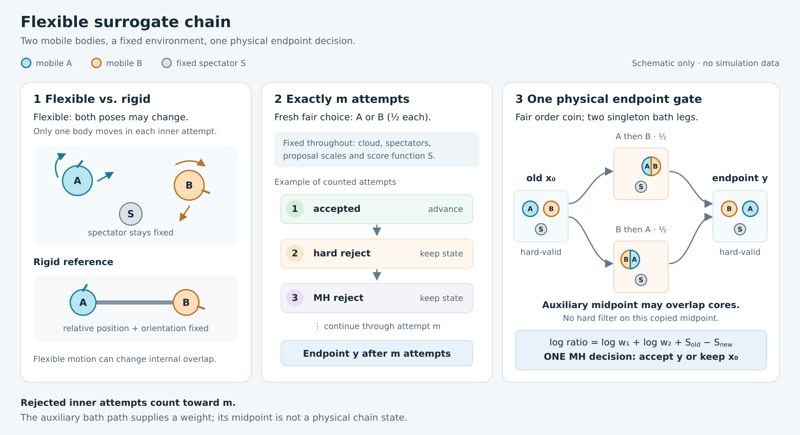

# Flexible pairs under one corrected physical decision

The completed growth replay identifies free single-tetramer docking onto a
four-body aggregate. Its two unregistered internal contacts remain unchanged.
The existing rigid surrogate chain can move a pair through its surroundings,
but its collective step cannot change the pair's internal geometry. The flexible
extension tests that missing degree of freedom without changing the physical
hard-shape/ideal-depletant model.

## Construction and balance

Keep two selected labels, every spectator pose, the body-frame quadrature cloud,
its weights, the proposal scales, guidance strength and integer horizon fixed.
The state consists of both independently variable poses. Use the existing
many-body score

\[
S(X)\simeq z\bigl(|E_0\cap E_1|+|(E_0\cup E_1)\cap B|\bigr),
\]

where B is the spectator exclusion union. It includes internal overlap and
Boolean spectator shielding. It is a deterministic proposal score for the
frozen cloud, not an exact physical energy.

At each of exactly m inner attempts, select either member with probability 1/2,
then apply the same symmetric translation and proper-rotation proposal to that
member alone. Check the full candidate against the other member, spectators and
atomic wall. Inner MH uses `S(candidate) - S(current)`. All rejections consume
a step. There is no stopping at a successful move, target contact, best score,
or internal separation.

Both coordinate kernels are reversible for the same hard-supported density
`exp(S)`. Their fixed-probability mixture K is reversible by linearity of
accepted flow; fresh independent member choices generate K^m. The kernels
need not commute. A deterministic alternating sweep would require a different
argument. The endpoint proposal correction is exactly `S(source) - S(endpoint)`.

The final physical correction uses the existing fair-order **two-singleton
path**, with independent bath draws on its two legs. The copied intermediate
may violate hard cores or the protein-only wall; it is an auxiliary geometry,
not an accepted physical state, and must not be filtered. Swapping source and
endpoint reverses the order and preserves the intermediate. The two physical
log factors telescope, and the order probabilities cancel. Make one decision:

\[
\log R=\log\widehat R_1+\log\widehat R_2+S(X)-S(Y).
\]

Using the rigid two-body gate here would incorrectly cancel changes in the
moving union's own exclusion volume. There is no separate acceptance decision
on an inner step's physical depletion energy or on either auxiliary leg.

This balance argument uses the count-law involution, not merely unbiasedness
of a random weight. Each leg exchanges gained/lost counts under reversal. Zero
volume has only zero counts on its support, so no volume ratio is needed.
Reversing the two legs and summing their log factors gives the endpoint physical
flow identity. Both initial and final states obey the physical hard constraints.

The Lean fixed-power theorem applies to this flexible state space once
the random-scan kernel's reversibility is established. The new checked
[two-leg bridge](../formal/TwoLegPoisson.md) discharges the fair-order count-law
specialization and derives invariance under the single endpoint correction.
Geometry, count-law execution, floating point and the mapping from Rust to the
mathematical kernel remain explicit implementation obligations.

## Validation boundary

This is a fixed-label conditional building block. It does not choose connected
clusters or claim that a configuration-dependent pair-selection law cancels.
Those selection probabilities require a separate construction in assembly.

Validation must include changing internal separation with no spectators,
spectator shielding, all hard and inner-MH rejections, fair coordinate selection,
fixed horizon, fatal budget paths without state mutation, and deterministic RNG
continuation. The physical reference must draw independently variable source
poses; the earlier rigid-fiber reference is insufficient. An independent
Poisson-void source sampler and direct sphere predicates can test actual
kernel stationarity with changing union volume and triple shielding. It must
retain all rejections and predeclare the allocation and negative controls.

The existing rigid benchmark remains unchanged. A unit-test pass alone is
insufficient to start a flexible protein campaign: independent physical validation,
journal reconstruction, matched proposal sizes and full rejected-state
observations precede an efficiency comparison. Neither a conditional reference
nor improved contact motion establishes finite-system equilibrium assembly.

## Independent reference allocation

The predeclared check uses four independent populations of 2,048 source states,
shared by three arms: one guided inner step, eight guided inner steps, and eight
steps with zero guidance. Two independently variable mobile spheres have core
radius 0.1, exclusion radius 1, and a hard container radius 1.6, with a fixed
third sphere at the origin. The physical activity is 0.5, auxiliary intensity
2, translation scale 0.25 and rotation scale 30 degrees. This small reference
is separate from the protein model's dimensions and decision conditions.

Uniform positions and Haar orientations, conditioned on direct hard-sphere
checks, supply source proposals. For each valid source, independent Poisson
clouds of intensity z in the two mobile bounding cubes test the disjoint sets
`E0 \\ B` and `E1 \\ (B union E0)`. Accepting only empty sets has probability

\[
\exp[-z|(E_0\cup E_1)\setminus B|].
\]

This is the physical density up to a constant, including variable internal
overlap and triple shielding. Testing the two complete exclusion balls
independently would double-count their overlap. Source generation uses direct
sphere predicates rather than the kernel's BVH or acceptance estimator.

All attempted source configurations, cloud points, inner attempts and outer
rejections are retained. The allocation and checks are frozen before execution.
The same guided eight-step endpoints and bath draws also supply omitted- and
reversed-correction controls; they require no additional physical sampling.
Fixed body quadrature guides the proposal, while a different world quadrature
measures some observables. Those quadrature observables are approximate; the
source Poisson-void law does not use them.

## Validation results, 2026-10-04

Nine focused unit tests passed. They include a changing internal exclusion
volume with no spectators, a hard-invalid copied auxiliary midpoint, failure
on the second bath leg after a nonzero first leg, and continuation from a saved
physical boundary with independently reconstructed RNG streams.

The fixed independent reference completed all 8,192 sources and 24,576 kernel
calls in 143.2 seconds wall time (125.4 seconds recorded experiment CPU).
All 38 paired observable checks per arm and the source symmetry/Haar checks
passed the predeclared six-standard-error threshold. The largest standardized
paired change was 2.19 for one guided step, 1.86 for eight guided steps, and
2.58 for eight unguided steps. The source set contained 6,990 configurations
with nonzero measured triple coverage and 1,005 without internal exclusion
contact, so neither a rigid-union nor a permanently bound limit explains the
result.

Omitting the correction increased the attraction-volume diagnostic by
`0.22370 +/- 0.01039` (one standard error); reversing it gave
`0.32315 +/- 0.00936`. Both exceeded the fixed sensitivity threshold. These
controls reuse existing candidate/bath/acceptance draws. No extra reference
sampling, replacement populations or threshold tuning occurred.

These are finite reference checks supporting correctness, not a proof of
protein mixing or equilibrium assembly. A conditional protein comparison must
measure changing internal contacts as well as exchange of external contacts,
retain every rejected state, compare initializations, and report independent
contact samples per CPU. Pair-label selection in an all-mobile assembly system
still requires its own reversible rule.

The [all-mobile integration audit](flexible-surrogate-all-mobile-design.md)
specifies a corrected neighbor selector, separates attempt-count scaling from
spectator-search cost, and records why the existing frozen body-frame cloud
can be reused. This design is not yet a production option.

Evidence under `results/flexible-surrogate-reference-20261004/`:

- Numerical validation receipt: `validation.json`, SHA256
  `84d0b14661f5b137cd84b130add0b6cb5fac6c691eb35d57c4af30d158f2428f`.
- Independent reference receipt: `reference/receipt.json`, SHA256
  `d5aac345bd46dabf525b59e7b5c309caf29dc1eb19734bfdc1f7529361c4801d`.
- Independent Python reconstruction of every saved inner/outer decision,
  retained state, path sum and count passed: `journal-audit.json`, SHA256
  `2f22d5e47fcf717299ca140b1b9beb15748c7eef5c424f8a899e0e5e46098c79`.
  Eight synthetic mutation tests covered that observer before the full pass.
- Source archive, compiled test binary, full source/point/kernel journals and
  predeclared protocol are retained there. The production executable remained
  unchanged. A preflight manifest mismatch was fixed before any numerical
  execution; its record is retained as `preflight-attempt01.json`.
