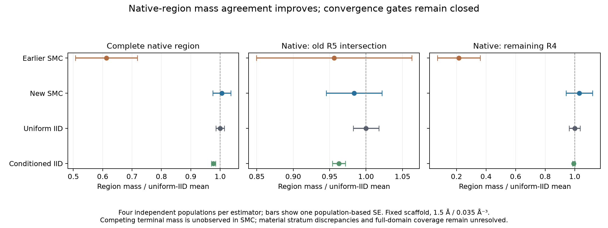

# Completed SMC comparison, 3 October 2026

The supplemental saved-data audits completed successfully for the remaining two populations. The frozen four-population analysis now agrees with both independent importance-sampling calculations for the principal native-region masses. No physical draws or classifications were repeated for this presentation.

All comparisons below use the same repaired shape, two-neighbor scaffold, frozen R4 domain, native definition, translation/Haar measure, depletant radius **1.5 Å** and activity **0.035 Å⁻³**. Each SMC region mass is its population's normalizer multiplied by its terminal indicator fraction. Population masses are averaged in linear units; terminal descendants are not treated as independent samples.

| Region | ln(Q new SMC / Q uniform IID) | ln(Q new SMC / Q conditioned IID) |
|---|---:|---:|
| Complete registered native region | 0.0056 ± 0.0337 | 0.0287 ± 0.0314 |
| Native intersection with old R5 | −0.0166 ± 0.0428 | 0.0215 ± 0.0401 |
| Native remainder of R4 | 0.0307 ± 0.0952 | 0.0368 ± 0.0880 |

The displayed uncertainties are combined delta-method standard errors from independent whole populations, not 95% intervals. All six principal comparisons pass the existing 0.2 kBT and three-combined-linear-SE checks. The native SMC population relative SE is 3.06%.

The earlier broad SMC estimate remains lower by 0.496 in log total native mass and by 1.567 in the native remainder outside the old R5 intersection. Agreement in the old intersection alone would have hidden this problem. The new aggregate agreement narrows the historical sampling discrepancy; it does not retrospectively validate the older estimates or identify every source of their error.

The full-vessel and assembly gates **remain closed**. Material radial/orthant strata still miss the absolute tolerance, even where their uncertainties include agreement. No terminal non-native contact or unbound descendants survive in these SMC populations. Their absence is neither a zero-mass estimate nor an upper bound; class-balanced independent sampling remains necessary for these contributions. Previously recorded IID proposal/population-size failures remain part of the evidence. Contributions outside the measured region also remain necessary for a finite-system conclusion.

The authoritative analysis is `results/hard-free-protein-smc-recovered-analysis-preparation-20261002/analysis.json`, SHA256 `12552e9a3168a58f9af9bce3e514669796fa32d22262ac8b56f2eeaa214c4dda`. The presentation script authenticates that artifact, extracts its existing statistics, and performs no additional classification. Its output is `results/hard-free-smc-reconciliation-20261003/summary.json`.

The physical conclusion is still unresolved. These are improved conditional contact weights, not proof of finite-system native assembly or instability.
