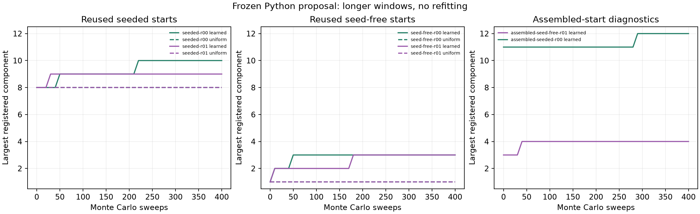

# Longer frozen tetramer runs

Four reused pilot initial configurations, fresh paired RNG streams; not new independent initializations. Assembled starts analyzed separately. Frozen Python kernel, no refitting or Rust speedup claim.

All runs use 400 fresh sweeps, the archived Python kernel and unchanged model `2e534634e6e2fe83da969a2867504c293af8e90a0cf3c4330cdc9e38a6770064`. Radius 1.5 Å; activity 0.035 Å⁻³; 12 mobile rigid tetramers; identical local controls. Paired methods share each initialization and a fresh RNG seed.

| Start / run | Final / maximum component | Motifs formed / broken | ≥50-sweep new incorporation IDs | Nonempty environment / unbound returns | CPU s |
|---|---:|---:|---|---:|---:|
| assembled-seed-free-r01-learned | 4 / 4 | 4 / 1 | [] | 0 / 0 | 203.7 |
| assembled-seeded-r00-learned | 12 / 12 | 1 / 0 | [] | 0 / 0 | 438.7 |
| seed-free-r00-learned | 3 / 3 | 9 / 1 | [] | 0 / 0 | 200.4 |
| seed-free-r00-local-uniform | 1 / 1 | 0 / 0 | [] | 0 / 0 | 84.1 |
| seed-free-r01-learned | 3 / 3 | 8 / 0 | [] | 0 / 0 | 178.4 |
| seed-free-r01-local-uniform | 1 / 1 | 0 / 0 | [] | 0 / 0 | 76.1 |
| seeded-r00-learned | 10 / 10 | 7 / 1 | [9, 10] | 0 / 0 | 359.2 |
| seeded-r00-local-uniform | 8 / 8 | 0 / 0 | [] | 0 / 0 | 540.6 |
| seeded-r01-learned | 9 / 9 | 5 / 3 | [8] | 0 / 0 | 344.3 |
| seeded-r01-local-uniform | 8 / 8 | 0 / 0 | [] | 0 / 0 | 588.1 |

Registration uses the existing full-tetramer relative-pose and external native residue-patch classifier. Formation, breakage, persistence and return counts come from every accepted move, not the ten-sweep frame cadence. All saved positions agree with replay; initial/final configurations receive an independent periodic atomic hard audit.

New incorporation requires ≥2 distinct registered neighbors in a component retaining ≥4 original seed bodies for ≥50 sweeps. Initial episodes are excluded as left-censored. Final persistent episodes remain right-censored; persistence does not establish equilibrium or a physical lifetime.

Environment returns count individual bodies returning to an identical registered neighbor/motif set after visiting a different set. Counts can share one collective event and are not independent round trips. Returns to the empty set after binding are reported separately. A lack of either return type means mixing has not been demonstrated.

The assembled-start tests were selected from successful pilot outcomes and have no paired baseline. They diagnose retention and start dependence. Comparing them with dispersed starts does not establish equilibrium, especially with finite inventory and association hysteresis.

These are repeats of four existing starts using fresh random streams, not additional independent initial configurations. Training and initialization include native examples; the frozen model is a proposal, not an equilibrium density. CPU time is not physical time. No nucleation rate, thermodynamic stability or Rust speedup is inferred.

Source artifact: `/home/xvg/protein-nucleation/results/learned-tetramer-long/assessment/`. The original run inputs, manifests, full trajectories, and all move logs remain there. This is the frozen Python campaign, separate from the Rust port validation.
