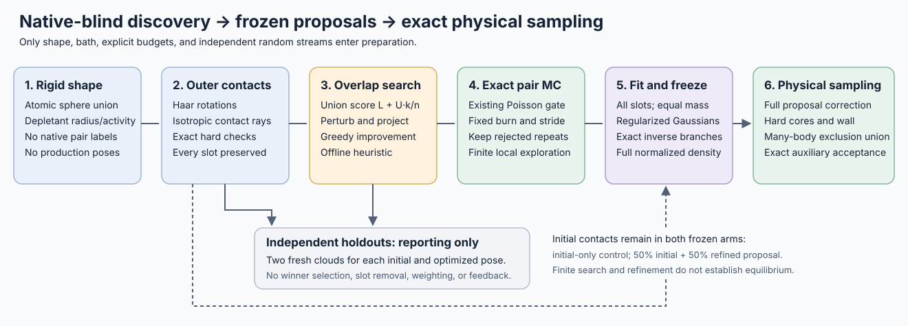

# Native-blind depletion contact discovery and frozen proposals

The [discovery implementation](../src/contact_discovery.rs) builds pair-contact
proposal data from the rigid sphere-union shape, depletant bath, explicit search
budgets, and random seeds. It first improves a finite overlap score with an
offline geometric heuristic, then refines each endpoint with the existing exact
anchored-pair Monte Carlo kernel. The [fitter](../tools/fit_depletion_contact_atlas.py)
freezes a normalized proposal before any production trajectory starts.



No inter-particle native motif, registration label, fitted native covariance,
native atlas, production trajectory, or production starting pose enters discovery
or fitting. The input rigid body may itself be a native tetramer; its internal
shape is the physical particle geometry. Native labels may be used only after
freezing, for evaluation. A supplied native seed in a later physical benchmark
does not turn its initialization into blind assembly.

**Geometry and heuristic search.** Each independent slot uses
`MemoryState::initialize` to draw a Haar orientation and isotropic separation ray,
find its outermost hard contact, and move outward by an explicit gap plus a
floating-point guard. This preparation is geometry-only and is not an equilibrium
draw. Contact witnesses record the tangent atom pair, surface point, and mobile
lever for the later rolling covariance.

For a relative pair pose \(A=(t,R)\), let \(E_A\) and \(E_0\) be its inflated
atomic **unions**, and define

\[
C(A)=|E_A\cap E_0|.
\]

`OverlapEnvelope` partitions the overlap into a certified interior of volume
\(L\) and a disjoint uncertain envelope of volume \(U\). With a fixed allocation
of \(n\) unconditional samples in that envelope and \(k\) exact union-membership
hits, the score is

\[
\widehat C=L+U k/n,\qquad
\widehat{\mathrm{SE}}=U\sqrt{(k/n)(1-k/n)/n}.
\]

The output also records a binomial Wilson interval transformed to volume units,
the geometric bounds \([L,L+U]\), and point/cell counts. Zero-hit scores retain
their full denominator; a zero estimated standard error does not imply zero
uncertainty when \(U>0\). Exact empty or fully certified envelopes need no random
point queries. Membership counts overlapping atomic spheres only once. A sum of
atomic lens volumes, or `log(overlap_weight)/z`, is not this score.

Each attempted search step independently selects orientation-only, ray-only, or
combined perturbation with equal probabilities, and a 1°, 4°, or 12° per-axis
small-angle scale for its Gaussian Cayley increment with equal probabilities.
It projects the proposed
orientation/ray back to an outermost radial contact with the same gap, rejects
invalid endpoints, and retains a candidate only when its score strictly improves.
Each slot reuses fixed pseudorandom score uniforms mapped through the candidate's
own envelope. This makes the finite objective reproducible; it can still favor
sampling noise. Projection and greedy acceptance are **offline optimization**,
with no equilibrium or reversible-search interpretation. At positive activity,
maximizing \(C\) also maximizes the pointwise pair depletion factor \(e^{zC}\). The
search itself has no activity-dependent Metropolis acceptance.

**Validation and exact refinement.** Initial and optimized poses each receive
two fresh fixed-size validation populations. Four distinct validation streams
are separate from initialization, search moves, search scores, and refinement.
SHA256-derived master-seed/slot/stream keys prevent budget-dependent stream
shifts and unintended stream reuse for adjacent job seeds. Holdout scores are
reporting data: they never select an endpoint, remove a slot, alter its weight,
or choose a covariance. Changing only the validation allocation leaves search
and refinement bitwise unchanged.

The optimized pose then initializes a one-slot `MemoryState`. Its exact target,
with respect to Cartesian translation and normalized proper Haar rotation, is

\[
\rho(A)\propto
\mathbf 1_{|t|<R_{\rm mem}}\mathbf 1_{\rm hard}(A)
\exp[-z_{\rm mem}|E_0\cup E_A|]
\propto
\mathbf 1_{|t|<R_{\rm mem}}\mathbf 1_{\rm hard}(A)e^{z_{\rm mem}C(A)}.
\]

The finite ball makes the pair law proper. Its default radius is
\(2(b+r_d)+g+2\epsilon_{\rm geom}\), where \(b\) is the shape bound and \(g\)
the initialization gap. It bounds the mobile origin, not every atom or the
ideal depletant bath. Other slots and production particles are absent from this
two-body environment.

`MemoryState::update` supplies the existing symmetric local translation/Cayley
proposal, hard/domain rejection, and exact conditional Poisson acceptance.
Global refresh has probability zero in this local refinement. The default
translation standard deviation is 0.2 Å, the per-axis small-angle parameter is
1°, and
\(\lambda=64z_{\rm mem}\) at positive activity. At zero activity every valid
local proposal is accepted. The approximate search score never enters this
physical transition. See [pair-memory balance](contact-memory-balance.md) for
the conditional gain/loss construction.

There are 256 attempted refinement steps per slot by default. Steps 1–64 are
excluded as preparation, and steps 68, 72, …, 256 are retained: 48 poses per slot.
Sampling is by attempted step, including unchanged poses after rejection. The
full move trace is archived. These finite, correlated traces are proposal-design
data; the burn allocation does not demonstrate stationarity, and retained
counts are not effective sample sizes or basin masses.

**All-slot fitting and the matched initial control.** Every slot contributes
one initial contact chart and one fitted chart. With \(M\) slots and frozen
initial mass \(\alpha=0.5\), their base weights are \(\alpha/M\) and
\((1-\alpha)/M\). No native score, overlap score, accepted-move count, or sample
count changes this allocation. The initial-only control uses those same initial
contact charts at weight \(1/M\), with identical widths and reciprocal
representation. It isolates the added search/refinement information from the
particular random outer contacts used to prepare this campaign.

The chart scale is shape-derived:
\(\ell=2\max(\mathrm{RMS}\text{ atom-center distance about their mean},
\max_a r_a)\). Initial charts have 1 Å independent translation width and 3°
per-axis angular width, with the existing contact-pivot rolling coupling. The
fit uses all retained poses in translation/Cayley coordinates about the optimized
contact, including repeated rejected states. Let \(B=LL^T\) be the corresponding
shape-contact rolling covariance, and let \(S\) be the retained population
scatter, with denominator \(n\). If
\(L^{-1}SL^{-T}=V\operatorname{diag}(d)V^T\), the frozen covariance is

\[
\Sigma=LV\operatorname{diag}\!\left(
\max\{0.75\max(d,0)+0.25,\;0.01\}\right)V^TL^T.
\]

The shrinkage 0.25 and dimensionless variance floor 0.01 are fixed proposal
regularizers. They are not measured thermodynamic stiffnesses. The fitter fails
the complete fit if a retained pose lies at its chart's Cayley seam; it does not
trim that pose or omit its slot. All Gaussian tails remain untruncated.

**Frozen density and physical balance.** For a chart anchored at \((t_k,R_k)\),
write \(c_k=\mathrm{Cayley}^{-1}(RR_k^T)\) and
\(x_k=(t-t_k,\ell c_k)\). The normalized Haar density in Cayley coordinates is

\[
J_H(c)=\frac{1}{\pi^2(1+|c|^2)^2},\qquad
g_k(t,R)=\varphi_6(x_k;m_k,\Sigma_k)\frac{\ell^3}{J_H(c_k)}.
\]

Thus each complete Gaussian chart integrates to one under
\(d^3t\,dHaar(R)\), and \(G(T)=\sum_k w_k g_k(T)\) is normalized. The fitter
stores the exact reciprocal mixture

\[
F(T)=\tfrac12G(T)+\tfrac12G(I(T)),\qquad
I(t,R)=(-R^Tt,R^T).
\]

Physical inversion preserves this measure. Both virtual branches contribute
their exact densities; transforming a Gaussian covariance is not a replacement
for the inverse branch. With four eight-slot populations, the discovered model
has 64 base/128 virtual components, and the initial-only model has 32 base/64
virtual components. These are predetermined allocations, not discovered basin
counts.

For an independent capture move using selected anchor \(j\), production adds
its configured uniform Cartesian/Haar branch of mass \(\eta>0\):

\[
Q_j(x)=\eta U_{\rm lab}(x)+(1-\eta)F(T_j(x)).
\]

The Hastings factor is the **complete** \(Q_j(x_{old})/Q_j(x_{new})\), including
every overlapping component and both reciprocal branches. Invalid raw draws
are rejected without redraw, clipping, or hard conditioning of \(Q_j\).
For the existing posterior-transport branch, the labelled involution instead
has the full learned-density correction \(F(T_{old})/F(T_{new})\), with the
runner's separate uniform branch unchanged; see the
[reciprocal proposal derivation](reciprocal-contact-proposal-design.md).

After endpoint selection, the unchanged production kernel evaluates hard cores,
the physical wall, and the exact many-body ideal-depletant interaction. Its
spectator region is the **union of all other bodies' exclusions**, not a sum of
pair scores. In the moving body's coordinates, let \(v_g\) and \(v_l\) be the
gained and lost spectator-overlap volumes. The auxiliary gate samples
\(N_g\sim\mathrm{Pois}(\lambda v_g)\) and
\(N_l\sim\mathrm{Pois}((\lambda+z)v_l)\) by exact membership thinning, and uses

\[
a=\min\left[1,
\exp(\Delta\log q)\left(1+z/\lambda\right)^{N_g-N_l}\right].
\]

Here \(\Delta\log q\) is the appropriate full proposal correction above.
The tilted lost-count law supplies auxiliary detailed balance. This is not a
noisy plug-in overlap energy. Fixed proposal information cancels from the target;
there is no search projection Jacobian or fitted basin normalization in
production. Approximate discovery, unequal success among slots, and an imperfect
Gaussian fit can affect efficiency while leaving this frozen physical target
unchanged.

**Reproduction and audit.** Run from `/home/xvg/tetramer-mc`. Every output directory
must be fresh. The standalone binary defaults to 8,192 samples per validation
cloud; the four-population pilot controller explicitly increases that fixed
allocation to 65,536. Its other search/refinement settings match the defaults.

```bash
cargo build --release --bin depletion-contact-discovery --bin tetramer-mc
python3 tools/run_depletion_contact_discovery.py \
  --shape examples/tetramer-shape.json \
  --out runs/native-blind-depletion-discovery-reproduction \
  --populations 4 --workers 4 --starts 8 \
  --search-steps 128 --search-points 2048 --validation-points 65536 \
  --refine-steps 256 --burn 64 --save-every 4 \
  --rd 1.4 --activity 0.0275 --seed 20260926301

python3 tools/fit_depletion_contact_atlas.py \
  --shape examples/tetramer-shape.json \
  --discovery runs/native-blind-depletion-discovery-reproduction/populations/r00 \
              runs/native-blind-depletion-discovery-reproduction/populations/r01 \
              runs/native-blind-depletion-discovery-reproduction/populations/r02 \
              runs/native-blind-depletion-discovery-reproduction/populations/r03 \
  --initial-weight 0.5 --shrinkage 0.25 --covariance-floor 0.01 \
  --translation-width 1 --angle-width-degrees 3 \
  --out runs/native-blind-depletion-discovery-fit-reproduction

python3 tools/benchmark_depletion_contact_atlas.py \
  --config runs/cluster-oligomer-seed8-free256-geometry/config.json \
  --initial-model runs/native-blind-depletion-discovery-fit-reproduction/model-initial-only.json \
  --discovered-model runs/native-blind-depletion-discovery-fit-reproduction/model.json \
  --out runs/native-blind-depletion-discovery-benchmark-reproduction \
  --streams 2 --sweeps 200 --sample-every 100 --workers 4 \
  --seed 20260926101
```

The fitter requires NumPy and SciPy. The discovery controller archives the input
shape and executable before launching four bounded workers. Each population
writes its exact source bundle, configuration, stream keys, attempts, scores,
contact witnesses, refinement trace, and retained samples. Its completion
manifest is written last and hashes every payload. The fitter verifies those
hashes, archives the complete inputs and source closure, validates chart
normalization and inversion, and writes immutable models plus fit/preflight
receipts. An incomplete directory is not a usable discovery population.

The matched benchmark launches two fresh streams per arm from the same supplied
seed8/free256 configuration. It holds bath, physical start, schedule, and budget
fixed while changing the frozen proposal file. Matching arm seeds do not imply
identical random-number consumption or independent paired errors. The supplied
seed is evaluation context only; its poses never feed discovery or fitting.
No native classifier is used to choose a move or accept it.

Focused [Rust controls](../tests/depletion_contact_discovery.rs) check analytic
sphere lens volumes, union counting with duplicate atoms, zero radius and zero
activity, deterministic replay, adjacent-job stream separation, holdout-budget
independence, preservation of every slot/repeated state, exact pair-kernel replay,
and CLI hash/completion/no-overwrite behavior. Run them with
`cargo test --test depletion_contact_discovery`. For an anchored hard sphere of
radius \(a\), the exact refinement reference is
\(p(r)\propto r^2e^{zC(r)}\), \(2a\le r<R_{\rm mem}\), with
\(C(r)=\pi(4A+r)(2A-r)^2/12\) for \(r<2A\), zero otherwise, and \(A=a+r_d\).
Existing [pair-memory stationarity tests](../tests/contact_memory_stationary.rs)
check that law independently of a burn-in assumption.

This bounded protocol does not enumerate all contact basins, estimate their
equilibrium weights, establish native accessibility, prove faster mixing, or
measure assembly stability or physical kinetics. Outermost-ray search can miss
interlocking pockets; short local exact refinement can remain trapped. Stronger
pointwise pair overlap is distinct from a larger basin mass, and compatibility
with a third neighbor requires the later many-body physical checks. Discovery,
validation, fitting, and production costs should be reported separately.

**2026-09-26 pilot results.** The fixed 32-start search at 1.4 Å and
0.0275 Å⁻³ improved fresh-cloud overlap estimates in 31 of 32 starts; all 31
improvements exceeded twice their pointwise integration standard error.
Mean union overlap increased from 86.84 to 260.91 ų. Thus the average
fixed-pose pair log-weight gain was 4.79, not an integrated association free
energy. All starts were retained, including the one whose heldout score fell.
The four discovery processes used 95.3 summed wall seconds (about 25 seconds
in parallel); exact refinement accepted 2,013 of 8,192 attempts and retained
1,536 scheduled states, including repeated states. The frozen atlas contains
64 base / 128 reciprocal components. Rust/Python density agreement was within
7.11e-15 in log density and the Jacobian check within 1.78e-15. Ten Rust tests,
13 fitter tests, and a production ingress smoke passed.

In the matched 200-sweep, two-stream many-body comparison, both arms accepted
zero learned independent redraws out of 23,897 attempts. Correlated learned
transport accepted zero out of 23,864 initial-atlas attempts and 23,817
discovered-atlas attempts. The average of the two run medians for the redraw's
log depletion factor improved from 0.81 to 1.66, while the proposal-density
penalty remained about 24.6–24.9. These summaries concern hard-valid proposals;
medians of terms do not add to the median total acceptance ratio. The stronger
pair contacts therefore did not yet produce useful capture moves. Sampler CPU
times summed to 245.2 seconds for the initial control and 248.1 seconds for the
discovered arm; this is not a mixing-speed comparison.

Native geometry entered only the separate, subsequent diagnostics. None of the
32 initial or 32 optimized centers satisfied the existing complete native-entry
definition; all 14 ideal native templates passed its positive control. At saved
sweeps 0, 100, and 200, every many-body run retained 13 native tetramer bonds
within the original eight-body seed and had zero native bonds involving the
initially free bodies. Intermediate transient events were not classified.
The result supports successful discovery of stronger non-native pair contacts,
but neither useful native-blind assembly sampling nor physical instability.
The next proposal-design target is broad coverage of extended contact basins
and their accessible pose volume, beyond outermost-ray overlap maximization.

Artifacts under `runs/native-blind-depletion-discovery-20260926/` include
`frozen-fit/`, `validation.json`, `posthoc-native-coverage/`,
`benchmark-after-storage-recovery/`, and `benchmark-native-diagnostics/`.
The first benchmark allocation in `benchmark/` stopped at filesystem exhaustion
and has no completed populations. It remains preserved and excluded. A separate
fixed four-population allocation with fresh seeds was recorded after moving
data to `/vast`; it is the comparison reported here. Original run paths remain
valid through symlinks. The benchmark controller now checks a conservative
output-size estimate before launching; concurrent writers can still consume
space after that check.

The same disk failure interrupted two existing growth jobs. Their archived
source bundles rebuilt to byte-identical original executables. One complete
sweep from each saved checkpoint reproduced all non-profiling move fields
(266 rows at sweep 67,501; 272 rows at sweep 4,001). Both were resumed toward
their original absolute target of 100,000 sweeps, with unchanged models,
configurations, RNG checkpoints, and output cadence, in fresh directories:
`runs/coverage-seeded-256-500uM-d00275-r14-2-resume67500/` and
`runs/cluster-oligomer-seed8-free256-2-resume4000/`. Original partial tails were
preserved and not appended to. Binary, replay, launch, and checkpoint receipts
are archived at `/vast/xvg/tetramer-mc-runs/storage-recovery-20260926/`.

## Exhaustive FFT pose scan (2026-09-26)

The pilot's random outermost-ray starts cannot reach interlocked interfaces.
Post-hoc, the 14 ideal native motifs have union overlaps of 188–1507 ų
(nine of them 697–1507 ų), versus a pilot optimum of 487 ų. So the pair
objective already favors native contacts, and the search was the limitation.

[`tools/fft_depletion_docking.py`](../tools/fft_depletion_docking.py) scans a
300,000-rotation super-Fibonacci SO(3) grid (maximum nearest-grid angle
3.07° in a 2,000-draw check). For each rotation, FFT cross-correlation of
1 Å indicator grids gives the inflated-union overlap \(C(t)\) and a clash
volume of cores shrunk by 0.5 Å for every translation. The four best local
maxima (3 Å suppression) with clash ≤ 2 ų and ≤ 10 ų are kept. The full
scan took 4,724 s wall time on 110 workers (1.4 CPU-days).
[`tools/select_fft_contact_starts.py`](../tools/select_fft_contact_starts.py)
takes the 10,000 best grid peaks from each clash class and repairs each one
to exact hard validity by greedy reduction of squared atom penetration
(19,330 of 20,000 succeed). It scores them with the exact envelope estimator
(`pair-overlap-score`, 8,192 points) and keeps 64 distinct contacts by
non-maximum suppression (4 Å / 20°, with a pose and its physical inverse
treated as the same contact). Only the particle shape enters these stages.

The resolution settings (1 Å grid, 0.5 Å shrink, about 3° rotation coverage)
were checked against the ideal native motifs before the scan: the native
overlap peak degrades between 3° and 6° of rotation error. That is a
calibration of resolution, not a selection; no native quantity ranks or
filters any candidate.

Supplied starts enter the unchanged discovery binary through
`--initial-poses`. Such slots use a local non-projecting greedy search
(0.1/0.3/1 Å translation and 0.25/1/4° rotation steps; same fixed score
uniforms, exact hard rejection, strict improvement). Their contact witness
is the globally closest atom pair (`kind = "nearest_pair"`), whose rolling
lever is measured from the pose origin. The fitter validates that witness
by an all-pairs check. Refinement, validation, the fit and the production
balance are unchanged.

**Results.** The selected 64 starts have exact overlaps of 1571, 1366,
1259, 1237, … ų. Mean held-out overlap after local search and refinement
is 810 ų (maximum 1523). Post-hoc, one start is native motif 8 (0.37 Å,
0.14°) and one lies 2.4 Å / 3.4° from motif 6, just outside complete entry.
The other 62, including the highest-scoring contact, are non-native pair
contacts of comparable strength. At the pair level the shape model supports
strong competitors, not only native interfaces. Native motifs weaker than
about 800 ų fall below the 64-contact cut.

In the matched 200-sweep, two-stream benchmark from the seed8/free256
geometry configuration (seeds as in the storage-recovery pilot), the atlas
fitted from these 64 slots accepted 12 of 23,897 learned independent
capture redraws. The pilot atlas accepted 0 and reproduced its earlier
counts exactly. Hard-valid fractions fall from about 33% to 6%, as expected
for charts centered on interlocked contacts. Correlated posterior transport
still accepted 0 of about 24,000 in both arms. At sweep 200 the FFT-atlas
runs have 5 and 6 complete native-entry bonds between initially free bodies,
one of them fully registered; the pilot arm has none. These are two short
realizations: evidence that native-blind proposals can now create native
contacts, not a rate, equilibrium or assembly-yield estimate.

Artifacts (on `/vast`, symlinked under `runs/`): `fft-depletion-docking-20260926/`,
`fft-contact-starts-20260926/`, `fft-seeded-discovery-20260926/` (populations
and `frozen-fit/`), `fft-seeded-benchmark-20260926/` and
`fft-seeded-benchmark-native-20260926/`. Post-hoc recall:
`tools/posthoc_native_recall.py <selected.json|discovery.json>`.

### 512 contacts and the frozen assembly maps

The same scan, with a 60,000-peak pool (30,000 per clash class), yields
57,756 hard-valid repaired candidates and 512 distinct contacts
(exact overlap 1386 down to 545 ų). The motifs are directed, so they form
seven inverse pairs. Counting pose inverses, post-hoc recall finds the two
strongest native contacts, {3,8} (0.17 scaled error) and {6,7} (slot 1:
motif 7 complete entry). The five weaker native contacts (about
190–780 ų) are not among the 512. At a native rotation, stronger
near-clash grid peaks can take the four peaks kept per rotation, so
recovering them would need a rescan that keeps more peaks.

With equal slot masses, the 512-slot atlas diluted the useful charts. It
accepted 1 of 23,897 learned captures versus 12 for the 64-slot atlas, at
about 45% more CPU. The fitter therefore gained
`--weight-activity z_w`: slot masses become proportional to
\(\exp(z_w\,C_{\rm search})\), using each slot's own search-side score.
Held-out clouds still never enter, and any positive frozen weights leave
the physical target unchanged. \(z_w=0.005\) Å⁻³ gives 60.6 effective
slots. Full pair-Boltzmann weighting at the physical \(z=0.0275\) would
put 89% of the mass on one non-native contact.

Matched 200-sweep, two-stream benchmark (the same seeds as above):

| Atlas | Learned captures accepted | Free–free native bonds at sweep 200 | Registered free–free edges | Sampler CPU (s) |
|---|---:|---:|---:|---:|
| pilot (32 radial slots) | 0 | 0 | 0 | 245 |
| FFT, 64 slots, equal | 12 | 11 | 1 | 230 |
| FFT, 512 slots, equal | 1 | 1 | 0 | 334 |
| FFT, 512 slots, tempered \(z_w=0.005\) | 15 | 14 | 4 | 343 |

Per CPU second the two useful FFT atlases are comparable. These are two
short realizations per arm, not rate or yield estimates.

**Frozen proposal maps for assembly runs:**

- `examples/frozen-blind-contact-mixture-512.json` (sha256 prefix
  `c460dc61fb7bf9e7`): 512 slots, tempered weights, 1024 base / 2048
  virtual components. Source: `runs/fft-seeded-discovery-512-20260926/frozen-fit-tempered-z0005/`.
- `examples/frozen-blind-contact-mixture-64.json` (`481524a9a335cc02`):
  64 slots, equal weights, about 35% cheaper per sweep in this benchmark.
  Source: `runs/fft-seeded-discovery-20260926/frozen-fit/`.

Both are ordinary `reciprocal-pose-mixture-v1` files for `--model`, for example:

```bash
target/release/tetramer-mc run --config examples/spherical-cluster-oligomer.json \
  --model examples/frozen-blind-contact-mixture-512.json \
  --free-tetramers 256 --tetramer-concentration-um 500 --seed 20260926 \
  --depletant-radius 1.4 --depletant-activity 0.0275 \
  --out runs/<fresh> --sweeps 10000 --sample-every 100
```

They were built for \(r_d=1.4\) Å. The contact search used only the shape;
the activity enters only through the refinement kernel and the weight
tempering. No native motif, label or production pose entered either map.

### Converged chart centers and the twisted competitor family

In an assembly run with the 512 map, the free tetramers formed native bonds
but attached to the seed in a disordered way. A contact census at sweep 600
explained it. The run had 11 strong non-native contacts, 10 of them map
slot 2, versus none in the native-informed run. Slots 0, 2 and 4 form one
family: the native contacts of motifs 7, 6 and 5 with the partner twisted
about 90° around its long axis and slid about 21 Å. This is not a symmetry
image (the shape changes by 6.3 Å rms under that rotation). As a single pair
it packs more excluded volume than any native contact (slot 2: 1656–1696 ų
after convergence; the best native is 1535 ų).

Some observed native seed placements have larger total overlap through multiple
contacts. In the native-informed run at sweep 600, seed newcomers had a median total
overlap of 2121 ų with their neighbors (maximum 4771), and 6 of 7 exceeded
the twisted single contact. These pointwise scores identify a strong competitor
and suggest trapping as a sampling concern. At z = 0.0275, the isolated-pair
overlap contributes about 45 kT to the log Boltzmann weight. This is neither a
basin association free energy nor a measured escape barrier. Comparing a
multi-neighbor overlap with a single contact does not establish which assemblies
are thermodynamically stable, or whether the observed disorder is kinetic.
That requires integrated contact weights and reversible reorganization evidence;
see the [physical-weight campaign](native-class-physical-campaign-review.md).

**Converged starts.** Rerunning seeded discovery on the same 512 FFT starts
with 2,000 local search steps and 8,192 score points (otherwise unchanged)
converges the native charts onto the motifs. {6,7} reaches 1530 ų
held-out (scaled error 0.94) and {3,8} reaches 1416 ų (0.14). They now
rank 1 and 2 by search score, and their tempered mass rises from 8.1% to
14.2%. Slot 2 remains the strongest contact. Mean held-out overlap rises
from 638 to 694 ų. With \(z_w=0.005\), the refit has 37.8 effective slots.

In the matched benchmark (sums over two streams at sweep 200), the converged
map accepted 18 learned captures versus 15. It formed 18 native bonds
between free bodies versus 14, and 14 strong twisted contacts versus 11, at
the same CPU cost (333 versus 338 s). Convergence thus makes the native
charts exact but does not change the native-to-twisted ratio (about 1.3).
Candidate sampling improvements include moves that exchange twisted contacts
and proposals guided by several neighbors. Lower activity is a separate
physical-model comparison, not an efficiency improvement at fixed conditions.
None of these short runs determines whether native order is favored at
equilibrium.

- `examples/frozen-blind-contact-mixture-512-converged.json` (sha256 prefix
  `fc353bcc0c120297`): source `runs/fft-seeded-discovery-512-converged-20260926/frozen-fit-tempered-z0005/`.

### GPU rescan for the weaker native contacts

Post-hoc, the CPU scan had no peak near the five weaker native contacts. At
their rotations the four kept peaks lay 20–48 Å away. So the scan was
rerun keeping **every** local maximum.

- [`tools/fft_depletion_docking_gpu.py`](../tools/fft_depletion_docking_gpu.py)
  (CuPy/cuFFT, raw-kernel voxelization) matches the CPU maps to 0.02 ų. It
  keeps all local maxima with grid overlap ≥ 1000 ų at clash ≤ 2 ų: about
  70 per rotation, 20.8M peaks. The full 300k-rotation scan takes 4.6 min on
  two H100s, versus 79 min on 110 CPU cores.
- [`tools/gpu_rescore_peaks.py`](../tools/gpu_rescore_peaks.py) keeps one
  peak per basin (about 7.6° rotation cells and 3 Å translation cells; 12.4M
  basins) and rescores the best 3M by grid overlap on the GPU. The score is
  the 0.5 Å fine-grid union overlap, summed over the fixed body's depletion
  shell (the only region a hard-valid overlap can occupy), with a full-core
  clash check. Each basin is also tried under 35 perturbations (radial
  pushes of 0–2 Å, and ±1.5°/±3° rotations about the interface pivot). On
  native and selected poses the fine score correlates 0.991 with the exact
  estimator (median ratio 0.996). Runtime: 7 min on two GPUs; 299,187
  basins become clash-free.
- The best 20,000 then pass through the unchanged exact repair, scoring and
  selection (`--basin-rotations` also exposes the basin reduction there).

Post-hoc, the resulting 512 starts contain complete native entries for
{3,8}, {4,5} and {10,12}, with {6,7} at scaled error 1.5. {4,5} is the
contact the native-informed seed grows through. {2,9} and {0,1} (about 500
and 190 ų) and {11,13} remain missing.

**Union map.** Converged discovery (2,000 steps) from these starts, merged
with the converged radial-FFT slots, is ranked by search score and reduced
by NMS to 768 distinct contacts. A final converged pass then has complete
native entries for {6,7} (search rank 1, 1521 ų), {3,8} (rank 3, 1322),
{4,5} (rank 73, 839) and {10,12} (rank 462, 694). With \(z_w=0.005\)
(54.4 effective slots) native slots carry 9.1% of the proposal mass, of
which {4,5} carries 0.17%. \(z_w=0.0025\) flattens the map to 577 effective
slots.

In the 200-sweep, two-stream benchmark, measured against the converged 512
map (18 accepted captures, 18 free–free native monomer bonds, 14 strong
twisted contacts, 330 CPU s):

- union \(z_w=0.005\): 14, 14, 14, 420 CPU s;
- union \(z_w=0.0025\): 4, 4, 4, 416 CPU s (dilution).

No arm grows the seed within 200 sweeps, so this benchmark cannot test the
added seed-growth contacts. An assembly run with the union map at
z = 0.0275 is the relevant test:
`runs/cluster-oligomer-seed8-free256-discovery-union768` (on `/vast`),
matched to the converged-map run.

- `examples/frozen-blind-contact-mixture-768-union.json` (sha256 prefix
  `175cf0ec68ece727`): source
  `runs/fft-union-discovery-768-20260926/frozen-fit-tempered-z0005/`.

The fitter's preflight now evaluates the whole mixture once, on all probe
poses, instead of once per component (identical output bytes). The
768-slot fit drops from about 15 minutes to under a minute. The GPU
environment is a separate uv venv with `cupy-cuda13x` (see the tool docstrings).

## Other bodies: lysozyme monomers

Every discovery stage takes the rigid shape as an input, so the pipeline
applies unchanged to `examples/monomer-shape.json` (1LYZ, 1001 atoms):

```bash
S=examples/monomer-shape.json; PY=/vast/xvg/venvs/tetramer-gpu/bin/python
# 1. GPU scan (68 s on two H100s) and 2. GPU basin rescoring (3 min)
for d in 0 1; do $PY tools/fft_depletion_docking_gpu.py --shape $S --out scan --min-overlap 250 \
    --clash-tolerances 2 --batch 32 --device $d --devices 2 & done; wait
for d in 0 1; do $PY tools/gpu_rescore_peaks.py --scan scan --shape $S --out rescored \
    --device $d --part $d --parts 2 & done; wait
# 3. exact repair/score/select
python3 tools/select_fft_contact_starts.py --scan rescored --shape $S --out select --pool 20000 --select 512
# 4. converged seeded discovery (one process per 8-slot population)
target/release/depletion-contact-discovery --shape $S --initial-poses starts-rXX.json --starts 8 \
    --search-steps 2000 --search-points 8192 --validation-points 65536 --seed <per population> --out populations/rXX
# 5. frozen fit; choose the tempering by effective slot count, not by a body-specific z_w
python3 tools/fit_depletion_contact_atlas.py --shape $S --discovery populations/r* \
    --target-effective-slots 54 --out frozen-fit
```

`--target-effective-slots N` bisects for the \(z_w\) whose tempered masses
have \(1/\sum m^2 = N\). A fixed \(z_w\) does not carry over between bodies.
At \(z_w=0.005\) the monomer map was almost flat (476 effective slots),
because monomer overlaps span only about 400–760 ų. Targeting 54 gives
\(z_w=0.0172\) Å⁻³.

**Monomer map.** `examples/frozen-blind-monomer-contact-mixture-512.json`
(sha256 prefix `525a5ff50cfe2ca1`; source
`runs/monomer-seeded-discovery-512-20260926/frozen-fit-eff54/`). Post-hoc,
the lysozyme crystal has 7 distinct monomer contacts, with exact overlaps
of 698, 361, 333, 168, 37, 11 and 1 ų. The strongest is the global optimum
of the blind scan (search rank 0, scaled error 0.31, 11.3% of the proposal
mass). The other six are not in the map: the closest slots have scaled
errors of 2.5–7. The second- and third-strongest native contacts rank
behind thousands of non-native contacts of 420–600 ų. The native-lattice
free-energy comparison is in
`runs/monomer-crystal-free-energy-20260926/` (separate report).

**Monomer assembly config.** `tools/make_monomer_config.py` expands the
labelled seed tetramers of a tetramer config into their member monomers
at the exact native poses. For `examples/spherical-cluster-oligomer.json`
this gives 32 seed monomers (hard-valid, minimum gap 0.011 Å, 93 contacting
pairs) with the same bath, schedule and cluster phase:
`examples/spherical-cluster-monomer.json`. Run it with body-neutral flags:

```bash
target/release/tetramer-mc run --config examples/spherical-cluster-monomer.json \
  --model examples/frozen-blind-monomer-contact-mixture-512.json \
  --free-bodies 1024 --concentration-um 2000 --seed 20260926 \
  --out runs/<fresh> --sweeps 10000 --sample-every 100
```

1024 free monomers at 2000 µM match the protein mass concentration of 256
tetramers at 500 µM. The first sweeps cost about 3.5 CPU s each, about 5×
the tetramer run's early cost. `--free-bodies` and `--concentration-um`
replace `--free-tetramers` and `--tetramer-concentration-um`, which remain
as aliases. Preparation metadata adds body-neutral keys (`total_bodies`,
`body_concentration_uM`, `body_shape`) next to the legacy tetramer keys.
The tetramer-level native observer is not configured for monomer bodies;
classify monomer contacts post hoc.
