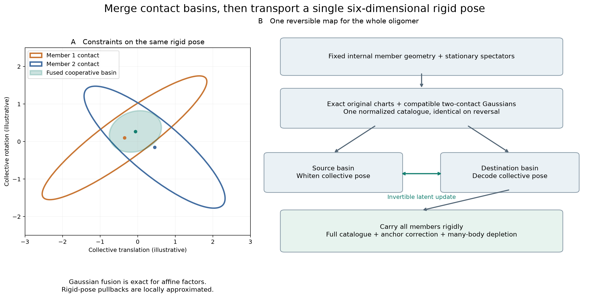

# Two-contact fusion for rigid oligomer proposals

This optional extension constructs cooperative docking basins for a rigid dimer
or trimer from the frozen single-tetramer atlas. It preserves the existing hard
shape, bath, subset clock, defensive uniform proposal and full many-body
depletion gate. It does not learn from production contacts or use native labels
to select a subset or a contact tuple. A native-informed input atlas remains a
native-informed proposal control.



The figure uses synthetic two-dimensional Gaussian constraints to illustrate a
construction performed in six-dimensional rigid-pose coordinates. It is not a
projection of a measured protein basin.

## Why another chart family

The existing member mixture describes alternative ways to dock any one carried
member. The [contact-anchor diagnostic](../runs/contact-anchor-benchmark-20260926/report.md)
showed that representing the current interface removes much of the source map
penalty, but typical proposed destinations lose cooperative contacts. A fused
chart combines two member-contact constraints on the same collective pose.

Write each member pose as `g_i = H B_i`, using the first selected member as the
canonical reference. The internal poses `B_i` remain fixed under a rigid move.
For spectator `A_a`, a pair-atlas component constrains `A_a^-1 H B_i`. Every
original component is therefore also an exactly normalized chart for `H`, since
left and right rigid multiplication preserve translation volume times Haar
orientation measure. Reciprocal atlas branches retain their exact wrappers.

For constructing a cooperative component only, linearize two such pullbacks in
a common local chart. Translation/rotation covariance includes each member's
lever arm. For affine Gaussian factors with means `mu_1, mu_2` and covariances
`Sigma_1, Sigma_2`, the product is another Gaussian:

\[
\Sigma_*^{-1}=\Sigma_1^{-1}+\Sigma_2^{-1},\qquad
\mu_*=\Sigma_*(\Sigma_1^{-1}\mu_1+\Sigma_2^{-1}\mu_2).
\]

Its compatibility factor is

\[
c=\mathcal N(\mu_1;\mu_2,\Sigma_1+\Sigma_2).
\]

This identity is exact for the local affine factors. The nonlinear rigid-pose
pullbacks are not generally Gaussian, and their exact product normalizer is
not being computed. Instead, each resulting Gaussian defines a new explicit
proposal chart with its own exact Cayley/Haar density. Approximation quality
affects efficiency, not the physical target.

## Bounded construction

All original member/anchor/virtual-branch charts are retained exactly. Fusion
uses a deterministic shortlist based on frozen component weights and covariance
volumes, then geometry-based pair ranking and Gaussian compatibility. Distinct
carried members are required; both may contact the same spectator. Construction
uses the invariant internal geometry and fixed spectator pool, not the current
external-contact graph or the current collective pose.

The initial configuration is:

```json
"cluster_phase": {
  "transport_charts": "members",
  "anchor_count": 4,
  "anchor_contact_uniform_probability": 0.1,
  "contact_fusion": {
    "fused_weight": 0.5,
    "max_fused": 32,
    "candidates_per_member_anchor": 8,
    "max_pair_candidates": 128
  }
}
```

The bounds limit proposal construction, not the physical interaction. They are
heuristics and do not certify that the best cooperative basin was retained.
They are explicit choices to revisit after measuring coverage and CPU cost.
The original broad and single-contact charts remain available, as does the
separate uniform pose branch. No Gaussian is truncated to its hard-valid part.

For the current coverage atlas, the default shortlist contains virtual branches
`44, 45, 2, 3, 318, 22, 23, 48`, representing five base components and 8.51% of
the original virtual-component mass. These components have particularly small
covariances: their positional marginal standard deviations range from about
0.022 to 0.118 angstrom. Thus this first comparison tests a narrow cooperative
catalogue, not exhaustive pairing of the full atlas. The complete ranking and
parameters are archived in the benchmark's `input/static-shortlist.json`.
A geometry-first shortlist that searches all component means is a separate
extension; it is not silently substituted during the frozen comparison.

## Reversible transport and acceptance

At a retained spectator-pool label, let `G_single` be the existing normalized
member mixture and `G_fused` the normalized mixture of cooperative charts.
The learned catalogue is

\[
G(H)=(1-f)G_{\rm single}(H)+fG_{\rm fused}(H).
\]

The source chart is drawn from its posterior responsibility in `G`; the target
chart is drawn from the catalogue weights. The existing orthogonal latent/noise
update is used between the exact encoders and decoders of the selected charts:

\[
(z,\eta)\mapsto(\rho z+\sqrt{1-\rho^2}\eta,
                 \sqrt{1-\rho^2}z-\rho\eta).
\]

Swapping the source and destination labels yields the inverse. The chart-volume,
auxiliary-noise and label-probability factors combine to `G(H_old)/G(H_new)`.
All members are carried by one rigid motion; there is one collective correction.
When contact-aware primary selection is enabled, its retained-label correction
is included once as well:

\[
\log R=\log W_{\rm depletion}
       +\log G(H_{\rm old})-\log G(H_{\rm new})
       +\log q_a(Y,S)-\log q_a(X,S).
\]

The complete catalogue has the same construction at both endpoints because its
inputs are invariant under moving the subset. Accepted forward and reversed
auxiliary flows are equal after applying `min(1,R)`. Summing labels and auxiliary
variables and including rejected self-loops preserves the physical distribution.
The subset clock and optional assembly-bias correction remain as before.

The uniform pose branch is selected separately and has no fused-catalogue
correction. A numerical failure or hard-invalid candidate is a null/rejection,
not permission to redraw. Floating-point geometry, deterministic reconstruction,
chart seams and thinning remain implementation obligations, checked separately
from this real-arithmetic balance argument.

## Validation and interpretation

Validation must exercise both original-to-fused and fused-to-original maps,
independent Gaussian-product algebra, catalogue reconstruction after contact
changes, full density versus expanded Jacobian/label correction, and production
equilibrium against an independent sphere/depletion reference. A passing test
must include accepted moves involving fused charts. Restart and disabled-mode
checks cover the production integration.

The fixed protein diagnostic compares the existing contact-aware catalogue
against fusion, with four fresh streams and 128 reset phases per stream per arm.
Both arms use the same saved 264-tetramer state, 500 micromolar concentration,
1.4 angstrom depletants and activity 0.0275 per cubic angstrom. Every attempted
event is retained. This is conditional proposal performance, not an equilibrium
calculation, contact ESS estimate or assembly trajectory. Accepted contact
changes, rejected proposals and catalogue cost must be reported together.

The exact many-body gate still decides whether an apparent two-contact fit
compensates the existing interface. Gaussian compatibility is neither a physical
free energy nor an assumption of pairwise-additive depletion.
