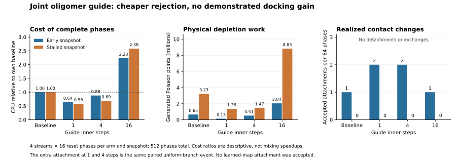

# Joint guide for rigid oligomer proposals

This opt-in extension guides one six-dimensional rigid-subset pose using all its
members, before evaluating the physical many-body depletion gate. It uses frozen
proposal densities. It does not fit a new model or change the physical target.
Protein performance must be assessed separately from the balance checks.

## Fixed context and guide

For a selected internally connected subset S, choose the existing uniform handle
h and write its member poses as g_i = g_h a_i. The a_i are invariant during the
move. Choose a primary anchor uniformly from bodies outside S, then include its
nearest external neighbors up to `anchor_count` (center-distance order, stable
body-index tie breaking). This construction uses only unchanged spectators;
it does not crop neighbors around the moving handle. The pool and handle remain
fixed for every inner attempt and for the corresponding reverse move.

For each carried member, evaluate the complete frozen density averaged over the
anchor pool:

    Q_i(g) = mean_a [ epsilon / V_cube + (1-epsilon) G_a(g a_i) ]
    log H(g) = score_power * sum_i log Q_i(g)

The implementation uses the existing open-space Gaussian-plus-uniform density,
including exact reciprocal branches and rotational Haar Jacobians. The uniform
term has its actual cube support. All physically valid spherical-wall poses are
inside that cube. The hard-core, atomic-wall, and unchanged internal-connectivity
conditions define the guide's feasible support. Expanding the product gives a
mixture of partially and multiply bound arrangements; every member need not
occupy a narrow contact component. No native labels select or filter contacts.
The supplied atlas can still be native-informed, which remains an explicit
control rather than a geometry-only discovery result.

The unknown normalization of H depends on invariant internal geometry and the
unchanged external context, so it is identical at the two endpoints. Score power
zero is a constant-guide control on feasible support, not a bypass of the inner
Metropolis correction.

## Reversible inner search and physical correction

Each inner attempt uses the existing posterior-source involution (including its
separately labeled uniform branch) to propose a new handle pose. All members are
reconstructed from the original internal template. After hard checks, accept the
inner trial with

    min(1, exp(log H(next) - log H(current) + base_map_log_ratio)).

Rejected, hard-invalid, and numerical-null attempts remain self-loops and consume
one step. The same guide-reversible kernel is repeated a fixed `steps` times;
there is no retry-until-valid, success threshold, adaptive stopping, or inner
thermalization requirement. A subset occupying the entire system has no external
anchor and gives an immediate null event.

If the resulting handle is unchanged, return an explicitly logged null endpoint
and skip the physical gate. Otherwise evaluate one complete moving-union
Poisson depletion gate and use

    min(1, exp(log R_depletion + log H(old) - log H(endpoint))).

The guide ratio replaces the single-handle map correction at this outer stage;
individual inner corrections are not summed again. There is one collective
pose measure and one endpoint correction. An optional assembly bias is applied
afterward through the existing elementary-kernel correction. The fixed-duration
cluster clock, internally determined subset rates and local rigid branch remain
unchanged.

The [balance argument and independent finite-state tests](oligomer-guide-balance.md)
show why the guide normalizer cancels. With one inner step and the same raw
candidate, splitting acceptance cannot increase its final acceptance probability;
it can only avoid some expensive depletion work. Several steps alter the endpoint
distribution and must earn their cost through useful physical moves.

## Configuration and records

Add to the existing `cluster_phase` object:

```json
"guide": {
  "steps": 4,
  "anchor_count": 4,
  "score_power": 1.0
}
```

Absent/null guide or `steps: 0` preserves the existing phase random stream. The
scope remains spherical boundaries and frozen models with positive defensive
uniform support. Use [spherical-oligomer-guide.json](../examples/spherical-oligomer-guide.json)
for the opt-in example. No running job is automatically changed.

Each guided event records the fixed anchor labels, every attempted inner step
when move recording is enabled, old/new joint log scores, endpoint correction,
inner hard/acceptance decisions, and whether the endpoint changed. Counts under
`cluster_phase` include `guide_events`, `guide_inner_attempts`,
`guide_inner_hard_valid`, `guide_inner_accepted`, `guide_endpoint_nulls`, and
`guide_accepted`. The last counts only physically accepted nonidentity guide
endpoints. Inner acceptance is not physical acceptance or mixing efficiency.

## Validation and benchmark allocation

The implementation is checked against independent Gaussian/Haar density algebra,
anchor-pool invariance, exact disabled-mode behavior, complete rejected-state
replay, and deterministic checkpoint continuation with assembly bias. The physical
reference test reuses the archived analytic three-sphere depletion reference,
with four streams at each guide length 1/4/16 and both dispersed and aggregated
initializations. It requires accepted nonidentity guide moves in addition to
observable agreement.

The first protein comparison is deliberately a conditional-transition pilot:
whole-system frozen states at early sweep 600 and stalled sweep 27000; baseline
and guide lengths 1/4/16; four independent streams per arm; 16 complete reset
phases per stream. Total 512 fixed-duration phases, at most two jobs together.
The physical settings remain 264 repaired tetramers, 500 micromolar, spherical
boundary, depletant radius 1.4 angstrom and activity 0.0275 per cubic angstrom.
These are the ongoing growth settings, not the separate contact-weight campaign.

`tools/run_oligomer_guide_benchmark.py` has separate `prepare`, `run`, and `analyze`
actions. Preparation freezes inputs and executable hashes; execution drains all
allocated jobs and records failures. Every phase begins from its designated full
snapshot and retains the final holding time. Independent postprocessing verifies
poses and exact contact-edge changes. Setup, sampler, diagnostic and output CPU
are separated. Report states and independent streams separately, including all
attempted-event denominators and zero exchanges. This pilot cannot yield
trajectory ESS, equilibrium occupancies, finite-system stability, or physical
kinetic rates.

## Completed protein pilot (2026-09-25)

All 32 jobs and 512 phases completed, with 1,308 outer events, no failed phases,
and no replay mismatches. The frozen source manifest matches the executable.
Every population's attempted events and retained endpoints are archived in
`runs/oligomer-guide-pilot-20260925`; `analysis.json` contains the four population
values and paired differences for each comparison. The tracked
[validation record](../research/oligomer-guide-validation-20260925.json) preserves
input/source hashes, validation results and compact benchmark data.



Each row below pools four streams of 16 phases. The baseline uses the previous
single-handle transport. Attachments include the unchanged local rigid branch.

| Preparation | Inner steps | Attempted events | Hard-valid endpoints | Accepted changed poses | Attach / detach / exchange | Phase CPU (s) |
|---|---:|---:|---:|---:|---:|---:|
| Early | Baseline | 90 | 26 | 18 | 1 / 0 / 0 | 1.059 |
| Early | 1 | 90 | 21 | 17 | 2 / 0 / 0 | 0.675 |
| Early | 4 | 90 | 21 | 17 | 2 / 0 / 0 | 0.930 |
| Early | 16 | 90 | 29 | 19 | 1 / 0 / 0 | 2.363 |
| Stalled | Baseline | 237 | 20 | 12 | 0 / 0 / 0 | 2.917 |
| Stalled | 1 | 237 | 19 | 13 | 0 / 0 / 0 | 1.688 |
| Stalled | 4 | 237 | 24 | 15 | 0 / 0 / 0 | 2.006 |
| Stalled | 16 | 237 | 48 | 12 | 0 / 0 / 0 | 7.522 |

One inner step used 0.64 times the baseline phase CPU in the early state and
0.58 times in the stalled state. This is a short, conditional cost observation;
it is not an effective-sample speedup. Sixteen steps cost 2.23 and 2.58 times the
baseline, respectively. Most extra cost was physical Poisson work, while guide
construction/search accounted for about 7–18% of phase CPU. Generated depletion
points in the stalled state were 3.23 million for baseline and 1.36, 1.47 and
8.83 million for guide lengths 1, 4 and 16.

Branch attribution is decisive here. The only accepted guided attachment is
the **same paired realization** in lengths 1 and 4: a defensive uniform inner
draw carries dimer `[130,233]` into contact with particle `245`. That destination
is outside its selected guide pool `[215,13,96,190]`. It is not an accepted
learned cooperative docking event. The remaining attachments are local rigid
moves. There were no accepted detachments or completed exchanges in any arm.

The stalled guide arms did propose two weak-contact detachments of dimer
`[13,24]`, each with final conditional acceptance about 0.166–0.168; neither was
accepted. These same paired proposals account for nearly all of the summed
contact-change acceptance, about 0.334. Larger guide lengths mostly added
strongly unfavorable detachments. These probabilities condition on the sampled
proposal and Poisson auxiliaries; they are not equilibrium weights or free
energies. See `branch-report.md` and `branch-analysis.json` in the archived pilot
for every contributing event.

This establishes an implemented, validated joint guide and a useful early
rejection mechanism, but no demonstrated improvement in cooperative docking or
contact mixing. Keep it opt-in. Increasing inner length alone is not supported
by this pilot. A subsequent improvement should change the inner proposal's
joint geometric conditioning rather than only repeat the same single-handle
atlas more often. These conditional experiments leave the assembly and
thermodynamic questions unresolved.

Reproduce the plot without sampling:

```bash
python tools/plot_oligomer_guide.py \
  --analysis runs/oligomer-guide-pilot-20260925/analysis.json
```

## Choices to revisit

- Anchor pool size and external-only neighborhood construction control which
  cooperative interfaces the score can represent.
- The existing map still acts on one handle. A joint covariance or different
  guide-reversible inner kernel could reduce wasted inner attempts.
- Guide strength and broad support affect the competing goals of proposing
  contacts and retaining reasonable reverse probabilities.
- Fixed step count may waste work when guide acceptance is very low; changes to
  the stopping rule require a new balance argument.
- Exact full-atom hard checks and mixture evaluations are the baseline. Caching
  or certified pruning must preserve the same score and proposal law.

A better guide cannot eliminate a physical configurational-entropy cost or
establish thermodynamic stabilization without the independent contact evidence.
