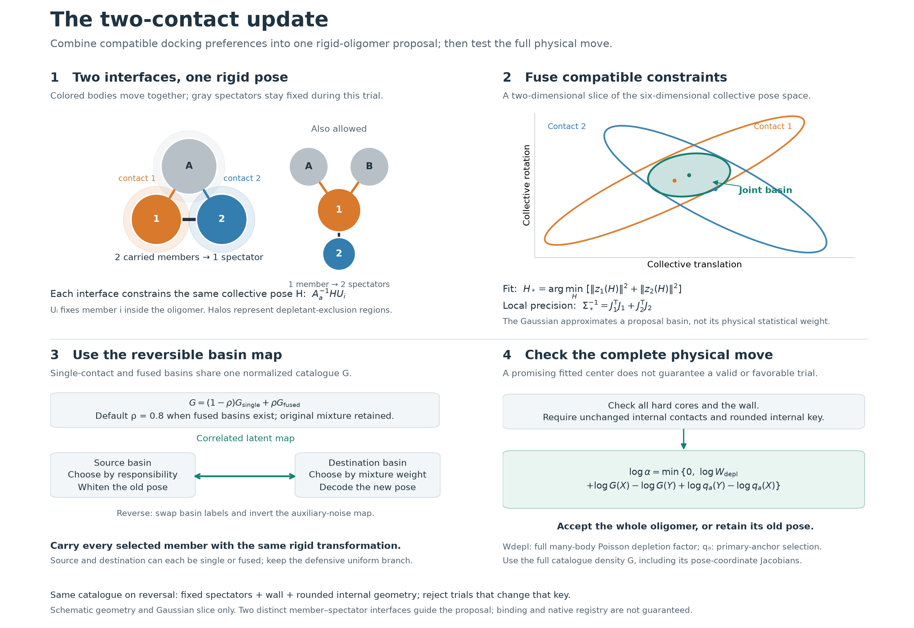

# Two-contact oligomer charts for rigid-subset transport

Status (2026-09-26): opt-in. The sweep-7400 audit of `f2e33c3` found that
catalogues rebuilt after a rigid carry could differ; this is fixed by rounding
the internal offsets and guarding on the rounded key (see Balance). The
conditional diagnostic found one oligomer attachment, before and after the fix,
but no validated sampling speedup. See [the sweep-7400 audit](oligomer-7400-benchmark.md).
It extends the [member charts](oligomer-conditioned-learning.md#implemented-member-charts-no-fitting)
and works with or without [contact-aware anchors](contact-aware-cluster-anchors.md).

## Why

With contact-aware anchors the source side is recognized: the median map
correction of hard-valid embedded trials fell from -38.26 to -0.162. The
destination is still one member in one atlas basin against one anchor. An
embedded subset gives up its other contacts. In that diagnostic 50 of 52
hard-valid non-fallback trials lost at least one existing contact, and the
median depletion log-factor was -80.49.

This extension adds destinations where two carried-member/anchor interfaces
hold at the same time. It does not fit anything. It is built from the frozen
atlas and the fixed context of each attempt.

## Construction



[Editable SVG](assets/two-contact-update.svg) ·
[PDF](assets/two-contact-update.pdf) ·
[Plotting source](../tools/plot_two_contact_update.py)

The colored bodies in panel 1 are rigid tetramers carried together. Two contacts
mean two distinct member--spectator interfaces: two members may contact one
spectator, one member may contact two spectators, or two members may contact
two different spectators. The ellipses in panel 2 are an illustrative slice of
one collective six-dimensional pose space, not separate particle coordinates
or measured basin weights. The fit combines their local constraints; panel 3
then reuses the normalized catalogue and reversible transport. Panel 4 applies
the full many-body physical correction to the actual trial pose. Uniform
primary-anchor selection makes the anchor ratio unity; an enabled assembly
bias adds its existing separate correction, not shown in the schematic.

Write `g0` for the pose of the first selected member and `u_i = g0^{-1} g_i`
for the internal offsets. A single label `l = (i, a, b)` is the existing member
chart: branch `b` of the atlas on `g_a^{-1} g0 u_i`, with reciprocal inversion
where the branch has it. Its chart mean implies a pose `m_l` of `g0`.

For every pair of labels with different (member, anchor) interfaces:

1. Prefilter: implied positions within `pair_distance_A`, orientations within
   `pair_angle_degrees`. Keep at most `max_candidates` pairs, closest first.
2. Fit: Gauss-Newton on `|z_1(g0)|^2 + |z_2(g0)|^2`, the two labels' whitened
   latents, from `m_l1`. Keep fits with residual at most `max_mismatch`.
3. Screen: in mismatch order, place all members at the fitted center and
   check the wall and every spectator for hard overlap. Stop after
   `max_hard_checks` checks or `max_components` survivors.
4. Chart: a Gaussian in (translation, angular length times Cayley) coordinates
   about the fitted center, covariance the inverse of the summed information
   `J1^T J1 + J2^T J2`. Components are indexed by label pair.

The mixture is

\[
G_O(g_0)=(1-\rho)\,G_S(g_0)+\rho\sum_f w_f\,N_f(g_0),
\qquad w_f\propto w_{b_1}w_{b_2}e^{-\chi^2_f/2},
\]

with `rho = multi_contact_mass` when at least one fused component survives and
zero otherwise. `G_S` is the member mixture, so with no fused component the
proposal is exactly the member proposal.

## Balance

Every construction input is invariant under the move in exact arithmetic: the
offsets `u_i`, the pool anchors, the spectators and the wall. `g0` itself is
never read.

In floating point the offsets recomputed from carried poses differ in the last
bits. The fit order, the component cap, the check budget and the mismatch
threshold can turn that into a different catalogue. The audit found exactly
this: two fits with residuals 13.0416257636645 and 13.0416257636630 swapped
across the 32-component cap, changing the log density by 1.79. Sorting the
survivors does not help once one of them is dropped.

So construction uses rounded offsets: translations on a 1e-5 Å grid and the
sign-canonical quaternion components on a 1e-9 grid (`internal_key`). The
cluster phase rejects an oligomer trial whose rounded key differs between the
old and proposed member poses, recorded as `internal_offsets_preserved: false`
and counted with `internal_geometry_nulls`. That condition is symmetric in the
two endpoints, so it is a valid guard, like the internal-contact check. When it
holds, every construction input is bitwise identical, and so is the catalogue,
near-tied fits included. Offsets are recomputed with errors near 1e-13 Å, so
the guard should fire with probability of order 1e-7 per coordinate and move.
It never fired in the tests or the sweep-7400 rerun. As for every map here, the
reverse endpoint itself is reproduced to roundoff, not bitwise.

With the same catalogue at both endpoints, the posterior-source argument of the
member charts applies unchanged:

- source label drawn by responsibility at the old pose, destination label by
  weight, the existing correlated latent map between the two charts;
- correction `log G_O(old) - log G_O(new)`;
- the contact-aware primary-selection term and the defensive uniform branch are
  unchanged.

The fit, the thresholds and the budgets only decide which components exist.
Any deterministic rule reading only the rounded key, the pool, the spectators
and the wall is admissible; it affects efficiency, not balance.

## Configuration

Add to a member-chart `cluster_phase`:

```json
"oligomer": {
  "multi_contact_mass": 0.8,
  "max_mismatch": 12.0,
  "pair_distance_A": 8.0,
  "pair_angle_degrees": 60.0,
  "max_candidates": 4096,
  "max_hard_checks": 256,
  "max_components": 32
}
```

`{}` takes these defaults. Omitting the key keeps the member path and its random
stream. The portable example is
[spherical-cluster-oligomer.json](../examples/spherical-cluster-oligomer.json)
(contact-aware anchors plus defaults). Records carry `charts: "oligomer"`, the
source and target labels (single or fused, with both interfaces and the
mismatch), the component count, fit candidates, hard checks and build time.

## Validation

`tests/oligomer_proposal.rs`, base and reciprocal atlases:

- With no fused component the density equals the member mixture on the rounded
  offsets to 1e-10.
- Two anchors placed at two branch means fuse with mismatch below 1e-8 at the
  true subset pose. After a random rigid carry the key is unchanged and the
  rebuilt catalogue is bitwise identical: label pairs, mismatches, centers,
  weights and densities.
- Stress test with binding caps (3 components, 5 checks, 24 fits): 20 scenes,
  each carried 25 times in a chain. The caps bound in all 20 scenes; all 500
  keys were unchanged and every catalogue was bitwise identical. With unrounded
  offsets the same test fails on the first scene.
- Exact inverse through swapped labels and inverse noise; label/Jacobian
  expansion equals `log G_O(old) - log G_O(new)`. More than 300 of the checked
  moves use fused charts.
- An exact `G_O` sample stays `G_O`-distributed under the `c = 0.7` map, every
  trial accepted with unit probability, more than half of the moves through
  fused charts.

`tests/cluster_phase_stationarity.rs` runs the production phase with
contact-aware anchors and oligomer charts against the analytic four-sphere
depletion reference, from dispersed and aggregated starts. The toy atlas
needs looser fusion settings there (mismatch 40, angle 120 degrees, 128 fits,
64 checks) to give frequent fused charts. Mean contact counts were
1.0221 +/- 0.0107 and 1.0372 +/- 0.0114 against the reference 1.0303 +/- 0.0031,
with 8,269 and 8,701 trials through fused charts, of which 84 and 66 were
accepted. The test takes about 100 s.

## Protein diagnostic

The frozen sweep-7,400 state of the matched growth run is not in the
repository. This diagnostic uses the portable 12-body seeded start: a
preassembled 9-mer, a dimer and a monomer, at depletant radius 1.5 Å and
activity 0.035 Å⁻³, with the coverage reciprocal atlas. `contact-anchor-benchmark`
resets to that state each phase. Cluster phase duration 0.05, transport
probability 1, contact-aware anchors (0.1), 2 × 48 phases per arm.

| | Contact anchors | + oligomer charts |
|---|---:|---:|
| Learned trials | 94 | 97 |
| Hard-valid | 11 | 17 |
| Accepted | 0 | 2 |
| Median depletion log-factor, hard-valid | -200.9 | -133.0 |
| Median proposal correction, hard-valid | 8.52 | 2.32 |
| Median lost / gained contacts, hard-valid | 6 / 0 | 5 / 1 |
| Cluster-phase CPU (s) | 5.5 | 29.9 |

Both accepted moves go from a fused chart to the same fused chart and move the
subset 0.0 to 0.1 Å, keeping every contact. They are local refinements, not
docking. All relocations lose 2 to 7 contacts, and a two-contact destination
recovers at most 4. Their depletion log-factors run from -14 to -264.

95 of the 97 learned trials selected subsets embedded in the 9-mer, with 3 to 6
external partners. Only 2 selected the free dimer, and neither was hard-valid.
So this state tests exchanges out of a native aggregate, not attachment.

Build time per attempt is 0.15 to 0.4 s: 0.05 to 0.3 s of fits and about
0.05 s of hard checks. The budget of 256 hard checks is used every time, and
0 to 14 fused centers survive. Many fits have near-zero mismatch because the
pool anchors are already in native arrangement with each other. These sites
exist, but most are occupied.

## What this shows and what is next

Recognizing two contacts at the destination is not enough for an embedded
subset. Its source has 3 to 7 contacts, and a relocation pays for every one it
does not rebuild. That cost is physical: a better proposal cannot make
leaving a well-packed site favorable. It can only aim at destinations with a
comparable interface. Candidates:

- Fuse more than two interfaces greedily, so destinations with 3 or more
  contacts get their own charts. Most such sites in a native aggregate are
  occupied, so this helps mainly where equivalent open sites exist.
- Spend attempts where moves can succeed. A subset rate that prefers few
  external contacts is admissible if its reverse rate enters the acceptance,
  in the same way as the anchor-selection term. It would stop spending most
  events on deeply embedded subsets.
- Measure on the sweep-7,400 growth state and on seeded states with free
  oligomers, where attachment and exchanges between comparable non-native
  interfaces are the moves that matter.
- Cost: cheaper fits (fewer candidates, reuse of label Jacobians) and a
  cheaper hard-core screen, before any production use.
