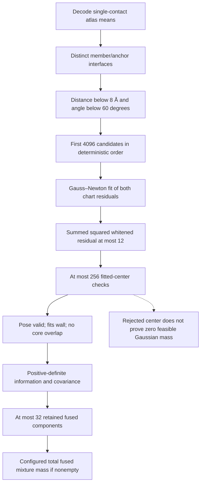

# Passive diagnosis of two-neighbor Gaussian construction

The completed singleton comparison found no fused target labels in 221,810
inner trials of the embedded 9/24 context. Those logs do not record whether
fused components were available. This diagnostic separates the construction
stages without changing a proposal, drawing depletants, or advancing a chain.

Thresholds shown are the current defaults; an actual diagnostic must bind the
configuration used by the completed benchmark. The zero-fusion-mass control
still constructs the catalogue. When components survive, a mass of 0.8 assigns
80% of the learned proposal's component-label selection mass to fused labels.
Their Gaussian supports can overlap. Mismatch penalties redistribute that
label mass among components; they do not reduce its total. The defensive
uniform branch is outside this learned-mixture accounting.

## What the counters can establish

The opt-in record follows the existing short-circuit calculation in its
original order. It distinguishes failed mean decoding, spatial/angular
screening, candidate truncation, fits returning no result, returned fits above
the mismatch threshold, invalid centers, wall/core collisions, covariance
failure, retained components and unvisited fits when a cap is reached. A fit
returning no result includes the existing early large-residual cutoff; that
counter alone must not be interpreted as a numerical failure.

For center rejection, record the first blocking spectator in the actual input
order and count the actual core-overlap calls. Do not query the remaining
spectators merely to explain a rejection. Bounded center records retain the
constituent atlas labels and mismatch, so later analysis can identify families
among checked centers without using native labels. Earlier-stage aggregate
counters cannot identify every missing contact family.

The strongest warranted conclusion from a rejected center is that this center
is unusable. Measuring feasible probability under its Gaussian would require
a separately fixed allocation of off-center probes. No such probes belong to
this diagnostic.

## Context, limits and interpretation

Use one explicitly named conditional environment per immutable manifest. Its
two mobile labels and fixed anchor are supplied, rather than selected by a
new contact-graph scan. For each moving member, the ordered neighbors are the
other mobile member and the fixed anchor; every nonmoving particle remains a
hard-core spectator. Coordinates must already be in the sphere-center frame.
The constructor receives the same single identity offset as
`TwoNeighborSingleton::new`; the current moving pose is not a catalogue input.

One shared source state and four prepared initial states, each with either
member moving, require ten constructions. With the existing default limits and
263 spectators, the ceilings are 40,960 fits, 2,560 center checks and 673,280
core pair-overlap calls. These are operation ceilings, not estimates of cost
or evidence that every permitted check is necessary. There is no native
classification, depletion estimate, trajectory replay or proposal attempt.

Choose a reorganization context using the completed initial native-registry
audit, without inspecting partial results from the trajectory audit. The first
original context, 27/132, has no native mobile-related contacts at its source
or any of its four prepared starts and is a suitable construction diagnostic.
The already natively bound 9/24 source is a retention control: a good sampler
need not detach it often. Catalogue availability and feasible proposal mass
are efficiency diagnostics, not physical contact weights or assembly-stability
tests.

## Correctness of passive instrumentation

The diagnostic path must preserve candidate ordering, fitted arithmetic,
short-circuit geometry tests, covariance construction, labels and normalized
mixture weights. It must add no geometry query or random draw. Tests compare
the diagnostic and ordinary catalogues, densities and identically seeded
proposals, excluding timing fields. A construction failure retains partial
counters and its journal rather than quietly omitting the attempted context.

No detailed-balance correction follows from recording counters: the transition
kernel is unchanged. Any subsequent use of these observations to alter
component construction or selection would require its own invariant-context
and complete-density argument, along with new efficiency measurements.

## Validation and executable

Six focused library tests and four standalone CLI tests passed. An isolated
offline, locked release build used `target-validation-fusion-diagnostic` with
four compiler jobs; the production executable was not replaced. The validation
receipt is `results/singleton-fusion-validation-20261004/validation.json`
(SHA `4ca8f081f4537b28440adcdaa8d80c18612eec964544dd26fdecd57190682b62`).
The initial compilation found an ambiguous test-only `sum()` type; adding
`::<usize>` fixed it before any scientific execution.

The executable accepts an immutable manifest, its SHA256, and a fresh output
directory. Its manifest binds the full states, shape, model, coordinate frame,
construction inventory, caps and compiled-source witnesses. A bounded controller
must supply the process CPU, wall-time and memory limits; the CLI does not
select a trajectory frame or start a simulation.
