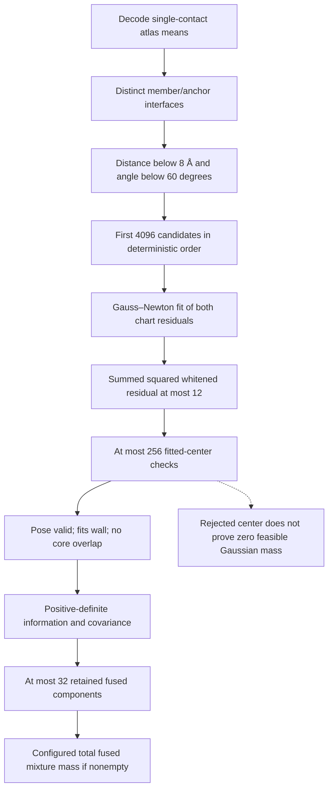
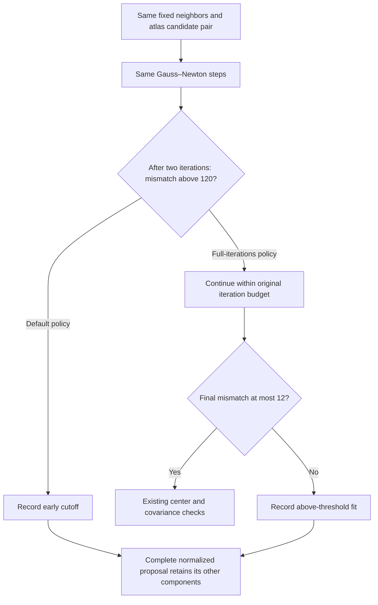

# Passive diagnosis of two-neighbor Gaussian construction

The completed singleton comparison found no fused target labels in 221,810
inner trials of the embedded 9/24 context. Those logs do not record whether
fused components were available. This diagnostic separates the construction
stages without changing a proposal, drawing depletants, or advancing a chain.

Thresholds shown are the current defaults; an actual diagnostic must bind the
configuration used by the completed benchmark. The zero-fusion-mass control
still constructs the catalogue. When components survive, a mass of 0.8 assigns
80% of the learned proposal's component-label selection mass to fused labels.
Their Gaussian supports can overlap. Mismatch penalties redistribute that
label mass among components; they do not reduce its total. The defensive
uniform branch is outside this learned-mixture accounting.

## What the counters can establish

The opt-in record follows the existing short-circuit calculation in its
original order. It distinguishes failed mean decoding, spatial/angular
screening, candidate truncation, fits returning no result, returned fits above
the mismatch threshold, invalid centers, wall/core collisions, covariance
failure, retained components and unvisited fits when a cap is reached. A fit
returning no result includes the existing early large-residual cutoff; that
counter alone must not be interpreted as a numerical failure.

For center rejection, record the first blocking spectator in the actual input
order and count the actual core-overlap calls. Do not query the remaining
spectators merely to explain a rejection. Bounded center records retain the
constituent atlas labels and mismatch, so later analysis can identify families
among checked centers without using native labels. Earlier-stage aggregate
counters cannot identify every missing contact family.

The strongest warranted conclusion from a rejected center is that this center
is unusable. Measuring feasible probability under its Gaussian would require
a separately fixed allocation of off-center probes. No such probes belong to
this diagnostic.

## Context, limits and interpretation

Use one explicitly named conditional environment per immutable manifest. Its
two mobile labels and fixed anchor are supplied, rather than selected by a
new contact-graph scan. For each moving member, the ordered neighbors are the
other mobile member and the fixed anchor; every nonmoving particle remains a
hard-core spectator. Coordinates must already be in the sphere-center frame.
The constructor receives the same single identity offset as
`TwoNeighborSingleton::new`; the current moving pose is not a catalogue input.

One shared source state and four prepared initial states, each with either
member moving, require ten constructions. With the existing default limits and
263 spectators, the ceilings are 40,960 fits, 2,560 center checks and 673,280
core pair-overlap calls. These are operation ceilings, not estimates of cost
or evidence that every permitted check is necessary. There is no native
classification, depletion estimate, trajectory replay or proposal attempt.

Choose a reorganization context using the completed initial native-registry
audit, without inspecting partial results from the trajectory audit. The first
original context, 27/132, has no native mobile-related contacts at its source
or any of its four prepared starts and is a suitable construction diagnostic.
The already natively bound 9/24 source is a retention control: a good sampler
need not detach it often. Catalogue availability and feasible proposal mass
are efficiency diagnostics, not physical contact weights or assembly-stability
tests.

## Correctness of passive instrumentation

The diagnostic path must preserve candidate ordering, fitted arithmetic,
short-circuit geometry tests, covariance construction, labels and normalized
mixture weights. It must add no geometry query or random draw. Tests compare
the diagnostic and ordinary catalogues, densities and identically seeded
proposals, excluding timing fields. A construction failure retains partial
counters and its journal rather than quietly omitting the attempted context.

No detailed-balance correction follows from recording counters: the transition
kernel is unchanged. Any subsequent use of these observations to alter
component construction or selection would require its own invariant-context
and complete-density argument, along with new efficiency measurements.

## Validation and executable

Six focused library tests and four standalone CLI tests passed. An isolated
offline, locked release build used `target-validation-fusion-diagnostic` with
four compiler jobs; the production executable was not replaced. The validation
receipt is `results/singleton-fusion-validation-20261004/validation.json`
(SHA `4ca8f081f4537b28440adcdaa8d80c18612eec964544dd26fdecd57190682b62`).
The initial compilation found an ambiguous test-only `sum()` type; adding
`::<usize>` fixed it before any scientific execution.

The executable accepts an immutable manifest, its SHA256, and a fresh output
directory. Its manifest binds the full states, shape, model, coordinate frame,
construction inventory, caps and compiled-source witnesses. A bounded controller
must supply the process CPU, wall-time and memory limits; the CLI does not
select a trajectory frame or start a simulation.

## Completed context-0 result

All ten constructions completed in 0.527 CPU seconds, without a pose draw,
depletant cloud, native query or core-overlap call. **None retained a fused
component.** Nine constructors produced no candidate pair after the mean
distance/angle screen. The source state with member 27 moving admitted five
pairs, all of which returned no fit. That return category includes the early
residual cutoff and does not identify a numerical failure. No candidate reached
center validity, collision, covariance or component-cap checks.

Each constructor has 4,194,304 possible cross-interface label pairs. These are
combinatorial counts, not that many geometry queries: the existing sorted
spatial search skips distant pairs. At source-27, 203 pairs pass distance and
five pass angle. At prepared-1-27, nine pass distance and none pass angle.
The other eight constructors have no pair passing distance.

Consequently, removing center-collision rejection cannot help these particular
initial catalogues. This does not identify what happens later along a trajectory
or in the other three environments.

Arithmetic bounds further separate incompatible neighborhoods from an overly
narrow atlas. The maximum distance of a zero-latent atlas mean from its anchor
is 70.3694 Å; reciprocal inversion preserves that distance. Fixed neighbors
farther apart than `2 * 70.3694 + 8 = 148.7389 Å` cannot produce a pair passing
the present mean-distance screen. Five of these ten constructions satisfy this
exclusion bound. This is a bound on **means**, not Gaussian support.

The hard shape is contained in an origin-centered sphere of radius 49.4870 Å.
At the conditional test's depletant radius 1.4 Å, simultaneous exclusion overlap
with both fixed neighbors requires their centers to be at most
`4 * (49.4870 + 1.4) = 203.5481 Å` apart. For member 27 in prepared states 2
and 3, their separations are 212.624 and 216.920 Å, respectively. Thus those two
fixed neighborhoods cannot support simultaneous contacts even with a broader
pose map. The bound does not establish feasibility in the remaining cases.
These conclusions use a 1e-8 Å exclusion margin; no additional geometry
predicate was evaluated.

The useful next question is which **geometrically compatible fixed neighbor
pairs** admit complementary poses. Neighbor selection based solely on the
unchanged spectators can preserve the forward/reverse selection probability;
selection based on the moving particle's current contacts needs its full
selection correction. Neither change is implemented by this passive diagnostic.
The two-neighbor benchmark's fallback behavior must not be interpreted as a
physical failure of multi-contact binding.

Reproducible evidence is in `results/singleton-fusion-context0-20261004`:
the authenticated reduction is `review.json` (SHA
`a777aad74a9be5c276698c0e099fa5452740d6a176114252b9fa7f9a8a0e3eb8`),
with `distance-bounds.json` recording all ten separations and the necessary
bounds. Six additional preparer tests passed before execution; the complete
initial audit and original prepared-state files are bound in the manifest's
preparation closure.

## Completed nearby-anchor mean screen

The follow-up `tools/audit_singleton_anchor_screens.py` reconstructs all ten
original screens independently in Python before examining alternatives. It
decodes zero-latent atlas means directly, including reciprocal inversion;
stored covariances are neither factored nor fitted. A chunked KD search is
followed by the same strict distance and rotation-angle predicates. Counts
within 1e-8 Å or 1e-10 radians of either threshold are flagged as ambiguous.

For each fixed primary neighbor, the inventory contains the original anchor
and up to eight nearest eligible spectators within `2 Rmean + 8 Å`. It excludes
the moving label and uses label order to break distance ties. The inventory
does not read the moving pose. All inventories are recorded before screening;
no anchor is selected by its screen outcome.

All ten original screens agreed with the saved Rust counts. The bounded job
completed 21 screens (ten controls and eleven alternatives) in 3.895 CPU
seconds, with no threshold ambiguity. Only two alternative screens admitted
mean pairs through both predicates:

| State / moving label | Alternative anchor | Distance pass | Angle pass | Original anchor angle pass |
| --- | ---: | ---: | ---: | ---: |
| source / 27 | 179 | 278 | 21 | 5 |
| prepared-0 / 27 | 46 | 11 | 8 | 0 |

The other nine alternatives admitted no pair. The union of alternative labels
is `[46, 106, 178, 179]`; this inventory is determined by spectator geometry,
not by the successful rows. No Gaussian fit, atomic overlap, native label,
Poisson cloud or pose draw was evaluated. Passing means are only candidate
initializations: they need not survive fitting, the whitened mismatch limit,
or hard-center checks. This result motivates checking construction at all four
alternative anchors before adding a sampling arm.

Eight synthetic tests cover decoding, reciprocity, spectator-only selection,
strict thresholds, chunked versus exhaustive enumeration, resource failure
prefixes and metadata-only preparation. The test receipt is
`results/singleton-anchor-screen-validation-20261004/validation.json` (SHA
`8df91735b9389819ba6fce96929b779c9e8e10ecfe6ee14cc7d447014339f976`).
The completed diagnostic and authenticated reduction are in
`results/singleton-anchor-screens-context0-20261004`; its terminal summary SHA
is `c4fe35254a88d1d45eb4492aa0e5a0ddfd34929b274ab59c775874b0154d308f`.

The prospective selection balance, exact finite-state controls and separate
Lean bridge are described in [context-selector-balance.md](context-selector-balance.md)
and [posterior-context-balance.md](posterior-context-balance.md). Neither these
proofs nor mean compatibility establish improved protein mixing or a physical
preference for assembly.

## Completed alternative-anchor construction

The next fixed diagnostic crossed **all four** alternative labels with all
five states and both moving labels: 40 constructors, reusing the validated
executable and unchanged shape, atlas, poses and default thresholds. The
original ten constructors were reused as controls. All four serial jobs
completed, taking 2.163 CPU seconds in total.

The 21 and 8 pairs identified above were the only fit candidates. All 29 fits
returned `None`; none reached a center, wall, core-overlap or covariance check.
No constructor retained a fused component. Alternative anchor selection alone
therefore does not yet justify a new trajectory benchmark with this fitter.
The frozen Cartesian allocation includes the unsuccessful anchors and starts,
not just the two passing mean screens.

`fit_returned_none` conflates initial/finite-difference chart encoding errors,
normal-matrix factorization failures and the heuristic early-abort rule
(`chi_squared > 120` after two iterations). Failed line search, a tiny step or
the sixteen-iteration limit instead returns a fit, which may still exceed the
final mismatch limit of 12. The next bounded test must separate those exits.
A large current residual is an upper bound on the attainable minimum, not a
certificate that the minimum exceeds the threshold. Skipping only that early
abort, while preserving all existing iteration/backtrack and final acceptance
limits, is a controlled fitting comparison. It remains a proposal construction
experiment, not a change in physical energy.

No fused component means this construction rule found none. It does not imply
zero Gaussian support, absence of hard-feasible contact poses, or unfavorable
physical assembly. Any modified fitter must remain a deterministic function
of unchanged spectators, use the same complete normalized proposal at both
endpoints, and retain the physical hard/depletion acceptance tests.

The complete preparation, four manifests, execution journals and authenticated
reduction are in `results/singleton-alternative-fusion-context0-20261004`.
Its execution-plan SHA is
`d351e0d791602a0b410e527748958188ae235469524d78ff033549ab5a80acb1`.

## Completed bounded fitting comparison

The diagnostic API now supports `early_abort` (the unchanged default) and
`full_iterations`. The second policy removes only the residual-based early
exit; both retain sixteen optimizer iterations, twelve line-search trials per
iteration, the final mismatch threshold of 12 and all existing geometry/cap
rules. Production assembly entry points still use the original policy.
Compact per-fit records observe existing residual evaluations, termination
stage, encoding errors and finite/nonfinite arithmetic without adding a
residual evaluation, geometry predicate or random draw.

All five anchors, five states and both moving labels were tested under both
policies: **100 constructors in ten serial jobs**. Every original diagnostic
key/value matched for all 50 default-policy constructors. The old compiled
source archives authenticate the two edited Rust files; the historical binary,
states and results were retained. The new build has its own source witness.

| Result | Default early abort | Full bounded fit |
| --- | ---: | ---: |
| Candidate fits | 34 | 34 |
| Early residual exits | 34 | 0 |
| Line-search stalls | 0 | 28 |
| Iteration limits reached | 0 | 6 |
| Fits above final threshold | 0 (returned early) | 34 |
| Usable / retained fused components | 0 / 0 | 0 / 0 |
| Residual evaluations | 918 | 6,374 |
| Encoding errors / core-overlap queries | 0 / 0 | 0 / 0 |

Full-fit mismatches range from **1,550.818 to 15,028.337**, far above 12. Median
relative reduction is 0.0131%; the largest is 2.465%. The whole ten-job
diagnostic used 5.037 CPU seconds including loading; summed constructor-only
timings were 0.263 versus 0.349 seconds. These are construction costs, not
sampling-speed measurements.

For these candidate pairs, removing the early abort is not a useful fix.
The current fixed-neighbor charts are poorly compatible on their fitted
Gaussian scales. Line-search stalls and a finite iteration cap are not global
minimum certificates, so the result does not rule out a better initialization,
broader proposal, different neighbors or cooperative rearrangement. These
whitened residuals are **proposal diagnostics, not physical free energies**.
Neither atlas support nor physical binding weights have been measured here.
The next sampling decision should address proposal breadth or movable-neighbor
geometry instead of spending more iterations on this same fit.

Eleven library tests, five CLI tests and six preparer tests passed. The tests
cover default catalogue/density/seeded-proposal equivalence, no additional
residual evaluations, bounded continuation, distinct failure stages, explicit
nonfinite serialization, immutable inputs and complete historical allocations.
The release binary was built offline in `target-validation-fusion-fit`; the
production executable remains unchanged. Build and test evidence is in
`results/singleton-fit-validation-20261004` and
`results/singleton-fit-preparer-validation-20261004`.

The completed paired comparison, reduction source, per-fit records and plot are
in `results/singleton-fit-policy-comparison-20261004`. Its authenticated
`review.json` SHA is
`3b74ba75ee8a54030ac8c04e07bfa9304e764b32909cd676b1356b0e41058fef`.
The independent physical-weight campaign and native-registry trajectory audit
remain separate calculations; this result changes neither their estimates nor
the unresolved finite-system assembly verdict.

## Admission-only follow-up: all fitted centers overlap

A second completed diagnostic changed only the final mismatch cutoff from 12
to 20,000, retaining `full_iterations`, the fitted charts/covariances, all fifty
anchor/state/member contexts and every original work cap. The CLI accepts this
single diagnostic override only with `full_iterations`; production kernels keep
their existing settings. Every field of all 34 fit traces matched the preceding
full-fit calculation exactly, except the final admission disposition.

| Stage or first failure | Count |
| --- | ---: |
| Saved contexts retained | 50 |
| Identical fits admitted and centers checked | 34 |
| First core collision with the other mobile member | 24 |
| First core collision with the selected anchor | 8 |
| First core collision with another frozen spectator | 2 |
| Wall or invalid-pose rejection | 0 |
| Centers reaching covariance checks / components retained | 0 / 0 |

All 34 centers collide. The whole diagnostic used 4,209 pair-core queries and
2.583 CPU seconds including loading (0.270 constructor-only seconds); it drew
no poses or Poisson clouds and made no native-label queries. The first blocker
is defined by the existing spectator traversal, so these counts do not enumerate
all overlapping neighbors or show that removing one blocker would clear a pose.

This rules out **raising this cutoff alone** as a rescue for the present fifty
contexts. It does not bound the feasible probability in the surrounding
Gaussians, establish a global fitting optimum, or measure physical stability.
The information/covariance tests were never reached. Broadening proposals or
optimizing under hard constraints would be separate changes requiring their own
feasible-mass, complete-density and sampling-efficiency controls.

The existing factorized dimer move already changes both mobile poses and their
relative geometry. A distinct next cooperative control can mix its two tree
rootings with a state-independent one-half prior. The chosen root must remain
fixed through every retry and the complete proposal/auxiliary/physical decision;
each component retains its own density ratio. Reversed-root source support may
be worse, so diagnostics must keep both root choices without filtering failures.
A role mixture does not by itself guarantee better contact exploration.

Seven CLI tests and four metadata-preparer tests passed. The unchanged fitting
library retains its previous eleven passing tests. Build/test evidence is in
`results/singleton-admission-validation-20261004` and
`results/singleton-relaxed-fit-context0-20261004-preparation/validation-attempt-01`.
All five serial jobs completed without retry. The launcher had a post-launch
metadata-record error; its original source/claim and the explicit recovery
receipt were preserved, using the completed controller and all five drained
child receipts. No simulation was restarted.

The complete results, per-center labels, fit-identity checks and reduction are in
`results/singleton-relaxed-fit-context0-20261004`. Its execution-plan SHA is
`1eaaa5c5c1f512810a7c021e18478cd2bd768afc83574234faeb306b718181c8`.
The production executable and running physical/native-audit jobs were unchanged.
