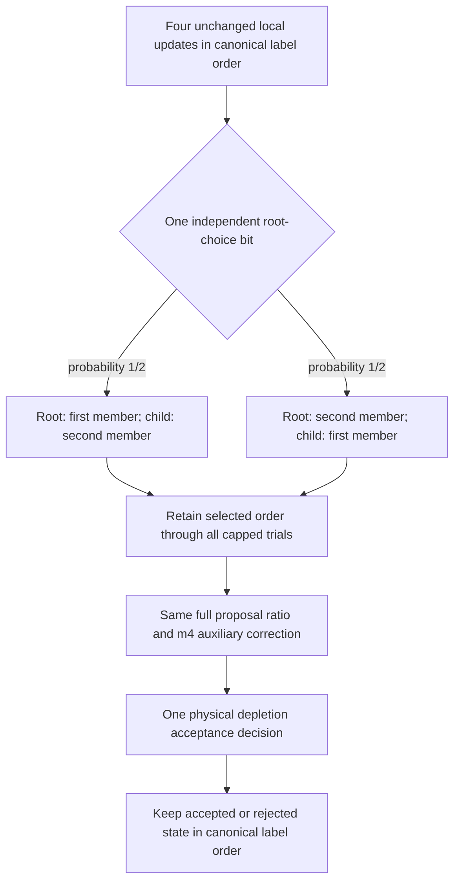

# Retaining either root of the conditional dimer proposal

The experimental `two_root_m4` arm in `examples/evolving_dimer_benchmark.rs`
chooses which of the two mobile tetramers is the root relative to a fixed
spectator anchor. It moves both tetramers and can change their relative pose,
using the existing factorized dimer kernel. The original `m4` arm always uses
the first mobile label as root; `two_root_m4` selects either order with probability
one half at each collective slot.



For fixed spectators, let `K0` and `K1` denote the two existing reversible
conditional kernels, including null trials and rejections. The new kernel is
`K = (K0 + K1)/2`. Summing their accepted-flow balance identities proves balance
for the mixture. The selected-root correction is still
`log F_r(old) - log F_r(proposed)` plus the existing auxiliary correction.
The one-half selection probabilities cancel. Relabeling the order used to store
two poses has unit Jacobian in the same product pose measure; physical particle
labels and the target density do not change.

This argument requires retaining the selected root for the entire kernel call.
It does not authorize choosing a new root after a failed inner trial, selecting
a root based on its apparent acceptance, or omitting a state-dependent reverse
selection factor. The [context-selector balance analysis](context-selector-balance.md)
and its existing finite-state tests cover that distinction. No new physical
balance identity is needed for a state-independent mixture of the unchanged
kernels; their geometry, floating-point and physical-bath obligations remain.

The existing general-state Lean theorem
`measurable_subset_uniformization_correct` in
[`ClusterMeasureRates.lean`](../formal/ReversibleSampling/ClusterMeasureRates.lean)
applies with two indices and constant weights one half. Constant weights satisfy
its internal-invariance premise, and their sum is one. The resulting completion
adds no missing mass beyond the rejections already present in each kernel.
This reuses a checked theorem rather than substituting a finite-state analogy
for the continuous pose space. It still assumes both selected kernels satisfy
their stated balance and measurability obligations. Combining four local updates
and the mixed dimer update preserves the same target by `invariant_hybrid` in
[`Balance.lean`](../formal/ReversibleSampling/Balance.lean); a fixed ordered sweep
need not itself be reversible.

The cached guidance points are body-coordinate data for the identical rigid
shapes. The selected engine evaluates them in its root's frame, with `m=4`
internal guidance and no root guidance. Proposal, threshold, bath and acceptance
random streams retain `m4` roles. Only root selection uses the additional
`two_root_m4/root_order` role. Local updates, retained endpoints and checkpoint
pose arrays remain in canonical label order.

The new arm requires its own exact policy:

```json
{
  "two_root_policy": {
    "schema": "two-root-factorized-m4-policy-v1",
    "root_probabilities": [0.5, 0.5],
    "selection": "once_per_global_slot",
    "internal_threshold_m": 4
  }
}
```

Trial records retain the selected order and add canonical/selected labels,
root slot/probability, and canonical old/proposed projections. Fatal and null
attempts retain the root metadata. Observers must validate these fields and map
by particle label; treating a reversed proposal array as canonical is incorrect.
The existing Python observer/preparer are frozen inputs of an ongoing native
registry audit and have not been modified. The separate
`tools/analyze_two_root_dimer_benchmark.py` validates the new label contract,
checks saved proposal/auxiliary/bath arithmetic, and gives a temporary canonical
projection to the unchanged state replay. Nested selected-root records and the
original journal are never rewritten. This checks recorded arithmetic and
discrete decisions, not an independent reconstruction of geometry or RNG.

`tools/prepare_two_root_dimer_benchmark.py` requires the isolated tested Rust
build and a Python validation receipt covering its complete local source
closure. It archives exactly those tested sources and uses the existing
one-worker controller. Existing completed contact caches supply the sixteen
matched local and `m4` controls; their raw trajectories and geometric
classification are not repeated. All eight new chains must finish before the
whole-campaign observer runs. This remains an experimental conditional control,
not a production assembly option.

The frozen first comparison is eight context-0 chains: four streams from the
same source plus one from each of the four existing proposal-prepared states.
Each has 512 warmup plus 4,096 production blocks, with four locals and one
collective attempt per block. Existing local and `m4` controls can be reused. The conditional
conditions remain 1.4 Å, activity 0.0275 Å⁻³, two mobile tetramers and frozen
spectators; they are distinct from the original finite-system decision target.

The diagnostic must keep both chosen roots and their failures, complete source
and destination proposal scores, auxiliary/bath contributions and completed
external-contact exchanges. Reversing the root can worsen source support.
Acceptance alone cannot establish useful sampling: compare contact-environment
ESS per full CPU, initialization agreement and nonempty exchanges, with native
registry assessed independently.

This control follows the [completed fusion diagnostic](singleton-fusion-diagnostic.md):
all 34 admitted fitted centers collide, including 24 whose first blocker is the
other mobile member. That result motivates investigating cooperative geometry,
but does not predict that changing root will solve it. Neither this conditional
control nor the collision diagnostic establishes physical assembly or instability.


All thirteen example tests passed, including five new tests for forced-root
record/state/RNG equivalence, correct body-cloud frame, null/fatal outcomes,
finite-state balance and disk continuation from both preparation types.
Independent source review passed. The offline release build uses the separate
`target-validation-two-root` directory. Source and production-executable hashes
were unchanged throughout validation. Evidence is in
`results/two-root-validation-20261004`; the authoritative clarified build witness
is `build-witness-protein-scope.json`. The clarification distinguishes synthetic
test draws from the zero new protein-campaign draws; original logs and receipts
are preserved. These build checks generated no protein trajectory.

The separate observer/preparer validation passed all 17 tests. It also replayed
two already-generated toy trajectories from the compiled Rust CLI, covering
both root orders and both preparation types, with 80 elementary attempts and
18 retained endpoints in total. This was a record-format and arithmetic check,
not a protein or efficiency experiment. Evidence is in
`results/two-root-python-validation-20261004-v2/validation.json`; the earlier
validation receipt remains intact. Independent review is recorded in
`results/two-root-campaign-preparation-20261004/independent-review.json`.

The eight-chain campaign was launched on October 4, 2026, under
`/vast/xvg/tetramer-mc-runs/two-root-dimer-context0-20261004`. Its execution plan
has SHA256 `7c2cff9234f0620037f3afe42269d2f6343c29cccddd998131819b59335a0168`.
It runs one scientific worker, with no automatic retry or replacement, and
does not modify the production sampler. Each chain retains per-root outcome
counts and candidate-only source/destination, auxiliary and bath scores.
Unscored null trials and zero-support scores remain distinct. The observer
separates external contacts from the internal dimer contact and includes
attachment, detachment and returns through the unbound state.

The fixed whole-campaign analysis covers 36,872 new endpoints, at most
19,357,800 mobile-related pair classifications before pruning/cache reuse,
and sixteen cached controls without new classification. Its one-worker limits
are 1,800 CPU seconds, 3,600 wall seconds and 16 GiB. It starts only after all
eight sampler jobs finish cleanly. No efficiency or assembly conclusion is
available from this campaign at launch.
