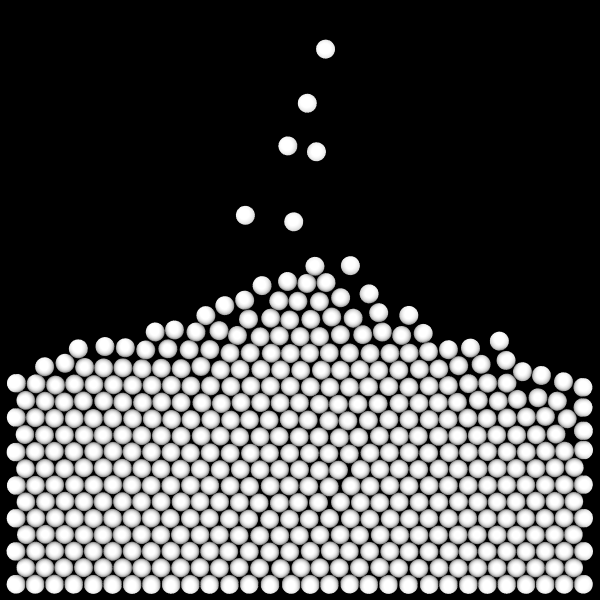

# Applying Interactions

<script type="module">
import init from 'https://glotzerlab.github.io/hoomd-rs/mc-tutorial/applying-interactions.js'
{{#include ../../scripts/init-wasm-canvas.js}}
</script>
{{#include ../../scripts/canvas.html}}

## Overview

The previous tutorials set the Hamiltonian $`H = 0`$. In this one, let's
place particles in an external gravitational field and add a pairwise
interaction that penalizes particle overlaps:

```math
H = \sum_i \alpha \vec{r}_i \cdot \hat{y} +
\sum_i \sum_{j > i} U_\mathrm{step}\left(\left|\vec{r}_j - \vec{r}_i\right|\right)
```
where
```math
U_\mathrm{step}(r) = \begin{cases}
\varepsilon & r \lt \sigma \\
0 & r \ge \sigma
\end{cases}
```

* Objective: Demonstrate the use of external and pairwise potentials in MC simulations.
* File: `hoomd-rs/examples/mc-tutorial/applying-interactions.rs`
* Run (interactively):
  ```shell
  cargo run --release --features "bevy" --example applying-interactions
  ```
* Run (in batch mode):
  ```shell
  cargo run --release --example applying-interactions
  ```

## Bodies and Sites

The previous tutorials introduced the **microstate** as a collection of point
bodies. That was an oversimplification. In *hoomd-rs*, a **body** is an ordered
collection of **sites** that are defined in the *local reference frame* of the
body. The **microstate** gains all of its degrees of freedom from the **bodies**
it contains.

You get to choose the types of the **body properties** and the **site
properties** in your simulation model. At a minimum, both must have
**position**. The **body properties** (denoted as the `B` generic) and the
**site properties** (denoted by the `S` generic) may be the same or different.
However, the **body properties** type must be able to transform a **site
properties** from the *body reference frame* to the *system reference frame*.

All **interactions** on bodies are a function only of its **sites** and are
computed in the *system reference frame*. Understanding this will help as
you review the [documentation] for the types used later in this tutorial:
`External`, `Linear`, `Boxcar`, `Isotropic`, and `PairwiseCutoff`. For a
complete reference on **bodies**, **sites**, and all their related traits, read
the [`hoomd-microstate`] documentation.

In this tutorial, the bodies will still be points. Specifically, that means
each **body** has `Point<Cartesian<2>>` for its **body properties** type (`B`),
and a single **site** at the origin (*in the body reference frame*) which has
`Point<Cartesian<2>>` for its **site properties** (`S`) type. The constructor
`Body::point()` used in these tutorials is a convenient way to create point
bodies.

The next tutorial will demonstrate a case where bodies and sites have different
properties and show how to create bodies with more than one site.

## Use Declarations

```rust,ignore
{{#rustdoc_include ../../../examples/mc-tutorial/applying-interactions.rs:use}}
```

## The Simulation Model

Here is the type that holds the simulation model:
```rust,ignore
{{#rustdoc_include ../../../examples/mc-tutorial/applying-interactions.rs:simulation_struct}}
```

In order, `Microstate`'s generic types are the **body properties**, the
**site properties**, and the **boundary condition**.

## Construct the Simulation Model

The `new()` method constructs a new simulation model:
```rust,ignore
{{#rustdoc_include ../../../examples/mc-tutorial/applying-interactions.rs:simulation_new}}
```

### Parameters

Assign all the model parameters in one code block:
```rust,ignore
{{#rustdoc_include ../../../examples/mc-tutorial/applying-interactions.rs:parameters}}
```

`box_length` is the side length of the square simulation box, `maximum_distance` is
the largest distance a translation trial move can take, `alpha` is the strength of the
gravitational potential, `epsilon` is the strength of the pairwise potential, `sigma`
is the range of the pairwise potential, and `macrostate` holds the temperature set point
(in units of energy).

### External Potential

This code implements the external potential term in the Hamiltonian:
```math
\sum_i \alpha \vec{r}_i \cdot \hat{y}
```

```rust,ignore
{{#rustdoc_include ../../../examples/mc-tutorial/applying-interactions.rs:external}}
```

`Linear` computes $` \alpha \vec{r} \cdot \hat{y} `$ in its `energy()` method.
`Linear` also implements the `SiteEnergy` trait whose method `site_energy` takes
a single **site properties** argument: $` U(s) `$. Building on that, `External`
wraps any type that implements `SiteEnergy` and sums over the energy contributed
by each **site** in the microstate: $` \sum_i U(s_i) `$. `External` implements the
`DeltaEnergyOne` trait which `Sweep` will use to evaluate the change in energy
$`\Delta E`$ of a trial that moves *one* body.

### Pairwise Potential

This code implements the pairwise potential term in the Hamiltonian:
```math
\sum_i \sum_{j > i} U_\mathrm{step}\left(\left|\vec{r}_j - \vec{r}_i\right|\right)
```

```rust,ignore
{{#rustdoc_include ../../../examples/mc-tutorial/applying-interactions.rs:pair}}
```

The [Boxcar function] implements $` U_\mathrm{step}(r) `$ via the
`UnivariateEnergy` trait.
```math
U_\mathrm{step}(r) = \begin{cases}
\varepsilon & r \lt \sigma \\
0 & r \ge \sigma
\end{cases}
```
`Isotropic` is a wrapper that computes $` U(\left|\vec{r}_j - \vec{r}_i\right|) \left[ \left|\vec{r}_j - \vec{r}_i\right| \lt r_\mathrm{cut} \right]`$
in its implementation of `SitePairEnergy`. The
`site_pair_energy()` method is a more general form that depends on the
full set of properties of the two interacting sites: $` U(s_i, s_j) `$. The
`PairwiseCutoff` type sums over all pairs of **sites** that are within a
distance of $` r_\mathrm{cut} `$ *and do not belong to the same body*:
```math
\sum_{i}\sum_{j>i} U\left(s_i, s_j\right)
\left[b_i \ne b_j\right]
```
Finally, `PairwiseCutoff` implements the `DeltaEnergyOne` trait which `Sweep`
will use to evaluate the change in energy $`\Delta E`$ of a trial move.

> [!IMPORTANT]
> In *hoomd-rs*, it is *YOUR responsibility* to determine the appropriate
> maximum $` r_\mathrm{cut} `$ for your choice of `SitePairEnergy`. You might be
> used to other simulation codes, HOOMD-blue for example, that *automatically*
> determine this maximum for you based on the parameters of the inner types.
> That is not possible in *hoomd-rs* as your `site_pair_energy` could be *any
> arbitrary code*.

### The Hamiltonian

To sum the external and pair energies, place them in a struct:
```math
H = U_\mathrm{external} + U_\mathrm{pair}
```
```rust,ignore
{{#rustdoc_include ../../../examples/mc-tutorial/applying-interactions.rs:hamiltonian}}
```

See [The Hamiltonian Type] for the definition of this struct and instructions
on how to derive implementations of traits like `DeltaEnergyOne` as a sum
over the struct's fields. In this example, `translate_sweep.apply()` calls
`hamiltonian.delta_energy_one()` to evaluate $` \Delta E `$ when needed.

[The Hamiltonian Type]: #the-hamiltonian-type

You can use `hamiltonian` to compute properties of the system:
* `hamiltonian.total_energy(&microstate)` - The total energy of the system.
* `hamiltonian.linear.total_energy(&microstate)` - The total external energy term.
* `hamiltonian.linear.0.site_energy(&site.properties)` - The contribution of a single site to the
  external energy.
* `hamiltonian.pairwise_cutoff.total_energy(&microstate)` - The total pair energy term.
* `hamiltonian.pairwise_cutoff.site_pair_energy(&site_i, &site_j)` - The contribution of a
  pair of sites to the pair energy.

The types `External` and `Isotropic` are single element tuples.
To access the parameters of the inner types, you need access the elements of
these tuples:
* `hamiltonian.linear.0.alpha` - Strength of the linear external potential.
* `hamiltonian.pairwise_cutoff.0.r_cut` - Maximum cutoff radius of of the pair potential.
* `hamiltonian.pairwise_cutoff.0.interaction.epsilon` - Strength of the pairwise step potential.

Due to Rust's ownership model, you *cannot* use names like `boxcar.epsilon`
to refer to parameters after constructing `hamiltonian`. You can read
more about ownership in [The Rust Programming Language].

### Trial Moves

Apply translation trial moves to the bodies:
```rust,ignore
{{#rustdoc_include ../../../examples/mc-tutorial/applying-interactions.rs:sweep}}
```

### Microstate

Confine the bodies and sites inside of a closed square. While the previous
tutorial showed how you could implement custom boundary conditions, this one
uses the built in `Rectangle` type:

```rust,ignore
{{#rustdoc_include ../../../examples/mc-tutorial/applying-interactions.rs:boundary}}
```

Construct the `VecCell` **spatial data structure** and pass it to the
`Microstate` when using `PairwiseCutoff`. `PairwiseCutoff` will use the spatial
data structure to efficiently compute the pairwise interactions.

> [!IMPORTANT]
> If you forget this step, your simulation will run **very slowly!**

```rust,ignore
{{#rustdoc_include ../../../examples/mc-tutorial/applying-interactions.rs:spatial_data}}
```

Set the *nominal search radius* to the same value as the `r_cut` used with
`PairwiseCutoff`. To aid you in choosing the right search radius,
the `maximum_interaction_range()` computes the maximum interaction
range needed for all terms in the Hamiltonian.

Construct the `Microstate` with the square boundary and `vec_cell` spatial data:
```rust,ignore
{{#rustdoc_include ../../../examples/mc-tutorial/applying-interactions.rs:microstate}}
```

### Initialize the Struct

```rust,ignore
{{#rustdoc_include ../../../examples/mc-tutorial/applying-interactions.rs:initialize_struct}}
```

## The Hamiltonian Type

The Hamiltonian of the system must be represented by a single type. To sum
terms from multiple types (`External` and `PairwiseCutoff` here), define a struct
with one field for each term in the Hamiltonian:
```rust,ignore
{{#rustdoc_include ../../../examples/mc-tutorial/applying-interactions.rs:hamiltonian_struct}}
```
`derive([TotalEnergy, DeltaEnergyOne])` implements those traits for the
`Hamiltonian` type where the result is the sum of the corresponding trait
over all the struct's fields. `derive([MaximumInteractionRange)]` similarly
determines the maximum of all the maximum interaction ranges over all the
struct's fields.

> [!TIP]
> When there is only one term in your Hamiltonian (e.g. `pairwise_cutoff`),
> you can use it directly as `hamiltonian` without the need for a new struct.

## Implement `Simulation`

```rust,ignore
{{#rustdoc_include ../../../examples/mc-tutorial/applying-interactions.rs:impl_simulation}}
```

### Advance the Simulation

The `advance()` method moves the simulation forward one step:
```rust,ignore
{{#rustdoc_include ../../../examples/mc-tutorial/applying-interactions.rs:advance}}
```

#### Add New Bodies

Every 100 steps, add a new body near the top of the simulation box:
```rust,ignore
{{#rustdoc_include ../../../examples/mc-tutorial/applying-interactions.rs:add}}
```

#### Apply Trial Moves

Attempt one translation trial move for each body in the microstate:
```rust,ignore
{{#rustdoc_include ../../../examples/mc-tutorial/applying-interactions.rs:apply}}
```

The previously unused temperature $` kT `$ now has meaning in this simulation
model. A pair of overlapping disks in this model results in $` U = 1000
kT `$. The probability of accepting a trial move that adds an overlap is
$` e^{\frac{\Delta E}{kT}} = e^{-1000} `$ which is identically $` 0 `$ in `f64`
arithmetic. Therefore, `translate_sweep.apply()` will never add new overlaps.

However, the unconditional `add_body()` above can place overlapping bodies. When
a pair of overlapping disks is placed, `translate_sweep.apply()` will accept
trial moves that *keep the same number of overlaps* because $` \Delta E = 1000 -
1000 = 0 `$.

#### Reset the Simulation

Eventually, the boundary will completely fill with particles. The overlapping
disks are visually disconcerting in the interactive example, so let's reset
it when needed.

The pair potential in this example adds 1000 for every pair of disks that
overlap. Remove all bodies from the
microstate when total pairwise energy exceeds a threshold:
```rust,ignore
{{#rustdoc_include ../../../examples/mc-tutorial/applying-interactions.rs:reset}}
```

### Get the Simulation Step

```rust,ignore
{{#rustdoc_include ../../../examples/mc-tutorial/applying-interactions.rs:step}}
```

## Execute the Simulation in Batch Mode

Visual, interactive simulations are great for teaching and quickly testing
new models. They are less practical when you scale your workflow to run thousands
of simulations on HPC resources. For that, you need to run in batch mode and
write the simulation results to one or more files.

### Construct the Simulation Model

To run the simulation, construct the `Fill` simulation model:
```rust,ignore
{{#rustdoc_include ../../../examples/mc-tutorial/applying-interactions.rs:main}}
```

### Create a GSD Trajectory

A [GSD] file stores the positions of the sites in frames. Each frame is a snapshot
of the simulation state at a specific step in the simulation. Start by creating
a new [GSD] file:
```rust,ignore
{{#rustdoc_include ../../../examples/mc-tutorial/applying-interactions.rs:create_gsd}}
```

[GSD]: https://gsd.readthedocs.io

### Advance the Simulation

Call `advance()` many times in the main loop:
```rust,ignore
{{#rustdoc_include ../../../examples/mc-tutorial/applying-interactions.rs:advance}}
```

### Write Frames to the GSD File

Call `append_microstate` to write to the GSD file periodically:
```rust,ignore
{{#rustdoc_include ../../../examples/mc-tutorial/applying-interactions.rs:append_microstate}}
```

If you would like to monitor the simulation progress, you can use `println!`
(or [`log`] and [`env_logger`]) to write any output you like.

[`log`]: https://docs.rs/log/latest/log/
[`env_logger`]: https://docs.rs/env_logger/latest/env_logger/

> [!NOTE]
> This `main()` function runs in batch mode. There is a different `main()` (not
> shown here) used in the interactive example. The interactive example does *not*
> write the GSD file.

### Run the Simulation

In a terminal, execute the following command to run the simulation in batch mode:
```shell
cargo run --release --example applying-interactions
```

### Visualize the Simulation Results

Open the generated `applying-interactions.gsd` in [Ovito] or another visualization
tool to see the simulation results. [Ovito] will render the disks as spheres
with the expected diameter of 1 by default.

Render with Tachyon, and you should see something like:


## Conclusion

This tutorial showed you how to define interactions in your simulation model via the
Hamiltonian.

Navigate to the top of the page to see the simulation in action. Notice how the
disks fall to the bottom of the boundary and do not overlap, except when newly
added. Wait long enough and you will see the simulation clear the bodies.

[documentation]: ../guide/overview.md
[`hoomd-microstate`]: ../api/hoomd_microstate/index.html
[Boxcar function]: https://mathworld.wolfram.com/BoxcarFunction.html
[The Rust Programming Language]: https://doc.rust-lang.org/stable/book/
[Ovito]: https://www.ovito.org/

## Complete Code

```rust,ignore
{{#rustdoc_include ../../../examples/mc-tutorial/applying-interactions.rs:all}}
