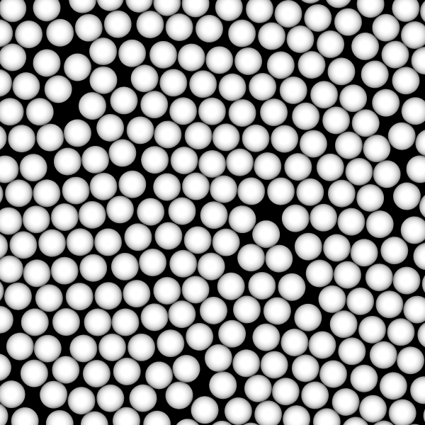

# Hard Disk Self-Assembly

<script type="module">
import init from 'https://glotzerlab.github.io/hoomd-rs/mc-tutorial/hard-disk-self-assembly.js'
{{#include ../../scripts/init-wasm-canvas.js}}
</script>
{{#include ../../scripts/canvas.html}}

## Overview

When compressed to a sufficiently high packing fraction, systems of hard
**particles self-assemble** into ordered structures. Use **periodic boundary
conditions** to model the behavior of the bulk material.

* Objectives:
  * Explain how to execute simulations with **periodic boundary conditions**.
  * Show how to quickly compress the microstate to a target packing fraction.
  * Demonstrate the self-assembly of hard disks into the hexagonal phase.
* File: `hoomd-rs/examples/mc-tutorial/hard-disk-self-assembly.rs`
* Run (interactively):
  ```shell
  cargo run --release --features "bevy" --example hard-disk-self-assembly
  ```
* Run (in batch mode):
  ```shell
  cargo run --release --example hard-disk-self-assembly
  ```

## Use Declarations

```rust,ignore
{{#rustdoc_include ../../../examples/mc-tutorial/hard-disk-self-assembly.rs:use}}
```

## Type Aliases

Create type aliases for your model's *vector*, *body properties*, and *site
properties* types so that you don't need to repeat the full generic type
names throughout the code:
```rust,ignore
{{#rustdoc_include ../../../examples/mc-tutorial/hard-disk-self-assembly.rs:type_aliases}}
```

The **sites** are in this tutorial are represented by isotropic disks.
Therefore, use `Point` for both the **body** and **site** properties.

## The Simulation Model

Here is the type that holds the simulation model:
```rust,ignore
{{#rustdoc_include ../../../examples/mc-tutorial/hard-disk-self-assembly.rs:simulation_struct}}
```

The simulation will consist of two phases:
* Compress: Decrease the volume of the microstate until it reaches a target.
* Equilibrate: Perform hard particle Monte Carlo to self-assembly the hexagonal phase.

The `phase` field tracks the current phase of the simulation. It stores an enum:
```rust,ignore
{{#rustdoc_include ../../../examples/mc-tutorial/hard-disk-self-assembly.rs:phase}}
```

### Construct the Simulation Model

The `new()` method constructs a new simulation model:
```rust,ignore
{{#rustdoc_include ../../../examples/mc-tutorial/hard-disk-self-assembly.rs:simulation_new}}
```

#### Parameters

Assign all the model parameters in one code block:
```rust,ignore
{{#rustdoc_include ../../../examples/mc-tutorial/hard-disk-self-assembly.rs:parameters}}
```

`initial_packing_fraction` is the volume of the disks divided by the volume of
the simulation boundary in the initial state. Choose this value so that the
placed disks do not overlap. During the `Compress` phase, the microstate will
be compressed until it reaches the packing fraction `target_packing_fraction`.
`n_disks` is the number of disks to place in the microstate, `maximum_distance`
is the largest distance a translation trial move can take, `sigma` is the
diameter of each disk, and `macrostate` holds the temperature set point (in
units of energy).

#### Hamiltonian

`HardSphere` represents each site with a hard sphere of the given diameter. The hard
sphere site pair energy $` U_{ij} `$ is infinite when the two sites overlap and 0 when
they do not. Use `PairwiseCutoff` with the `HardSphere` interaction as the Hamiltonian:
```rust,ignore
{{#rustdoc_include ../../../examples/mc-tutorial/hard-disk-self-assembly.rs:hamiltonian}}
```

#### Periodic Boundary Conditions

Perform the hard disk simulation in a `Rhomboid` tilted to match the shape and
aspect ratio of the hexagonal unit cell.

Use **periodic boundary conditions** via the `Periodic` type to represent an
infinitely repeating system. Provide the underlying shape and the **maximum
interaction range** between sites to construct `Periodic`:
```rust,ignore
{{#rustdoc_include ../../../examples/mc-tutorial/hard-disk-self-assembly.rs:periodic}}
```

`Periodic` uses this distance to generate **ghost sites** *outside* the boundary that
are periodic images of **sites** *inside*. Methods like `PairwiseCutoff` will compute
interactions between **sites** inside the boundary and *all* other sites (whether
they are ghosts or not). All pairs separated by a distance larger than the **maximum
interaction range** are assumed to be non-overlapping. You must choose this value
appropriately for your shape(s). For the case of hard disks, the largest distance
between the centers of two potentially overlapping shapes is `sigma`. `HardSphere`
provides this via the `maximum_interaction_range()` method.

> [!IMPORTANT]
> In *hoomd-rs*, it is *YOUR responsibility* to determine the appropriate
> `maximum_interaction_range`. You might be used to other simulation codes,
> HOOMD-blue for example, that *automatically* determine this maximum for
> you. That is not possible in *hoomd-rs* as your model's interactions
> and/or any analysis methods could be *any arbitrary code*.

> [!WARNING]
> If you set `maximum_interaction_range` too small, `PairwiseCutoff` (and similar
> methods) will *miss interactions that should be computed*.

#### Microstate

Construct a microstate with the periodic boundary conditions and the `VecCell`
spatial data structure:
```rust,ignore
{{#rustdoc_include ../../../examples/mc-tutorial/hard-disk-self-assembly.rs:microstate}}
```

#### Place Disks

Place `n_disks` disks in the microstate on a square lattice (in fractional
coordinates):
```rust,ignore
{{#rustdoc_include ../../../examples/mc-tutorial/hard-disk-self-assembly.rs:place_disks}}
```

#### Trial Moves

Apply both `Translate` trial moves to the bodies:
```rust,ignore
{{#rustdoc_include ../../../examples/mc-tutorial/hard-disk-self-assembly.rs:trial_moves}}
```

#### Quickly Compress the Microstate

`QuickCompress` will irreversibly scale the microstate toward the target boundary
volume:
```rust,ignore
{{#rustdoc_include ../../../examples/mc-tutorial/hard-disk-self-assembly.rs:quick_compress}}
```

#### Overlap Penalty Hamiltonian

`QuickCompress` will introduce strain in the system each time it compresses
the microstate. Translation trial moves can relieve that strain over many steps.
It is possible to use `QuickCompress` with pure hard shape interactions, though
you must choose the translation trial move distance very carefully.

The `OverlapPenalty` potential works around this problem. It consists of an infinite energy core
followed by a harmonic potential added to a step function. The infinite core
prevents bodies from overlapping too much on compression, the harmonic potential
encourages the trial moves to separate bodies, and the step function prevents
the trial moves from moving non-overlapping sites into overlapping configurations.

Express this Hamiltonian using `PairwiseCutoff` with an `Isotropic`, `Expanded` interaction:
```rust,ignore
{{#rustdoc_include ../../../examples/mc-tutorial/hard-disk-self-assembly.rs:compress_hamiltonian}}
```

`OverlapPenalty` applies the potential described above (centered on $` r=0 `$)
which `Expanded` shifts to the surface of the sphere at $` r=\sigma `$.

#### Initialize the Struct

Package all these values into a struct to represent the simulation:
```rust,ignore
{{#rustdoc_include ../../../examples/mc-tutorial/hard-disk-self-assembly.rs:struct_initialize}}
```

Begin the simulation in the `Compress` phase.

## Implement `Simulation`

```rust,ignore
{{#rustdoc_include ../../../examples/mc-tutorial/hard-disk-self-assembly.rs:impl_simulation}}
```

### Advance the Simulation

`advance` calls `self.apply()` to advance the simulation when in the
compress phase and `self.equilibrate()` when in the equilibrate phase:
```rust,ignore
{{#rustdoc_include ../../../examples/mc-tutorial/hard-disk-self-assembly.rs:advance}}
```

Each method advances the simulation one step and potentially changes the
`phase`. The `compress` method might return an error (see below). The `anyhow`
method `context` adds additional information to the error message.

### Get the simulation step

```rust,ignore
{{#rustdoc_include ../../../examples/mc-tutorial/hard-disk-self-assembly.rs:step}}
```

## Implement `HardDiskSelfAssembly`

Place the model-specific methods in the **inherent implementation** for
`HardDiskSelfAssembly`:
```rust,ignore
{{#rustdoc_include ../../../examples/mc-tutorial/hard-disk-self-assembly.rs:inherent_simulation}}
```

### Compress

Implement the `compress` phase:
```rust,ignore
{{#rustdoc_include ../../../examples/mc-tutorial/hard-disk-self-assembly.rs:compress}}
```

#### Compress the Microstate

The `quick_compress.apply` method irreversibly compresses the microstate toward the
target boundary volume:
```rust,ignore
{{#rustdoc_include ../../../examples/mc-tutorial/hard-disk-self-assembly.rs:apply_quick_compress}}
```

To avoid jamming the system, `QuickCompress` waits until the total energy of
the given Hamiltonian (`overlap_penalty_hamiltonian` in this case) is 0 before
compressing.

#### Separate Overlapping Bodies

`QuickCompress` is quick because it only scales the system toward the
target (never away from) and may cause some pairs of sites to overlap. Apply
translation and rotation trial moves to separate overlapping pairs and make free
space available for further compression:
```rust,ignore
{{#rustdoc_include ../../../examples/mc-tutorial/hard-disk-self-assembly.rs:compress_trial_moves}}
```

Use `overlap_penalty_hamiltonian` for trial moves during the `compress` step.
The harmonic part of `OverlapPenalty` allows overlaps to be removed over many
simulation steps. Pass a fixed `temperature=1.0` because the energy scale in
`OverlapPenalty` has no relation to that in `hamiltonian`.

> [!WARNING]
> If you use `hamiltonian` here, then a trial move would need to remove an
> overlap in one step. That might not be possible depending on the amount of
> overlap, the trial move size, and the packing fraction of the system.

#### Transition to the Equilibrate State

After many steps, `QuickCompress` should achieve the target boundary volume *and* all
overlaps will be removed (the total energy of `overlap_penalty_hamiltonian` is 0).
When both those are true `quick_compress.is_complete()` will return `true` and the
simulation can proceed to the equilibrate phase:
```rust,ignore
{{#rustdoc_include ../../../examples/mc-tutorial/hard-disk-self-assembly.rs:state_transition}}
```

#### Detect Failures

It might happen `QuickCompress` fails to reach the target boundary volume, even after
many steps. Instead of running the simulation for an infinitely long time, detect this
condition and report an error:
```rust,ignore
{{#rustdoc_include ../../../examples/mc-tutorial/hard-disk-self-assembly.rs:failed}}
```

You can use the `anyhow` crate to report errors with context. Set
`target_packing_fraction` to `1.0`, run the example, and you should get an error
similar to:
```text
Error: failed at step: 10000

Caused by:
    0: failed to compress
    1: Achieved volume 3971.206835460344 after 10000 steps. The target was 3216.990877275948.
```

### Equilibrate

The equilibration phase of the simulation applies the translate
trial moves with the hard overlap Hamiltonian (`hamiltonian`):
```rust,ignore
{{#rustdoc_include ../../../examples/mc-tutorial/hard-disk-self-assembly.rs:equilibrate}}
```

Equilibration never ends in this tutorial. In your own simulations, you might
transition to a production phase after a certain number of steps and eventually
complete the simulation.

## Execute the Simulation in Batch Mode

### Implement `main()`

To run the simulation, construct the `HardDiskSelfAssembly` simulation model.
Then call `advance()` many times and write the sites to a GSD file periodically so that
you can inspect the results of the simulation:
```rust,ignore
{{#rustdoc_include ../../../examples/mc-tutorial/hard-disk-self-assembly.rs:main}}
```

See [Applying Interactions](applying-interactions.md) for a step-by-step explanation
of this code.

> [!NOTE]
> This `main()` function runs in batch mode. There is a different `main()` (not
> shown here) used in the interactive example.

### Run the Simulation

In a terminal, execute the following command to run the simulation in batch mode:
```shell
cargo run --release --example hard-particle-self-assembly
```

### Visualize the Simulation Results

Open the generated `tetronimoes.gsd` in [Ovito] or another visualization
tool to see the simulation results. [Ovito] will render the disks as spheres
with the expected diameter of 1 by default.

Render with Tachyon, and you should see something like:


## Conclusion

This tutorial showed you how to perform hard disk self-assembly simulations
using periodic boundary conditions and `QuickCompress` to achieve a target
packing fraction.

Navigate to the top of the page to see the simulation in action. Notice that
the disks start on an evenly spaced grid and are quickly scaled to a higher
packing fraction. The many grain boundaries are caused by the quick compression.
Over time, local trial moves will heal these grain boundaries leaving a single
crystal.

[Ovito]: https://www.ovito.org/

## Complete Code

```rust,ignore
{{#rustdoc_include ../../../examples/mc-tutorial/hard-disk-self-assembly.rs:all}}
