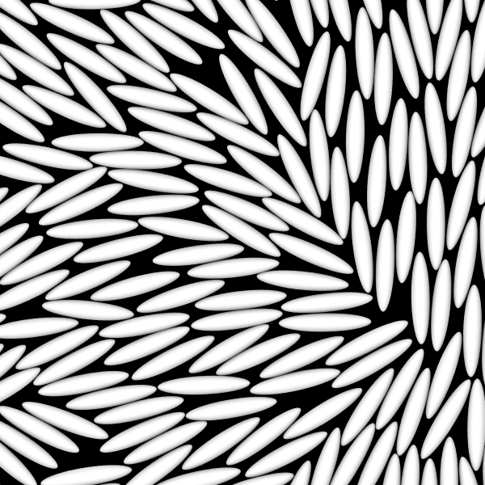

# Hard Ellipse Self-Assembly

<script type="module">
import init from 'https://glotzerlab.github.io/hoomd-rs/mc-tutorial/hard-ellipse-self-assembly.js'
{{#include ../../scripts/init-wasm-canvas.js}}
</script>
{{#include ../../scripts/canvas.html}}

## Overview

There are many ways you can model **anisotropic bodies** in *hoomd-rs*. This
tutorial shows you how to represents **sites** with hard ellipses. You can apply
the same techniques to any hard shape. When compressed to a sufficiently high
packing fraction, systems of hard ellipses **self-assemble** into the nematic
phase.

* Objectives:
  * Show how to quickly insert bodies into the microstate.
  * Demonstrate the self-assembly of hard ellipses into the nematic phase.
* File: `hoomd-rs/examples/mc-tutorial/hard-ellipse-self-assembly.rs`
* Run (interactively):
  ```shell
  cargo run --release --features "bevy" --example hard-ellipse-self-assembly
  ```
* Run (in batch mode):
  ```shell
  cargo run --release --example hard-ellipse-self-assembly
  ```

## Use Declarations

```rust,ignore
{{#rustdoc_include ../../../examples/mc-tutorial/hard-ellipse-self-assembly.rs:use}}
```

## Type Aliases

Create type aliases for your model's *vector*, *body properties*, and *site
properties* types so that you don't need to repeat the full generic type
names throughout the code:
```rust,ignore
{{#rustdoc_include ../../../examples/mc-tutorial/hard-ellipse-self-assembly.rs:type_aliases}}
```

The **sites** are in this tutorial are represented by ellipses with both
position and orientation. Therefore, use `OrientedPoint` for both the **body**
and **site** properties.

## The Simulation Model

Here is the type that holds the simulation model:
```rust,ignore
{{#rustdoc_include ../../../examples/mc-tutorial/hard-ellipse-self-assembly.rs:simulation_struct}}
```

The simulation will consist of two phases:
* Initialize: Add new ellipses to the microstate and compress to the target packing
  fraction.
* Equilibrate: Perform hard particle Monte Carlo to self-assembly the nematic phase.

The `phase` field tracks the current phase of the simulation. It stores an enum:
```rust,ignore
{{#rustdoc_include ../../../examples/mc-tutorial/hard-ellipse-self-assembly.rs:phase}}
```

### Construct the Simulation Model

The `new()` method constructs a new simulation model:
```rust,ignore
{{#rustdoc_include ../../../examples/mc-tutorial/hard-ellipse-self-assembly.rs:simulation_new}}
```

#### Parameters

Assign all the model parameters in one code block:
```rust,ignore
{{#rustdoc_include ../../../examples/mc-tutorial/hard-ellipse-self-assembly.rs:parameters}}
```

`initial_packing_fraction` is the volume of the ellipses divided by the volume
of the simulation boundary in the initial state. Choose this value so that
ellipses can be placed easily in the microstate. During the `Initialize`
phase, the microstate will be compressed until it reaches the packing fraction
`target_packing_fraction`. `n_bodies` is the number of ellipses to add,
`maximum_distance` is the largest distance a translation trial move can take
(initially), `maximum_rotation` is the largest angle possible in a rotation
trial move (initially), `sigma` is the major axis of the ellipse, `aspect` is
the ellipse aspect ratio and `macrostate` holds the temperature set point (in
units of energy).

To ensure that `sigma` is the major axis, `aspect` must be greater than or equal
to 1.0.

#### Hamiltonian

`HardShape` represents each site with the given shape. The site pair
energy $` U_{ij} `$ is infinite when the two sites overlap and 0 when they do
not. Use `PairwiseCutoff` with the `HardShape` interaction as the Hamiltonian:
```rust,ignore
{{#rustdoc_include ../../../examples/mc-tutorial/hard-ellipse-self-assembly.rs:hamiltonian}}
```

#### Periodic Boundary Conditions

```rust,ignore
{{#rustdoc_include ../../../examples/mc-tutorial/hard-ellipse-self-assembly.rs:periodic}}
```

For the case of hard ellipses, the largest distance between the
centers of two potentially overlapping ellipses is `sigma` &mdash; when two
ellipses a distance `sigma` apart rotated so their their long axes just touch.
`HardShape` computes this in the `maximum_interaction_range()` method.

#### Microstate

Construct a microstate with the periodic boundary conditions and the `VecCell`
spatial data structure:
```rust,ignore
{{#rustdoc_include ../../../examples/mc-tutorial/hard-ellipse-self-assembly.rs:microstate}}
```
Start with no bodies in the microstate.

#### Trial Moves

Apply both `Translate` and `Rotate` trial moves to the bodies:
```rust,ignore
{{#rustdoc_include ../../../examples/mc-tutorial/hard-ellipse-self-assembly.rs:trial_moves}}
```

In 2D simulations, `Rotate` uniformly selects a random angle between
`-maximum_rotation` and `maximum_rotation` and rotates the body by that angle.

#### Quickly Insert Bodies

The [Hard Disk Self-Assembly] tutorial placed disks on a square lattice. While
the same can be done for hard ellipses, the process is not as simple. Instead,
this tutorial uses `QuickInsert` to randomly place the ellipses.

[Hard Disk Self-Assembly]: hard-disk-self-assembly.md

`QuickInsert` will add *up to* `n_bodies` new bodies to the microstate
drawn randomly from the given distribution. `UniformIn` generates bodies
with positions uniformly distributed in the given `boundary` and orientations
uniformly distributed among all possible orientations:
```rust,ignore
{{#rustdoc_include ../../../examples/mc-tutorial/hard-ellipse-self-assembly.rs:quick_insert}}
```

`UniformIn` clones `template_sites` for each new body. In this case, a body
is represented by a single site at the body's origin and has a default
orientation.

#### Quickly Compress the Microstate

`QuickCompress` will irreversibly scale the microstate toward the target boundary
volume:
```rust,ignore
{{#rustdoc_include ../../../examples/mc-tutorial/hard-disk-self-assembly.rs:quick_compress}}
```

#### Overlap Penalty Hamiltonian

`QuickInsert` will only add a body when the change in energy due to the addition
is finite. You *could* use the hard particle `hamiltonian` with `QuickInsert`
and ensure that no ellipses in the microstate overlap. However, random body
insertions do not pack densely.

One way around this problem is to allow bodies to overlap *a little* when
inserted and allow later translate and rotate trial moves to remove that
overlap. The `OverlapPenalty` potential consists of an infinite energy core
followed by a harmonic potential added to a step function. The infinite core
prevents inserted bodies from overlapping too much, the harmonic potential
encourages the trial moves to separate bodies, and the step function prevents
the trial moves from moving non-overlapping sites into overlapping configurations.

Express this Hamiltonian using `PairwiseCutoff` with an `Anisotropic` interaction:
```rust,ignore
{{#rustdoc_include ../../../examples/mc-tutorial/hard-ellipse-self-assembly.rs:overlap_penalty_hamiltonian}}
```

`ApproximateShapeOverlap` computes the *approximate* amount of overlap between
a pair of shapes, `OverlapPenalty` applies the potential described above,
and the `Anisotropic` `PairwiseCutoff` computes this potential on pairs of
sites.

> [!IMPORTANT]
> Use `ApproximateShapeOverlap` *only* to remove overlaps during initialization.
> It does not compute the *exact* amount of overlap and is therefore not
> appropriate for use in production sampling.

#### Initialize the Struct

Package all these values into a struct to represent the simulation:
```rust,ignore
{{#rustdoc_include ../../../examples/mc-tutorial/hard-ellipse-self-assembly.rs:struct_initialize}}
```

Begin the simulation in the `Initialize` phase.

## Implement `Simulation`

```rust,ignore
{{#rustdoc_include ../../../examples/mc-tutorial/hard-ellipse-self-assembly.rs:impl_simulation}}
```

### Advance the Simulation

`advance` calls `self.initialize()` to advance the simulation when in the
initialization phase and `self.equilibrate()` when in the equilibration phase:
```rust,ignore
{{#rustdoc_include ../../../examples/mc-tutorial/hard-ellipse-self-assembly.rs:advance}}
```

Each method advances the simulation one step and potentially changes the
`phase`. The `initialize` method might return an error (see below). The `anyhow`
method `context` adds additional information to the error message.

### Get the simulation step

```rust,ignore
{{#rustdoc_include ../../../examples/mc-tutorial/hard-ellipse-self-assembly.rs:step}}
```

## Implement `HardEllipseSelfAssembly`

Place the model-specific methods in the **inherent implementation** for
`HardEllipseSelfAssembly`:
```rust,ignore
{{#rustdoc_include ../../../examples/mc-tutorial/hard-ellipse-self-assembly.rs:inherent_simulation}}
```

### Initialize

Implement the `initialize` phase:
```rust,ignore
{{#rustdoc_include ../../../examples/mc-tutorial/hard-ellipse-self-assembly.rs:initialize}}
```

#### Add New Bodies and Compress

The `quick_insert.apply` method adds new randomly placed bodies to the microstate and
`quick_compress.apply` irreversibly compresses the microstate toward the
target boundary volume. Insert all `n_bodies` ellipses first, *then* compress
to the target volume:
```rust,ignore
{{#rustdoc_include ../../../examples/mc-tutorial/hard-ellipse-self-assembly.rs:apply_quick_insert_compress}}
```

#### Separate Overlapping Bodies

`QuickInsert` is quick because it only inserts bodies (it never
removes them) that may overlap with others (as determined by the
`overlap_penalty_hamiltonian`). Apply translation and rotation trial moves
to separate overlapping pairs and make free space available for more body
insertions:
```rust,ignore
{{#rustdoc_include ../../../examples/mc-tutorial/hard-ellipse-self-assembly.rs:initialize_trial_moves}}
```

Use `overlap_penalty_hamiltonian` for trial moves during the `initialize` step.
The harmonic part of `OverlapPenalty` allows overlaps to be removed over many
simulation steps. Pass a fixed `temperature=1.0` because the energy scale in
`OverlapPenalty` has no relation to that in `hamiltonian`.

> [!WARNING]
> If you use `hamiltonian` here, then a trial move would need to remove an
> overlap in one step. That might not be possible depending on the amount of
> overlap, the trial move size, and the density of the system.

#### Transition to the Equilibrate State

After many steps, `QuickInsert` should add all the requested bodies,
`QuickCompress` should achieve the target boundary volume, *and* all
overlaps will be removed (the total energy of `overlap_penalty_hamiltonian` is 0).
When all those are true `quick_compress.is_complete()` will return `true`. Before
proceeding to the equilibrate phase, call `tune_with_options` to adjust the
trial move sizes and achieve a 20% move acceptance rate:
```rust,ignore
{{#rustdoc_include ../../../examples/mc-tutorial/hard-ellipse-self-assembly.rs:state_transition}}
```

#### Detect Failures

It might happen that after a long time, `QuickInsert` fails to add the target
number of bodies or `QuickCompress` is unable to achieve the target volume.
Instead of running the simulation for an infinitely long time, detect this
condition and report an error:
```rust,ignore
{{#rustdoc_include ../../../examples/mc-tutorial/hard-ellipse-self-assembly.rs:failed}}
```

You can use the `anyhow` crate to report errors with context. Set
`initial_packing_fraction` to `1.0`, run the example, and you should get an
error similar to:
```text
Error: failed to initialize

Caused by:
    inserted 391/512 bodies and compressed to 80.4247719318987 / 114.89253133128388
```

### Equilibrate

The equilibration phase of the simulation applies the translate and rotate
trial moves with the hard overlap Hamiltonian (`hamiltonian`):
```rust,ignore
{{#rustdoc_include ../../../examples/mc-tutorial/hard-ellipse-self-assembly.rs:equilibrate}}
```

Equilibration never ends in this tutorial. In your own simulations, you might
transition to a production phase after a certain number of steps and eventually
complete the simulation.

## Execute the Simulation in Batch Mode

### Implement `main()`

To run the simulation, construct the `HardEllipseSelfAssembly` simulation model.
Then call `advance()` many times and write the sites to a GSD file periodically so that
you can inspect the results of the simulation:
```rust,ignore
{{#rustdoc_include ../../../examples/mc-tutorial/hard-ellipse-self-assembly.rs:main}}
```

See [Applying Interactions](applying-interactions.md) for a step-by-step explanation
of this code.

> [!NOTE]
> This `main()` function runs in batch mode. There is a different `main()` (not
> shown here) used in the interactive example. The interactive example does *not*
> write the GSD file.

### Run the Simulation

In a terminal, execute the following command to run the simulation in batch mode:
```shell
cargo run --release --example hard-ellipse-self-assembly
```

### Visualize the Simulation Results

Open the generated `hard-ellipse-self-assembly.gsd` in [Ovito] or another
visualization tool to see the simulation results. To render the ellipses in
[Ovito], import this [modifier snippet] (use the copy button to copy the entire
text to your clipboard):
```
{"description": "OVITO Modifier Snippet: Compute property (Aspherical Shape)", "payload": "AAAC6njahVLNSsNAEP4a21p/aP0BFS8WEfQgpUW8K+rBg1q0FO0ttts00GbDZgP6BD6BV/GuB1/Ciw/iUwg6m0yaiIoD3+zm29mZLzNbeX59mv546wDhHoASYQFnaOMYLVqraEJBEjtBqCC2WeyghgZ2ydeZy8UwC174e5uQJ2wQqthHAB8DCMroogsbQ2IviLGJFxRjEZa4loXLyF9FvsPsOq9Fqluj+smu8W2XZ1hIrUCYM7c/M5Ye54zeO9ZdlqH2Q91U0hdK3yLzi+WuHPnSE54+tUciyB7NiBtfiSBwpTfmjdZSTwyFY2vzh4+5jLRFT7jO4Fqqox8XLZZkmfg1wvIB1Q21SDSdyJ7bd4WKa0RhZhJbTVtptzsUwR/xh6mWAt9bNTNn3vWcTOYiR6yY3v2SYZLPN43I/wvmOdyMoZQpk6SZJ0ydi37LVo7QaQPplYzfV2Rt7lAy33ceQpHnbPb3ceKomQ/GfQEXHnuD"}
```
Alternately, you can:
1) Add a [Compute Property] modification to the pipeline.
2) Set *Property Name* to [Aspherical Shape].
3) Set X=0.5, Y=0.1, Z=0.1.
To save time when visualizing many similar systems, you can [save the session state]
or use [modifier templates].


[Ovito]: https://www.ovito.org/
[Compute Property]: https://docs.ovito.org/reference/pipelines/modifiers/compute_property.html#particles-modifiers-compute-property
[Aspherical Shape]: https://docs.ovito.org/advanced_topics/aspherical_particles.html
[save the session state]: https://docs.ovito.org/usage/miscellaneous.html#usage-saving-loading-scene
[modifier templates]: https://docs.ovito.org/reference/app_settings/modifier_templates.html#modifier-templates
[modifier snippet]: https://docs.ovito.org/advanced_topics/modifier_snippets.html#modifier-snippets

Render with Tachyon, and you should see something like:


## Conclusion

This tutorial showed you how to perform hard-ellipse self-assembly simulations
using a shape overlap potential, periodic boundary conditions, and `QuickInsert`
to add bodies.

Navigate to the top of the page to see the simulation in action. Notice that
ellipses are first added in a large batch. Once all the overlaps are removed,
another batch appears. After all all ellipses are in the microstate and not
overlapping, the simulation compresses to a higher packing fraction. After
that, it speeds up as it begins using the more efficient hard particle overlap
Hamiltonian. Watch the simulation long enough and you should see domains form
where all the ellipses point in roughly the same direction while at the same
time there is no translational order. This is the nematic phase.

## Complete Code

```rust,ignore
{{#rustdoc_include ../../../examples/mc-tutorial/hard-ellipse-self-assembly.rs:all}}
