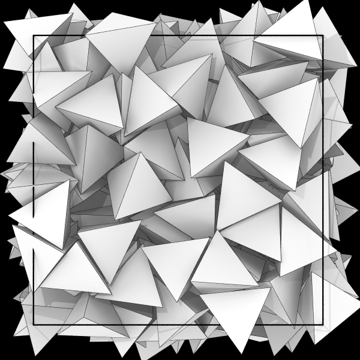

# Hard Tetrahedron Self-Assembly

<script type="module">
import init from 'https://glotzerlab.github.io/hoomd-rs/mc-tutorial/hard-tetrahedron-self-assembly.js'
{{#include ../../scripts/init-wasm-canvas.js}}
</script>
{{#include ../../scripts/canvas.html}}

## Overview

There are many ways you can model **anisotropic bodies** in *hoomd-rs*. This
tutorial shows you how to represents **sites** with hard convex polyhedra.
When compressed to a sufficiently high packing fraction, systems of hard
tetrahedra **self-assemble** into a quasicrystal: [10.1038/nature08641].

[10.1038/nature08641]: https://doi.org/10.1038/nature08641

* Objectives:
  * Explain how to model system of hard convex polytopes.
  * Demonstrate the self-assembly of hard tetrahedra.
* File: `hoomd-rs/examples/mc-tutorial/hard-tetrahedron-self-assembly.rs`
* Run (interactively):
  ```shell
  cargo run --release --features "bevy" --example hard-tetrahedron-self-assembly
  ```
* Run (in batch mode):
  ```shell
  cargo run --release --example hard-tetrahedron-self-assembly
  ```

## Use Declarations

```rust,ignore
{{#rustdoc_include ../../../examples/mc-tutorial/hard-tetrahedron-self-assembly.rs:use}}
```

## Type Aliases

Create type aliases for your model's *vector*, *body properties*, and *site
properties* types so that you don't need to repeat the full generic type
names throughout the code:
```rust,ignore
{{#rustdoc_include ../../../examples/mc-tutorial/hard-tetrahedron-self-assembly.rs:type_aliases}}
```

The **sites** are in this tutorial are represented by tetrahedra with both
position and orientation. Therefore, use `OrientedPoint` for both the **body**
and **site** properties. Use `Versor` to represent rotations in 3D.

## Construct the Simulation Model

The `new()` method constructs a new simulation model:
```rust,ignore
{{#rustdoc_include ../../../examples/mc-tutorial/hard-tetrahedron-self-assembly.rs:simulation_new}}
```

### Parameters

Assign all the model parameters in one code block:
```rust,ignore
{{#rustdoc_include ../../../examples/mc-tutorial/hard-tetrahedron-self-assembly.rs:parameters}}
```

`initial_packing_fraction` is the volume of the tetrahedra divided by the
volume of the simulation boundary in the initial state. Choose this value so
that tetrahedra can be placed easily in the microstate. During the `Initialize`
phase, the microstate will be compressed until it reaches the packing fraction
`target_packing_fraction`. `n_bodies` is the number of tetrahedra to add,
`maximum_distance` is the largest distance a translation trial move can take
(initially), `maximum_rotation`controls the size of the rotation trial moves
(initially), and `macrostate` holds the temperature set point (in units of
energy).

### Hamiltonian

A `ConvexPolyhedron` is the shape given by the convex hull of the given vertices.
Wrap it in the `Convex` newtype for use with the `HardShape` Hamiltonian:
```rust,ignore
{{#rustdoc_include ../../../examples/mc-tutorial/hard-tetrahedron-self-assembly.rs:hamiltonian}}
```
[Coxeter] is one of many tools you can use to construct the vertices of a
convex polyhedron.

[Coxeter]: https://coxeter.readthedocs.io

## Initialization and Simulation

See the [Hard Ellipse Self-Assembly] tutorial for a complete explanation of
remaining initialization and simulation code (see also the [complete code] below).

[Hard Ellipse Self-Assembly]: hard-ellipse-self-assembly.md
[complete code]: #complete-code

## Execute the Simulation in Batch Mode

### Implement `main()`

To run the simulation, construct the `HardTetrahedronSelfAssembly` simulation model.
Then call `advance()` many times and write the sites to a GSD file periodically so that
you can inspect the results of the simulation:
```rust,ignore
{{#rustdoc_include ../../../examples/mc-tutorial/hard-tetrahedron-self-assembly.rs:main}}
```

See [Applying Interactions](applying-interactions.md) for a step-by-step explanation
of this code.

> [!NOTE]
> This `main()` function runs in batch mode. There is a different `main()` (not
> shown here) used in the interactive example. The interactive example does *not*
> write the GSD file.

### Run the Simulation

In a terminal, execute the following command to run the simulation in batch mode:
```shell
cargo run --release --example hard-tetrahedron-self-assembly
```

### Visualize the Simulation Results

Open the generated `hard-tetrahedron-self-assembly.gsd` in [Ovito] or another
visualization tool to see the simulation results. To render the tetrahedra in
[Ovito], import this [modifier snippet] (use the copy button to copy the entire
text to your clipboard):
```
{"description": "OVITO Modifier Snippet: Edit types (Particle Type)", "payload": "AAAHKXjafVU9TBRBFH573HG/cAL+oYVnaAwFosTEBMyJeAUFgeBJYUOG3eF2de/2srsHucTCwspEY6hsDIWJjRY2diRUhoTERkysTIwWFhYYO4mJzpt9cyzrwiTvZu5972/ee/O2+Prdq9yf7TsAresAkBHUD7OwANNQFXsJ5sAFR3C7BBUhWAUYgxG4BFfE7yjxtIBw6+qn/xnaE0QPab9PewFl5lynyV2/Lc4j0AQm/PlggQ42cPDgoojgIK8kImsLSS40Lv+HelA6vybjPlxLLbxTSqM/SUFZLYSmMErJ6JYnPKY7p4zSRVY2qpuLMvKYCo3unCTfPXRG+71os/yzo1DseDomaFAr7+auNV98ykV3AfZhFEGeJ2X9AMbJ8hhlGj1l55jrW7rNPfHnzJEJGhB0+giPx1VSpEO1TpBTXCdVeaEui2KG5DDUXZL9rrK/+aH98m2+eKH8JWBsbpc2rg73/y5/DfgTb0D7/HxrR/GV/GZEfmP97940e7Q+8RTgx8et+fK3Z4+Hzz0ZhyNXkgoJoY5VK03VShAW5WsRW4oPB+1gLRM6yee5YfncqLabshqyzZKE9XpOy9V56F10TJ3STV63dGZXbF7nDX9x0TOZ4axSsoNHVWeeFwcMClaT3/b4DPfMKcd23DipISl1g+n3lpnOp1q2bTVqlQZbsrkRJ3/WtGqmLci/hYoVo8ZjvfdIu3FI34qxOs8MqxWr1+seCg3EuBbsBwrPSpd4W0ysFipjSiLhzHYHbsL9UOTxt0asR4/LHyKFBqvzWBVntcHdaFURSUljKnLkJNFIeA7lVyyPai5iTK5p9AARy1mGYFvLFnfDXfeL2moQU1wR7SabbcYxlGSaBPAxF9RsQKEgiH2s6lqsUbMpk+hTYjgk8hQUqSkIR1DuJvPZ7NJdrvvBuJQIjrU0IguWFwzOhJpxmVBsShxHW3aeL1eZW+M+3a4T2KTuWys87EO+u9H9z5FcC6FPEK496gR6pIlp+hqYNLfwIjs01THP7xH8BwoEH1E="}
```

Alternately, you can:
1) Download [tetrahedron.obj].
2) Add an [Edit types] modification to the Ovito pipeline.
3) Choose the `Mesh/user-defined` *shape*.
4) Set the *Display radius* to 1.
5) Click *Load geometry file...* and choose `tetrahedron.obj`.
To save time when visualizing many similar systems, you can [save the session state]
or use [modifier templates].

[Ovito]: https://www.ovito.org/
[Edit types]: https://www.ovito.org/docs/current/reference/pipelines/modifiers/edit_types.html
[tetrahedron.obj]: tetrahedron.obj
[save the session state]: https://docs.ovito.org/usage/miscellaneous.html#usage-saving-loading-scene
[modifier templates]: https://docs.ovito.org/reference/app_settings/modifier_templates.html#modifier-templates
[modifier snippet]: https://docs.ovito.org/advanced_topics/modifier_snippets.html#modifier-snippets

Render with Tachyon, and you should see something like:


> [!TIP]
> Use [Coxeter], [Blender], [OnShape], or any modeling tool you prefer to
> create `.obj` files that best represent your model's sites.

[Blender]: https://www.blender.org
[OnShape]: https://www.onshape.com

## Conclusion

This tutorial showed you how to perform hard tetrahedron self-assembly simulations
using a shape overlap potential.

Navigate to the top of the page to see the simulation in action. Notice that
tetrahedra are first added in a large batch. Once all the overlaps are removed,
another batch appears. After all all tetrahedra are in the microstate and not
overlapping, the simulation compresses to a higher packing fraction. After
that, it speeds up as it begins using the more efficient hard particle overlap
Hamiltonian. Watch the simulation long enough and you should see dimers and
pentamers form. These motifs organize to form a quasicrystal, but only after
very long simulation times with at least 4096 tetrahedra: [10.1038/nature08641].

## Complete Code

```rust,ignore
{{#rustdoc_include ../../../examples/mc-tutorial/hard-tetrahedron-self-assembly.rs:all}}
