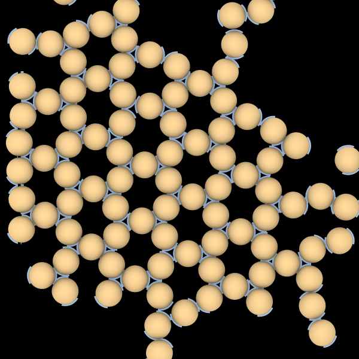

# Patchy Particle Self-Assembly

<script type="module">
import init from 'https://glotzerlab.github.io/hoomd-rs/mc-tutorial/patchy-particle-self-assembly.js'
{{#include ../../scripts/init-wasm-canvas.js}}
</script>
{{#include ../../scripts/canvas.html}}

## Overview

There are many ways you can model **anisotropic bodies** in *hoomd-rs*.
This tutorial shows you how to represents **sites** that have a hard core
and two attractive patches. This system self-assembles the kagome structure
([10.1039/C0SM01494J]) using the optimal parameters given in [10.1039/D2SM01593E].
The tutorial also uses a temperature ramp to improve the quality of the
self-assembled structures and logs the temperature and potential energy
for further analysis.

[10.1039/C0SM01494J]: https://doi.org/10.1039/C0SM01494J
[10.1039/D2SM01593E]: https://doi.org/10.1039/D2SM01593E

* Objectives:
  * Explain how to model systems of hard core particles with attractive patches.
  * Describe how to vary system parameters as a function of step.
  * Show how to log the system potential energy and temperature as a function of simulation step.
  * Demonstrate the self-assembly of patchy particles.
* File: `hoomd-rs/examples/mc-tutorial/patchy-particle-self-assembly.rs`
* Run (interactively):
  ```shell
  cargo run --release --features "bevy" --example patchy-particle-self-assembly
  ```
* Run (in batch mode):
  ```shell
  cargo run --release --example patchy-particle-self-assembly
  ```

## Use Declarations

```rust,ignore
{{#rustdoc_include ../../../examples/mc-tutorial/patchy-particle-self-assembly.rs:use}}
```

## Type Aliases

Create type aliases for your model's *vector*, *body properties*, and *site
properties* types so that you don't need to repeat the full generic type
names throughout the code:
```rust,ignore
{{#rustdoc_include ../../../examples/mc-tutorial/patchy-particle-self-assembly.rs:type_aliases}}
```

The **sites** are in this tutorial are represented by disks with both
position and orientation. Therefore, use `OrientedPoint` for both the **body**
and **site** properties. Use `Angle` to represent rotations in 2D.

## Site Pair Interaction

The `SitePairInteraction` type combines a hard disk overlap with attractive
patches:
```rust,ignore
{{#rustdoc_include ../../../examples/mc-tutorial/patchy-particle-self-assembly.rs:site_pair_interaction}}
```
Use the provided derive macros to implement the traits `MaximumInteractionRange`
and `SitePairEnergy` so that this type may be used with `PairwiseCutoff`.

The [Hamiltonian](#hamiltonian) section explains each term in more detail.

## Construct the Simulation Model

The `new()` method constructs a new simulation model:
```rust,ignore
{{#rustdoc_include ../../../examples/mc-tutorial/patchy-particle-self-assembly.rs:simulation_new}}
```

### Parameters

Assign all the model parameters in one code block:
```rust,ignore
{{#rustdoc_include ../../../examples/mc-tutorial/patchy-particle-self-assembly.rs:parameters}}
```

`initial_packing_fraction` is the volume of the disks divided by the volume
of the simulation boundary in the initial state. Choose this value so
that disks can be placed easily in the microstate. During the `Initialize`
phase, the microstate will be compressed until it reaches the packing
fraction `target_packing_fraction`. `n_disks` is the number of disks to add,
`maximum_distance` is the largest distance a translation trial move can take
(initially), and `maximum_rotation`controls the size of the rotation trial moves
(initially). `sigma` is the disk diameter, `patch_interaction_range` is largest
distance at which the attractive interaction applies, `patch_half_angle` is
the half open angle of the patch, and `patch_energy` is the potential energy
of a pair of particles when their patches align. `initial_temperature` sets
the temperature at step 0, `final_temperature` sets the temperature at step
`ramp_steps`, and `macrostate` holds the current temperature set point (in units
of energy).

### Hamiltonian

#### Hard Disk Term

As in [Hard Disk Self-Assembly], use `HardSphere` to model the hard cores
placed at each site:
```rust,ignore
{{#rustdoc_include ../../../examples/mc-tutorial/patchy-particle-self-assembly.rs:hard_disk}}
```

[Hard Disk Self-Assembly]: hard-disk-self-assembly.md

#### Patch Term

Use `AngularMask` combined with `Boxcar` to compute the patch interactions
detailed in [10.1039/C0SM01494J]. The `Boxcar` isotropic potential places an
attractive well at all distances less than `patch_interaction_range`.
`AngularMask` modulates that potential with oriented patches.
Place two patches, one directed up and one directed down in the site's local
frame.
```rust,ignore
{{#rustdoc_include ../../../examples/mc-tutorial/patchy-particle-self-assembly.rs:patch}}
```

#### Combined Pairwise Potential

The full Hamiltonian of the system is the sum of these two pairwise interaction terms.
You could use `hamiltonian = Hamiltonian { hard_disk, angular_mask }`
to add the terms (as demonstrated in [Applying Interactions]), but it is slightly
faster to use one `PairwiseCutoff` on a type that holds multiple
site pair interactions:
```rust,ignore
{{#rustdoc_include ../../../examples/mc-tutorial/patchy-particle-self-assembly.rs:hamiltonian}}
```

The former performs two loops over nearby sites and adds the results together
$`\left( \sum U^A_{ij} + \sum U^B_{ij} \right)`$ while the latter performs one loop and adds
terms in the loop body $`\left( \sum U^A_{ij} + U^B_{ij} \right)`$.

> [!TIP]
> Always list hard shape potentials first in struct. If the hard shapes
> overlap, *hoomd-rs* can assume that the move will be rejected and skip the
> computation of the following terms.

[Applying Interactions]: applying-interactions.md

#### Overlap Penalty Hamiltonian

This example uses `overlap_penalty_hamiltonian` when inserting disks randomly
and compressing the system to the target packing fraction. Use only the hard core
term to allow the system to arrange randomly without being hindered by the patches:
```rust,ignore
{{#rustdoc_include ../../../examples/mc-tutorial/patchy-particle-self-assembly.rs:compress_hamiltonian}}
```

### More Initialization

See the [Hard Ellipse Self-Assembly] tutorial for a complete explanation of
remaining initialization code (see also the [complete code] below).

[Hard Ellipse Self-Assembly]: hard-ellipse-self-assembly.md
[complete code]: #complete-code

## Implement `Simulation`

To implement the temperature ramp, modify `macrostate` at the start of
`advance()`.  This code implements a linear ramp from `initial_temperature` to
`final_temperature` as a function of the current simulation step:
```rust,ignore
{{#rustdoc_include ../../../examples/mc-tutorial/patchy-particle-self-assembly.rs:simulation}}
```

The remainder of the simulation code is identical to that in the
[Hard Ellipse Self-Assembly] tutorial (see also the [complete code] below).

## Log the Potential Energy and Temperature

When running simulations in batch mode, you often want to write a **log** file
for later analysis. In this system of patchy particles, the total system
potential energy indicates how many bonds have formed and therefore what
fraction of the system is part of the kagome structure.

### Log Record

Define a struct that records all quantities of interest:
```rust,ignore
{{#rustdoc_include ../../../examples/mc-tutorial/patchy-particle-self-assembly.rs:log_record}}
```

This tutorial writes the log to a [parquet] file (you may choose any file format
you like in your own projects). Parquet is a binary, column-oriented format
that preserves the full precision of every record value and can be written and read
efficiently. It is supported by R, pandas, MATLAB, and many other tools.
`#[derive(ParquetRecordWriter)]` generates code that writes each field of the
struct to a column with the same name.

[parquet]: https://parquet.apache.org/

### `main()`

The `main()` function executes when your binary in batch mode:
```rust,ignore
{{#rustdoc_include ../../../examples/mc-tutorial/patchy-particle-self-assembly.rs:main}}
```

> [!NOTE]
> This `main()` function runs in batch mode. There is a different `main()` (not
> shown here) used in the interactive example. The interactive example does *not*
> write any output files.

### Open the Log File

`ParquetLogger` from the `hoomd_utility` crate helps you write [parquet] files.
Use it to create a new parquet file:
```rust,ignore
{{#rustdoc_include ../../../examples/mc-tutorial/patchy-particle-self-assembly.rs:log_open}}
```

### Simulation Steps

To run the simulation, construct the `PatchyParticleSelfAssembly` simulation model.
Then call `advance()` many times and write the sites to a GSD file periodically so that
you can inspect the results of the simulation:
```rust,ignore
{{#rustdoc_include ../../../examples/mc-tutorial/patchy-particle-self-assembly.rs:run_simulation}}
```

### Write Log Records

On desired simulation steps, construct a `LogRecord` and call `parquet_logger.log`
to add it to the log file:
```rust,ignore
{{#rustdoc_include ../../../examples/mc-tutorial/patchy-particle-self-assembly.rs:write_log}}
```

> [!NOTE]
> Log records will not immediately appear in the file. `ParquetLogger` buffers
> log records in memory and writes them in batches.

### Exit `main()`

`ParquetWriter` writes all buffered log entries and closes the file when it
is dropped, which occurs automatically when `main()` returns:
```rust,ignore
{{#rustdoc_include ../../../examples/mc-tutorial/patchy-particle-self-assembly.rs:exit}}
```

### Run the Simulation

In a terminal, execute the following command to run the simulation in batch mode:
```shell
cargo run --release --example patchy-particle-self-assembly
```

### Examine the Log

Open the log file `patchy-particle-self-assembly.parquet` and plot it using the
tool of your choice. It will look something like this:
<script src="https://cdn.jsdelivr.net/npm/vega@6"></script>
<script src="https://cdn.jsdelivr.net/npm/vega-lite@6"></script>
<script src="https://cdn.jsdelivr.net/npm/vega-embed@7"></script>

<div id="vis" style="width: 100%"></div>

<script type="text/javascript">
  var spec = {
    $schema: 'https://vega.github.io/schema/vega-lite/v6.json',
    description: 'Potential energy versus step for patchy particle self-assembly.',
    data: {"name": "data", "url": "patchy-particle-self-assembly.csv"} ,
    "vconcat": [{
    width: "container",
    height: 200,
    "layer": [{
    mark: { type: 'line', tooltip: true},
    encoding: {
      x: {field: 'step', type: 'quantitative'},
      y: {field: 'potential_energy', type: 'quantitative'},
    }},
    {
    mark: { type: 'line', tooltip: true},
    encoding: {
      x: {field: 'step', type: 'quantitative'},
      y: {field: 'no_ramp', type: 'quantitative'},
    }},

    ]},
    {
    width: "container",
    height: 200,
    mark: { type: 'line', tooltip: true},
    encoding: {
      x: {field: 'step', type: 'quantitative'},
      y: {field: 'temperature', type: 'quantitative'},
    }}
    ],
  };
  var tooltipOptions = {
    theme: 'dark'
  };
  vegaEmbed('#vis', spec, {theme: 'dark', actions: false, tooltip: tooltipOptions} )
    .then(function (result) {
      // Access the Vega view instance (https://vega.github.io/vega/docs/api/view/) as result.view
    })
    .catch(console.error);
</script>


### Visualize the Simulation Results

Open the generated `patchy-particle-self-assembly.gsd` in [Ovito] or another
visualization tool to see the simulation results. By default, Ovito displays the
sites as appropriately sized spheres. To render the disk with patches,
import this [modifier snippet] (use the copy button to copy the entire
text to your clipboard):
```
{"description": "OVITO Modifier Snippet: Edit types (Particle Type)", "payload": "AABcqXjafZwHeBXFFsfvhhISEnoVpEhRFGJoNtChRURFUBARFQjJBYKBYBJArIjis9AV1AQVAbGABQVBBQ6gIgRFmvQWAQFRRCzPJ5a3u/d/b27+d475viXktyezszNnzpwyN5UXf7Yo8c+iAYHAmE6BQKCCe1UL9Ar0C/QI9HW/Nwr0DuQGclxaxr0qB0JfSYG2gZRA60B7999UMCd0ed/6z8TPFfA9Dtdj+P4Avid5Mr1zc0YHc/PHu/9PCYwOpLvPyw9kBTIC2YFgIC9wqduD0qyR27PxrmTQ/Y02MXfzAo0az/T7rf9W+Mt7p3IOfijrXglO1N1yXi99UN7/n/ff+Mj/KoR/10MJ/LuJDCp6Q+Hgncvi2cn4v9d+Ja9NcybyC5UjT6riXnUd82Pi1aPn70rk7+7Nql4vQuPc2Z+/QKADWm6LkfaelNA7PTc/KyM7mOf+cN6/DlB196rzL0+sER4U/4Hhr5p4qPdVKzy9gZH+pAyPknO72i8nJNtvGFA7s71L9bnrl04ye6aOrPlWlRx54wXvq4C5CfMd/b6dPW9UX7N76S0TH90+SOORdr4eUu+hxM/3ml2bJ7VdEp9vFB6R35nRsmGXj4eanQdGlV1ze2Oj8Ij8rttf2rX+3DbzdfHEoeNaDTQKj8jvTitf0POXCWbHvss3FpxsZhQekd/T9OSnfft3N9s3JcVlry0yCi+R//34gaIbqpltSx6pdWrHFqPwiPzeNc/sGXpFV7N1Wt3k2maFUXhEft/9s+Y9W6Oh2ZI58KasMyXjTzwiv7/F5LXd4qaazRmrv79y/EtG4SXyRa2P73l+itl0ZuC8G9dPNAqPyB+4q3Xbh96bajbmrO1/ruseo/AS+W+6P9H3yxVm/ZGayW9fk20UHpE/eHvrogeHtTOf3jC98fXbM4zCS+TXrnq16pzDZu2b9/RvfeZqo/CI/KF6S2dkLxhlVjsHm8/I7GwUXiI/9MxXxX27mhVzF/Ta6bQwCi+Rn3/j3HUTPzfvt127OTvhGqPwEvktC8c2Oj3FLLr/yaN1z5SMD/ES+dM/fbTuULKZO/GJffvb9TAKL5H/u+6Ys5syzePlD52uuuZno3CWF0VeYuRDzxWlPxLTn9B7ifK+EvO+oXETZTwlZjxD8yLKfEnMfIXmXRR9ENYH6JUo+iasb9BbUfRZWJ+xLkRZL8LrBetOlPUovB6xrkVZ78LrHXZDFHsibE9gl0SxV8L2CnZPFHsobA9hV0Wxt8L2FnZbFHsubM+xL4iyXwjvF9h3RNmPhPcj7Gui7HfC+x32TVH2U+H9FPuyKPu18H6NfV943yde0p8Zi6ZOnT/H7H/50dVDnVUaD7cjirxo8juCj564LXuzOXDvbS3em/CTxiPtbE/dN6LBI5vMwW7Hkga+X8MoPCK/9ZdLTzSrfdwcKru1UZ0FHY3CI/Jb3o0vuKjdNnNo+ab3N9RNMAqPyG/euGd72uRt5nDK+pUn+nQwCo/If9H8i/rzFywzh+87uajF0Z1G4RH5jeP+ODJ4SoI5vKZVrQ8fPmkUHpFfv/rZpsdmzjaH/86bH9x0mVF4RP6Tc4uXXjSjriluv9AU9PjEKDwivzY1d+rMrweY4uAbr5edPdwoPCK/cmWtOU2WzzLFpfWNeUR+ecVrJzWcVs0Uv3Pg9VVNkozCI/JLeh/pPmRWY1O88fSmczWXGYVH5F9rMHXwhLz+pnj/7DJJTc4ZhUfkn2uSnlKnszHFxzdsnfXkCKPwsHzHN4+dXTUgdZkpPjWpwYqbvzcKj6wjpX2jtG+U/hul/0YZH6OMj1HG3yjjb5T5Ncr8GkV/jKI/RtFPo+inUfTfKPpvlPVllPVllPVrlPVrFPtgFPtgFPtjFPtjFPtmFPtmFPtpFPtpFPtsVPtsjzdFiTdF2XdE2adE2e9E2e9E2U9F2U9F2a9F2a9F8QdE8QdE8TdE8TdE8WdE8WdE8ZdE8ZdE8cdE8cdE8fdE8fdE8SdF8SdF8VdF8VdF8YdF8YdF8bdF8bdF8edF8edFiRdEiRdEiUdEiUdEiXdEiXdEiadEiadEiddEiddEiQdFiQdFiTdFiTdFiWdFiWdFiZdFiZdFicdFicdFifdFifdFySeIkk8QJV8hSr5ClHyIKPkQUfItouRbRMnniJLPESVfJEq+SJR8lCj5KFHyXaLku0TJp4mSTxMlXydKvk6UfKAo+UBR8o2i5BtFyWeKks8UJV8qSr5UlHysKPlYUfK9ouR7Rckni5ZPhl8q7K/C/xSOC+D3Cvvz8J+F/Wr4pUL+asd52827V+6eLeS3G6Ud0fqp9Ud5rmjvBX9YOM6CXyccz8I/FI5b4acJx9fw94T9QPjJwv4z/GFhP1npZ9g/F44rlfZFk4efLBxfw98W9sOVcTDKuBmtfeV9w3kMoTyG0cZT66cyL0Zpn/VTFD0XRT9F0TdR1pEo+izKuhBlfYmyfkVZF5odEEXfRFkXoui5KOtLFD0UZR2Jop+irEdR9EoUfRZlPYqyvkRZX6LooSjrWpR1JMp6EUX/RVl3oui5KOtClHUX5oF/+4rLREU4EFUxj9zEvbio8mqYl4uqIEfzeLAKxBPAEolXBEsingxWiXhlsCrEq4JVI14drAbxmmC1iNcGq0O8Lth5xOuB1Sd+PlgD4g3BGhFvDHYB8SZgTYk3A2tO/EKwi4i3ALuY+CVgLYm3AkshfilYKvHWYG2ItwVrR7w92GXELwe7gviVYFcR7wDWkfjVYNcQN2CdiHcG60K8K1g34mlg1xLvDnYd8R5g1xO/AexG4j3BbiLeC6w38ZvBbiHeB6wv8VvB+tGpFO/n23A/Wr4vWB/it4DdTLw3WC/iN4H1JH4j2A3ErwfrQfw6sO7ErwVLI94NrCvxLmCdiXcCM8SvAbuaeEewDsSvAruS+BVglxO/DKw98XZgbYm3AWtNPBXsUuIpYK2ItwS7hPjFYC2IXwR2IfHmYM2INwVrQvwCsMbEG4E1JN4A7Hzi9cHqET8PrC7xOmC1idcCq0m8Blh14tXAqhKvAlaZeCWwZOJJYBWJJ4IlEK8AFk+8PFg54mXByhCPIxaI+rm/e91O/Hb4CSw/wL3ucK87qf27wAYSHwQ2mHg62BDiGWCZxINgQ4kPAxtOPAtsBPG7wbKJjwQbRTwHbDTxe8ByieeB5RMfAzaW+Diwe4mPB7uP+P1gDxB/EOwh4g+DTSD+CNhE4o+CPUZ8EtjjxP8D9gTxJ8GeIv402GTiU8CmEp8GNp34DLCZxJ8Be5b4LLDZxJ8De574C2C2ddEf96Plnwd7jvhssFnEnwV7hvhMsBnEp4NNIz4VbArxyWBPE38K7EniT4D9h/jjYJOIPwb2KPGJYI8QnwD2MPGHwB4k/gDY/cTvAxtP/F6wccTHgo0hng+WRzwX7B7io8FyiI8CG0k8G+xu4iPAsogPBxtGfChYkHgmWAbxIWDpxAeDDSI+EOwu4neCDSD9vwOsgLj3cyHuR/M57vWie71E7b8MNpf4K2DziM8HW0D8VbCFxF8De534G2BvEl8Etpj4W2BvE38H7F3iS8DeI/4+2FLiy8A+IL4cbAXxD8E+Iv4x2Eriq8BWExewNcTXgq0j/gnYp8Q/A1tP/HOwDcQ3ghUR3wT2BfEvwTYT/wpsC/GtYNuIbwfbQfxrsJ3Ed4HtJr4HbC/xfWD7iR8AO0j8ENhh4sVg3xA/AnaU+DGwb4kfBztB/CTYd8RPgX1P/Aew08R/BDtD/CewQrIDhbARP5H8GbAfiZ8G+4H492CniH8HdpL4CbDjxL8FO0b8KNgR4t+AFRM/DHaI+EGwA8T3g+0jvhdsD/HdYLuI7wT7mvgOsO3Et4FtJb4F7Cvim8G+JP4F2CbiRWAbiW8A+5z4erDPiH8K9gnxdWBria8BE+KrwVYRXwn2MfGPwD4kvgJsOfEPwJYRXwr2PvH3wJYQfxfsHeJvg71FfDHYIuJvgr1B/HWw14gvBHuV+AKw+cTngb1CfC7Yy8RfAptD3PMFzrrXzxb+i3v9atGrOpb8bTe828LSH/vx2/0N7XH7/3Wv3y38f3g2P/c8S364G8ZonoW/afE3umGO37bwpRY/wevPHxij6Pf6Ff23vdc59/rT0v/6ljx2EXIxjSy8uSX/fB3m8kXqz0KMQzfi7+F9OY9aCJ94BMn/jve1vddfeDfmf7vXP7HcCX8CjvMkuy37exFyTPWpP00xPkUWPb/Okge+DvdesszvYouf2Q22Y6llfAZb8ieFiAEyqZ8jEDMUWuRHW/IYhYi1HrDwxy3xvoNYdLplnN3vThkLL+te5aiff2J9WebXcefGibfwCu6VULodf17/trRTHnveNgvfa/HfipDjq0b9bAR9KLLIX2yps6xDLvgqi35eT3UBB+t/sWVddMJetdLC11n880LEeIOp/eHQE5s+5FryV4WIjfMtfALlkRzox0Sl/acs+Z9C5CYmW/TqWUvepp97K9G9KlLOsR90Ion0oVxID9ku+fr0l4W7+uQkEy+DtitRqjOsP5spHnGgZ1ss9dDy8O32Wvhhi/9/NGo8mJenOqwDfa1C+ulAL5tb9HYdagapFn4Z1ekc6PEVlrhvHXTxGov/043qaA72xbmKnn9E8awD/V5NdToH9m4I6ZsDfc1V9PA+yqM60NkJlnYmQ28LSd+mgzmkJw5yf8+TXrn66lSm+lrYjlWJ1VvPN/HsZMx++k/I7sXwLdDD8sQPQt9seniU4kcH+hRniR+LUHuoYOGVqF7vwA+rodjJFKovO9CzNqRXDvSpo4VfC92ZS3wl9KeTxZ58T/Gsg/0v2zLvD0BPmE+HvWL+PHK4jsXO32Sp576IWmlv0pOkkH0rpSdOyCZ5+2DMvO/Evlbe8r7f0jyGP/WfaLEPLbF/Mb8CdoDHfwXWdidLPXG9Jf+TgrY3UDvfIfZ2LP0/Q/kEB+t2rGX8Z2O/cIj3xvjb/MZ+VAd3Qv6Ktx5jxvkb2GdeX1Wg/zxuXTA2HxDfgPFJIX4a+sn9fwJ+F79vX+gP71+ujXGqxuqPv27LW/r5KeY2xTL+hZS3ceB33hmbt/Ge6VSzPDcVba8jO3kncsD8Xl+gjzzON8Jf4nk5AT13LPmxepa6cDHqvFwXTkN8zfG4G5c61d2rhqWdJpa6djHq0Y0tvLal7pyG+H2J5bk13asWza/bD6e2JV725N0Y1Klr4W5s59SjcWuM/hdb+lnTUgdPQz7hHeqP2z+nPvXHCfXDG7cY7vbDOd/Sf++53nkJY+HeuYgOFu6dK2hB73U+xt/2XlWpXu9gvpcFYs+HpCG/8Rr1v3ZoXqzj3yA01qXa74D3svXHO6fR3sK98xitqZ1meF9bO5UDsecN0pDf22XhWy15vzTk5b608M8t+bo05JHeon6+hjxSGnHvbM4Nyri58+U0snBXR50LaPzPD+l5TDsFqIvdbeF3WepZ3rhdHih9DsfBuLdVxtk799KK5KtjvdjkvRgl2cLDf6gnup1dyN/a9PArysc6mI9NirxY8p9pyFuuonbewDza2nmF8nsOxv3lQOz5q1fwO91pvtx5dZoo897UvZpZuBunOBdSO/VD+mBtx41tnBaB2K8CS328AHXnSRZ+v6W+XID6bI6FD7PUZwtQVw3SuA1CXbXAog/eubKuJN8e+llMvAX0kHkC9K3YUvfx/7oUyR+jWkf0vB+gOoUD3dxnWddfQj9t+vMJ5e0d6J8o8sspr+5A/161PLc7dPAV0pNmIXti1ZOLQ7pVSr5FyG5b5d1xdvgc7G0uc22Ak2Lhrt12UsnP8bhrU5w21H9PL5+xjL+nH965iykW7p2veNLCHwmUPl/hQI8ftuib97N3bmEMyXv6fQ/JO9DjYUodfwCdB3Cwf3e26Gcy9inm4fa4vhYP2SMkvw/6yfrwGfYp5h/C7jF/GbrTg/ThwpBdivFbWobsTCkegB7MCc1zKfk2IX0oxaFX/vnYWy3cOwfL52a9L+9c0AuWeZxG9s2BfjxtmceHoSc2ffDOvYwn+XugJ9xOOuwb81bwW3h+j2Bu44lvh3/C87IMdoC45wd46zdmXlJD65HH3x/HPvZ17fshPS3jPCtQ+lyWg3U4zfK+47FfML8b+0WBpf0fLPXrAOrOp6idchizY8TXwq7y+KSE7BWPj/+evSz8mUDps2ZhPgb6wO/1I9Xko/t/nOrpDvaPYsv83oq54v5Mgn3j556i2n443nR9CqetpZ2fqI2wffHWT3/L+3ZFH4tJfk6ofacSPbcSYtA5xFuH4l+H/HDfDlRF7i+aX4pYnc73+vpcETmgaN4KeW/6XIw/70nIWUTzS5BXpPqLb8fKICcezS9CvYbOCfv7YznkIqN5A7DfiJ8HRnVbP/78meqVcYgFz6K2F83rgFEd1o9vf0eNM5pXB6O6sB+3/xpbt/Vj6F9Qc4rmNcGoTurH4X/G1hn92PccagnRvHGIcd3Kt2PxyOVF84tR56J4wfeFk6nOFYd9KgG54GjeFIzqnr6f/Q9qY9G8YYhxPdT3253Yeoe/7gL2deGvFzrP78s2iY3vnHBswOf5/0Y8yHHBP/DtqO7s1wCbUrwQh7G5kPy9OIxlc+wl0bw85oA+b+XP1QWYz+j+/IX4lD/ndQ6xCp9D+BO5Ev4cwf+Q5+F8yy/INXDe6VfkgPhzB/9FnorzP78jF8PnE/5AvojzY2cRY3N+7GfkbvicwG/IL9Hn2vwabwOKy2BffJtCdVInbIPI3/ZtVUvsbdG8Cmwc+eG+LUyBTxDNE2FDqc7l29pU+GrRvDJsNH1+zbflbUL2vpT+VwO7Ldb/92uWUXVkT/fjMrD/VAxmZuUHM/uOH+3/Ndy4cA3G+14pL2dMbkYw6u8SR4a9dsbw4MisjPTstOzgyOCo/EGD8oanZ+aMC1di/I+QjEzPy7PdqOui0cFb84I9g3nDu+Zk5+TapJr4Ul3SM+4emp4R7DomOztr1LC0UelDsoOZNvl6w7OGDc92r/w+3i+mZQ4LWp+e7Ldru1N1bOa4W9Izs8ZYf69SrnqruuXRqOeFPmzqP9J7W29gnUDJx1jL+XdKFcZCjwkjby4qB+1v7d1LzrCNn3cnaVT6yKD1V3LGjQrm8qz6H8jxGwv33CNlvUbCIt7eXHFsVh7m3O1j2ZkOcuXevcSsTBdnDc0K5kZ7aGehVp5pqJrmqpuvbD1zMsOS8RDwbE1S+G8ze0KhTpTc65ublT5qWDZG0ntmXDgHVhGdwq+Fb3lqn9gtPT+915ARwYz8UCHCv+M5RPHenX5ZeaH8RVy4nlIhqm9hcc+vSrglOLRveu6wIA4jlHSsc0Z+1thg9DN8vyc1EPlz4JFDAnFRjusf0AQ4SXEIBvufCEQOkt3RpyRZd6fnTJf5P8y8TRY="}
```

Alternately, you can:
1) Download [patchy-particle.obj].
2) Add an [Edit types] modification to the Ovito pipeline.
3) Choose the `Mesh/user-defined` *shape*.
4) Set the *Display radius* to 1.
5) Click *Load geometry file...* and choose `patchy-particle.obj`.
To save time when visualizing many similar systems, you can [save the session state]
or use [modifier templates].

If you have an Ovito Pro license, you can render the particle cores and patches
in different colors. First, [clone the pipeline] and choose to position the new
pipeline in the same location as the original (the leftmost option). Then go to
the [Edit types] modifier in the cloned pipeline and change the site color.

[Ovito]: https://www.ovito.org/
[patchy-particle.obj]: patchy-particle.obj
[Edit types]: https://www.ovito.org/docs/current/reference/pipelines/modifiers/edit_types.html
[save the session state]: https://docs.ovito.org/usage/miscellaneous.html#usage-saving-loading-scene
[modifier templates]: https://docs.ovito.org/reference/app_settings/modifier_templates.html#modifier-templates
[modifier snippet]: https://docs.ovito.org/advanced_topics/modifier_snippets.html#modifier-snippets
[clone the pipeline]: https://www.ovito.org/docs/current/advanced_topics/clone_pipeline.html

Adjust the colors, render with Tachyon, and you should see something like:


## Conclusion

This tutorial showed you how to perform patchy particle self-assembly
simulations using a shape overlap potential with attractive patches.

Navigate to the top of the page to see the simulation in action. Notice that
the disks quickly form random chains and clusters. Over time, hexagons will
appear and the kagome structure will begin to grow. Run the simulation long
enough, and the system will equilibrate to a single large crystal as shown in
[10.1039/D2SM01593E].


## Complete Code

```rust,ignore
{{#rustdoc_include ../../../examples/mc-tutorial/patchy-particle-self-assembly.rs:all}}
