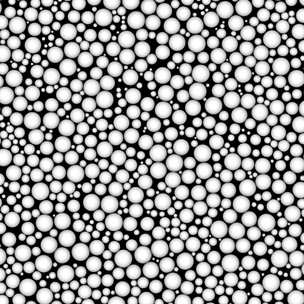

# Polydisperse Hard Disk Model

<script type="module">
import init from 'https://glotzerlab.github.io/hoomd-rs/mc-tutorial/polydisperse-hard-disk-model.js'
{{#include ../../scripts/init-wasm-canvas.js}}
</script>
{{#include ../../scripts/canvas.html}}

## Overview

In some models, every site is different from every other site. For example,
you can model polydisperse hard disks where each site has its own radius.
This tutorial shows you how to define a custom **site type** and compute a
radius-dependent pairwise interactions.

* Objectives:
  * Add a `radius` field to a custom **site properties** type.
  * Show how to compute radius-dependent pairwise interactions.
  * Execute a sample simulation where every site has a randomly chosen radius.
* File: `hoomd-rs/examples/mc-tutorial/polydisperse-hard-disk-model.rs`
* Run (interactively):
  ```shell
  cargo run --release --features "bevy" --example polydisperse-hard-disk-model
  ```
* Run (in batch mode):
  ```shell
  cargo run --release --example polydisperse-hard-disk-model
  ```

## Use Declarations

```rust,ignore
{{#rustdoc_include ../../../examples/mc-tutorial/polydisperse-hard-disk-model.rs:use}}
```

## Type Aliases

Create type aliases for your model's *vector* and *body properties* so that you
don't need to repeat the full generic type names throughout the code:
```rust,ignore
{{#rustdoc_include ../../../examples/mc-tutorial/polydisperse-hard-disk-model.rs:type_aliases}}
```

The **sites** are in this tutorial are placed at points in space and interact via
an isotropic interaction. Therefore, use `Point` for the **body** properties.

## Site Properties

### Define `SiteProperties`

No built-in *hoomd-rs* site type has a radius field. Define a custom type to hold it
along with the site's position:
```rust,ignore
{{#rustdoc_include ../../../examples/mc-tutorial/polydisperse-hard-disk-model.rs:site_properties}}
```

As in [Type-dependent Interactions], `#[derive]` the traits that are needed.

[Type-dependent Interactions]: type-dependent-interactions.md

### Transforming Sites

Implement `Transform<SiteProperties>` for the body properties type:
```rust,ignore
{{#rustdoc_include ../../../examples/mc-tutorial/polydisperse-hard-disk-model.rs:site_transform}}
```

## Site-site Interactions

The `site_pair_energy` method is a function only of two sites. It does not
reference any particular microstate. At the same time, the interaction type
must be aware of the maximum radius it can expect so that it can be used
with `PairwiseCutoff`. You can meet these requirements by storing the maximum
interaction range in a field of the site pair interaction type.

### Define the Hard Shape `SitePairInteraction`

Define the `SitePairInteraction` type:
```rust,ignore
{{#rustdoc_include ../../../examples/mc-tutorial/polydisperse-hard-disk-model.rs:interaction_type}}
```
Every site-site interaction type must implement `MaximumInteractionRange`
which sets the distance above which the interactions go to zero. You can implement
this trait directly, or add the `maximum_interaction_range` field and
`#derive[(MaximumInteractionRange)]` as shown here.

### Implement `SitePairEnergy`

`PairwiseCutoff` uses the `SitePairEnergy` trait to calculate the interaction
energy that each pair of sites contributes to the total. Implement the trait
and compute the radius-dependent interactions:
```rust,ignore
{{#rustdoc_include ../../../examples/mc-tutorial/polydisperse-hard-disk-model.rs:interaction_impl}}
```
First, compute the distance between the two sites. Return infinity when
the disks overlap and 0 when they do not.

### Special Methods for Hard Shapes

Hard potentials (potentials that always result of a value of 0 or infinity)
should implement two additional methods. `site_pair_energy_initial` should
return 0 and `is_only_infinite_or_zero` should return `true`:
```rust,ignore
{{#rustdoc_include ../../../examples/mc-tutorial/polydisperse-hard-disk-model.rs:infinite_zero}}
```

> [!NOTE]
> Your simulations will run correctly without these methods (the default
> `site_pair_energy_initial` calls `site_pair_energy` and the default
> `is_only_infinite_or_zero` returns `false`). However, these implementations
> will make hard shape simulations execute faster. There is no need to compute
> the energy of the initial state before a trial move as it will *always* be
> zero for a hard potential. Even if the initial energy were infinity, a trial
> move with an initial infinite energy and a finite final energy would always
> be accepted.

## Site-site Overlap Penalty

### Define `SitePairOverlapPenalty`

To use `QuickInsert` and `QuickCompress` we need to define *another* site-site
interaction potential. This one uses `OverlapPenalty` to allow partially
overlapping sites during initialization:
```rust,ignore
{{#rustdoc_include ../../../examples/mc-tutorial/polydisperse-hard-disk-model.rs:overlap_penalty_type}}
```
As with `SitePairInteraction`, this type also needs to have a maximum interaction range.

### Implement the Overlap Penalty Computation

As in [Hard Disk Self-Assembly], you can use an `Expanded<OverlapPenalty>` to compute
the overlap penalty shifted to the surface of the disks. When the disks are
polydisperse, you need to set `delta` to the sum of the radii unique to each
pair interaction:
```rust,ignore
{{#rustdoc_include ../../../examples/mc-tutorial/polydisperse-hard-disk-model.rs:overlap_penalty_impl}}
```

[Hard Disk Self-Assembly]: hard-disk-self-assembly.md

## Body Distribution

`QuickInsert` randomly draws bodies from a distribution and places them in
the microstate. [Hard Ellipse Self-Assembly] and similar tutorials use the
`UniformIn` distribution which randomizes the body's position (and orientation
when present) but keeps all the other body and site properties fixed.

### Define `PolydisperseBodyDistribution`

Define a custom distribution type that samples bodies whose sites have random radii:
```rust,ignore
{{#rustdoc_include ../../../examples/mc-tutorial/polydisperse-hard-disk-model.rs:body_distribution_type}}
```

> [!WARNING]
> You cannot simply draw a new random radius for each sample. If you did, the larger
> sites would be more likely to overlap with existing ones and `QuickInsert`
> would strongly bias toward placing smaller sites.

To ensure that the inserted sites have an unbiased distribution of radii,
precompute the radii and store them in the distribution type.

### Implement `BodyDistribution`

Implement the `BodyDistribution` trait:
```rust,ignore
{{#rustdoc_include ../../../examples/mc-tutorial/polydisperse-hard-disk-model.rs:body_distribution_impl}}
```
`QuickInsert` calls this `sample` method each time it *attempts* to place a new body.
It increments the `index` argument after each *successfully placed* site.
This implementation of `sample` chooses a position randomly in the simulation boundary
and chooses a unique (but predetermined) radius based on `index`.

## Implement `AppendMicrostate`

As in [Type-dependent Interactions], implement the `AppendMicrostate` trait
to write the custom `SiteProperties` type. In this case, use the
`particles_diameter` method to write the unique diameter of each site:
```rust,ignore
{{#rustdoc_include ../../../examples/mc-tutorial/polydisperse-hard-disk-model.rs:append_microstate}}
```

## Construct the Simulation Model

The `new()` method constructs a new simulation model:
```rust,ignore
{{#rustdoc_include ../../../examples/mc-tutorial/polydisperse-hard-disk-model.rs:simulation_new}}
```

### Parameters

Assign all the model parameters in one code block:
```rust,ignore
{{#rustdoc_include ../../../examples/mc-tutorial/polydisperse-hard-disk-model.rs:parameters}}
```

`seed` is the random number seed. Change this value to select different random
distribution of radii. `minimum_radius` and `maximum_radius` set the limits of
the radii distribution. `initial_packing_fraction` is the area of the disks
divided by the area of the simulation boundary in the initial state. Choose
this value so that disks can be placed easily in the microstate. During the
`Initialize` phase, the microstate will be compressed until it reaches the
packing fraction `target_packing_fraction`. `n_disks` is the number of disks
to add, `maximum_distance` is the largest distance a translation trial move can
take (initially), and `macrostate` holds the current temperature set point (in
units of energy).

### Precompute the Radii

Use the `rand` crate to randomly sample radii from a uniform distribution:
```rust,ignore
{{#rustdoc_include ../../../examples/mc-tutorial/polydisperse-hard-disk-model.rs:radii}}
```
Place the sampled radii in a `Vec`.

> [!TIP]
> This example uses a uniform distribution for simplicity. A normal distribution
> would likely be more appropriate for production use.

### Particle Area

Sum the area of all sites:
```rust,ignore
{{#rustdoc_include ../../../examples/mc-tutorial/polydisperse-hard-disk-model.rs:particle_area}}
```
This value will later be used to compute the total area of the simulation boundary
from the packing fraction.

### Hamiltonian

Construct the `SitePairInteraction` type and use it with `PairwiseCutoff`
to form the system's Hamiltonian. Similarly construct the overlap penalty
Hamiltonian using the `SitePairOverlapPenalty` implemented above:
```rust,ignore
{{#rustdoc_include ../../../examples/mc-tutorial/polydisperse-hard-disk-model.rs:hamiltonian}}
```
With a uniform distribution, the maximum interaction range between
any two sites is twice the maximum radius of any individual site.

> [!TIP]
> If you use a normal distribution, you need to compute this maximum.

> [!WARNING]
> If you set the maximum interaction range too small, *hoomd-rs* will miss
> some interactions that should be computed. *hoomd-rs* has no idea what
> your custom `site_pair_energy` computes, so it cannot validate or provide
> an error when you choose a `maximum_interaction_range` that is incommensurate
> with your implementation.

### Construct the Microstate

```rust,ignore
{{#rustdoc_include ../../../examples/mc-tutorial/polydisperse-hard-disk-model.rs:microstate}}
```

### Place Polydisperse Bodies with `QuickInsert`

Construct the custom `PolydisperseBodyDistribution`, pass it the predetermined
`radii`. Then make a new `QuickInsert` with this distribution:
```rust,ignore
{{#rustdoc_include ../../../examples/mc-tutorial/polydisperse-hard-disk-model.rs:quick_insert}}
```

## Initialization and Simulation

The remaining initialization and simulation code is very similar to that in the
[Hard Ellipse Self-Assembly] tutorial. The only difference is that rotation moves
are not present here (see the [complete code] below).

[Hard Ellipse Self-Assembly]: hard-ellipse-self-assembly.md
[complete code]: #complete-code

## Execute the Simulation in Batch Mode

In a terminal, execute the following command to run the simulation in batch mode:
```shell
cargo run --release --example polydisperse-hard-disk-model
```

### Visualize the Simulation Results

Open the generated `polydisperse-hard-disk-model.gsd` in [Ovito] or another
visualization tool to see the simulation results. By default. Ovito displays
the sites with the diameter set in the GSD file.

[Ovito]: https://www.ovito.org/

Render with Tachyon, and you should see something like:


> [!NOTE]
> The diameters in the GSD file take precedence in OVITO. When they are set,
> there is **no way** to override the display radius. For example, you can
> no longer set the radius smaller to more easily see self-assembled crystal
> planes.

## Conclusion

This tutorial showed you how to add a site radius field, how to use that
when computing custom site-site interactions, and how to write each
site's diameter to a GSD file.

Navigate to the top of the page to see the simulation in action. Notice how
the sites have different sizes and are randomly distributed in the simulation
by `QuickInsert`.

## Complete Code

```rust,ignore
{{#rustdoc_include ../../../examples/mc-tutorial/polydisperse-hard-disk-model.rs:all}}
