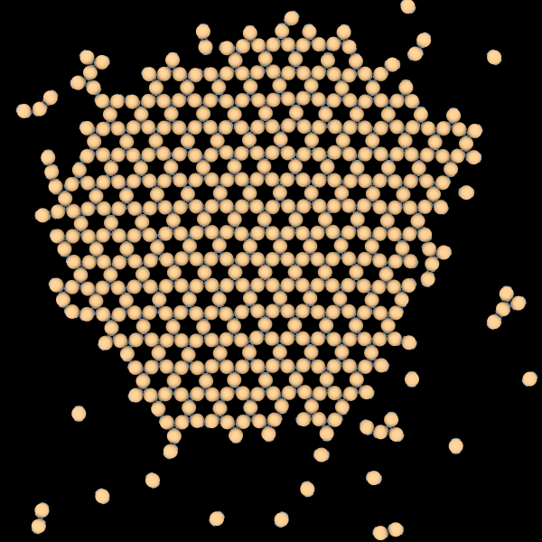

# Seeded Self-Assembly

<script type="module">
import init from 'https://glotzerlab.github.io/hoomd-rs/mc-tutorial/seeded-self-assembly.js'
{{#include ../../scripts/init-wasm-canvas.js}}
</script>
{{#include ../../scripts/canvas.html}}

## Overview

The [Patchy Particle Self-Assembly] tutorial uses a temperature ramp to improve
the quality of the self-assembled structures. This tutorial demonstrates another
technique to do the same. It places a small portion of the final crystal (a
seed) and keeps it fixed during the simulation.

Refer to the [Patchy Particle Self-Assembly] tutorial for a complete description
of the simulation model.

[Patchy Particle Self-Assembly]: patchy-particle-self-assembly.md

* Objectives:
  * Explain how to fix certain bodies in place while applying trial moves to others.
  * Demonstrate the self-assembly of patchy particles around a crystal seed.
* File: `hoomd-rs/examples/mc-tutorial/seeded-self-assembly.rs`
* Run (interactively):
  ```shell
  cargo run --release --features "bevy" --example seeded-self-assembly
  ```
* Run (in batch mode):
  ```shell
  cargo run --release --example seeded-self-assembly
  ```

## Use Declarations

```rust,ignore
{{#rustdoc_include ../../../examples/mc-tutorial/seeded-self-assembly.rs:use}}
```

## Type Aliases

```rust,ignore
{{#rustdoc_include ../../../examples/mc-tutorial/seeded-self-assembly.rs:type_aliases}}
```

## Construct the Simulation Model

### Place the Crystal Seed

The kagome structure formed by these patchy particles consists of points placed
on a honeycomb with the patches oriented tangent to a circle placed around each
hexagon. One way to construct this is to start with one hexagon:
```rust,ignore
{{#rustdoc_include ../../../examples/mc-tutorial/seeded-self-assembly.rs:place_seed}}
```

Then place another hexagonal ring of of these hexagons:
```rust,ignore
{{#rustdoc_include ../../../examples/mc-tutorial/seeded-self-assembly.rs:place_second_ring}}
```

Constructing the second ring in this way duplicates some of the points. Add
bodies to the microstate only when they do not overlap with existing bodies.

### Populate the Simulation Model Struct

The first part of `new()` is similar to that in [Patchy Particle Self-Assembly]:
```rust,ignore
{{#rustdoc_include ../../../examples/mc-tutorial/seeded-self-assembly.rs:simulation_new}}
```
The only difference is the removal of the temperature ramp.

### Set the Initial State

After constructing the empty `Microstate`, call `place_seed` to place
the crystal seed:
```rust,ignore
{{#rustdoc_include ../../../examples/mc-tutorial/seeded-self-assembly.rs:microstate}}
```

### Randomly Insert the Remaining Bodies

Use `QuickInsert` to randomly insert the rest of the bodies so that the total
number is equal to `n_disks`:
```rust,ignore
{{#rustdoc_include ../../../examples/mc-tutorial/seeded-self-assembly.rs:quick_insert}}
```

### Finish Constructing the Simulation Model

The rest of the construction code is similar to that in [Patchy Particle Self-Assembly]:
```rust,ignore
{{#rustdoc_include ../../../examples/mc-tutorial/seeded-self-assembly.rs:simulation_new_remainder}}
```
The only addition is that `SeededSelfAssembly` now has a `seed_size` field that
tracks the number of bodies in the crystal seed.

## Implement the Simulation Phases

### Initialize

#### QuickInsert, QuickCompress, and Apply Trial Moves

As in [Patchy Particle Self-Assembly], the `initialize()` method inserts bodies
randomly, then compresses the simulation to the target density:
```rust,ignore
{{#rustdoc_include ../../../examples/mc-tutorial/seeded-self-assembly.rs:initialize}}
```

To avoid moving the crystal seed, it applies trial moves with a filter that
selects non-seed bodies:
```rust
|body| body.tag >= self.seed_size
```
The filters operate on tagged bodies, so they have access to the body
tag (used here) and also the body's properties (`body.item.properties`)
and sites (`body.item.sites`). The filter must be applied separately
in `quick_compress.apply`, `translate_sweep.apply_with_filter`, and
`rotate_sweep.apply_with_filter`.

#### Tune Trial Move Sizes

After initializing, tune the trial move sizes with the same filter:
```rust,ignore
{{#rustdoc_include ../../../examples/mc-tutorial/seeded-self-assembly.rs:tune}}
```

#### More Initialization

The remainder of the `initialize` method is identical to that in [Patchy
Particle Self-Assembly]:
```rust,ignore
{{#rustdoc_include ../../../examples/mc-tutorial/seeded-self-assembly.rs:initialize_remainder}}
```

### Equilibrate

During the equilibration phase, apply trial moves with the same filter:
```rust,ignore
{{#rustdoc_include ../../../examples/mc-tutorial/seeded-self-assembly.rs:equilibrate}}
```

## Implement `Simulation`, Interactions, etc...

See the [Patchy Particle Self-Assembly] tutorial for a complete explanation of
remaining example code (see also the [complete code] below).

[complete code]: #complete-code

## Conclusion

This tutorial showed you how to seed self-assembly simulations with a reference
crystal.

Navigate to the top of the page to see the simulation in action. Notice that the
seed in the center does not move and that the kagome structure starts to grow
more quickly than with the temperature ramp in [Patchy Particle Self-Assembly].
The seeded simulations are also more likely to form a single crystal grain:




## Complete Code

```rust,ignore
{{#rustdoc_include ../../../examples/mc-tutorial/seeded-self-assembly.rs:all}}
