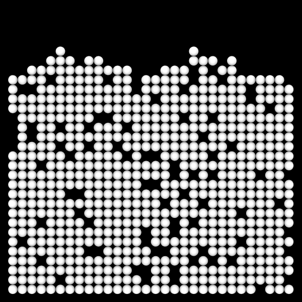

# Tetronimoes

<script type="module">
import init from 'https://glotzerlab.github.io/hoomd-rs/mc-tutorial/tetronimoes.js'
{{#include ../../scripts/init-wasm-canvas.js}}
</script>
{{#include ../../scripts/canvas.html}}

## Overview

There are many ways you can model **anisotropic bodies** in *hoomd-rs*.
This tutorial shows you how to place multiple **sites** in **bodies** that
can translate *and rotate*. It uses the same *site-site* and *site-field*
interactions as the [Applying Interactions] tutorial and the lattice moves of
the [Custom Random Walk] tutorial. Combine those with tetronimo-shaped bodies,
and you get something very interesting.

* Objective: Explain how to execute simulations with multi-site bodies.
* File: `hoomd-rs/examples/mc-tutorial/tetronimoes.rs`
* Run (interactively):
  ```shell
  cargo run --release --features "bevy" --example tetronimoes
  ```
* Run (in batch mode):
  ```shell
  cargo run --release --example tetronimoes
  ```

## Use Declarations

```rust,ignore
{{#rustdoc_include ../../../examples/mc-tutorial/tetronimoes.rs:use}}
```

## Type Aliases

Create type aliases for your model's *vector*, *body properties*, and *site
properties* types so that you don't need to repeat the full generic type
names throughout the code:
```rust,ignore
{{#rustdoc_include ../../../examples/mc-tutorial/tetronimoes.rs:type_aliases}}
```
The `OrientedPoint` type gives the tetronimo bodies in this tutorial both a
position in space and an orientation that rotates about the origin of the body.
These tetronimoes have disks at each site and therefore only need `Point`
site properties.

## Custom Trial Move

Implement a custom trial move to make the tetronimoes move in the way you might
expect. Like in the [Custom Random Walk], tetronimoes take discrete steps left,
right, down, or up. Tetronimoes can also rotate by $` \pm \pi/2 `$. The
`DiscreteRotateOrTranslate` type implements this behavior:
```rust,ignore
{{#rustdoc_include ../../../examples/mc-tutorial/tetronimoes.rs:local_trial}}
```

### Enumerate Possible Moves

First, enumerate the possible moves:
```rust,ignore
{{#rustdoc_include ../../../examples/mc-tutorial/tetronimoes.rs:local_trial_steps}}
```

### Choose and Propose a Move

Then, choose a random move and mutates the body properties accordingly:
```rust,ignore
{{#rustdoc_include ../../../examples/mc-tutorial/tetronimoes.rs:local_trial_mut}}
```

Using `random_bool()`, this code proposes translate moves more often than rotate
moves because the result is more visually interesting.

## The Simulation Model

Here is the type that holds the simulation model along with the corresponding
Hamiltonian:
```rust,ignore
{{#rustdoc_include ../../../examples/mc-tutorial/tetronimoes.rs:simulation_struct}}
```

### Construct the Simulation Model

The `new()` method constructs a new simulation model:
```rust,ignore
{{#rustdoc_include ../../../examples/mc-tutorial/tetronimoes.rs:simulation_new}}
```

#### Parameters

Assign all the model parameters in one code block:
```rust,ignore
{{#rustdoc_include ../../../examples/mc-tutorial/tetronimoes.rs:parameters}}
```

#### Hamiltonian

Use the same Hamiltonian as the [Applying Interactions] tutorial:
```rust,ignore
{{#rustdoc_include ../../../examples/mc-tutorial/tetronimoes.rs:hamiltonian}}
```

These interactions are applied to the *sites* in the microstate.

#### Microstate

Use the `VecCell` spatial data structure, confine the bodies and sites inside of a
closed square, and start with no bodies in the microstate:
```rust,ignore
{{#rustdoc_include ../../../examples/mc-tutorial/tetronimoes.rs:microstate}}
```

#### Trial Moves

Apply sweeps of the custom `DiscreteRotateOrTranslate` trial move:
```rust,ignore
{{#rustdoc_include ../../../examples/mc-tutorial/tetronimoes.rs:trial_moves}}
```

#### Prepare the Tetronimo Shapes

`new()` also prepares a list of tetronimo shapes for later use. There are
five types of tetronimoes that are each represented by a vector of
four points:
```rust,ignore
{{#rustdoc_include ../../../examples/mc-tutorial/tetronimoes.rs:template_sites}}
```

#### Initialize the Struct

```rust,ignore
{{#rustdoc_include ../../../examples/mc-tutorial/tetronimoes.rs:struct_initialize}}
```

## Implement `Simulation`

The `Simulation` implementation closely follows that in [Applying Interactions].
```rust,ignore
{{#rustdoc_include ../../../examples/mc-tutorial/tetronimoes.rs:impl_simulation}}
```

### Advance the Simulation

```rust,ignore
{{#rustdoc_include ../../../examples/mc-tutorial/tetronimoes.rs:advance}}
```

#### Add New Tetronimoes

The code that adds tetronimoes is more complex than that for disks:
```rust,ignore
{{#rustdoc_include ../../../examples/mc-tutorial/tetronimoes.rs:add}}
```
It first chooses a random tetronimo from the `template_sites`, then it adds the
body near the top of the boundary with a default orientation of $` \theta = 0 `$
and clone of the chosen sites. Each body has four sites in this example.

*hoomd-rs* uses a *counter based random number generator*. Whenever you need to
use random numbers in your code, you can get a `Rng` to generate them by calling
`microstate.counter().make_rng()`.

> [!IMPORTANT]
> Whenever you use `counter.make_rng`, You *MUST* indicate that your substep is
> complete by calling `microstate.increment_substep()` so that the next substep
> will use a different set of random numbers.

#### Apply Trial Moves

Apply the custom trial move to each body in the microstate:
```rust,ignore
{{#rustdoc_include ../../../examples/mc-tutorial/tetronimoes.rs:apply}}
```

#### Reset the Simulation

```rust,ignore
{{#rustdoc_include ../../../examples/mc-tutorial/tetronimoes.rs:reset}}
```

### Get the Simulation Step

```rust,ignore
{{#rustdoc_include ../../../examples/mc-tutorial/tetronimoes.rs:step}}
```

## Execute the Simulation in Batch Mode

### Implement `main()`

To run the simulation, construct the `Tetronimoes` simulation model. Then call
`advance()` many times and write the sites to a GSD file periodically so that
you can inspect the results of the simulation:
```rust,ignore
{{#rustdoc_include ../../../examples/mc-tutorial/tetronimoes.rs:main}}
```

See [Applying Interactions](applying-interactions.md) for a step-by-step explanation
of this code.

> [!NOTE]
> This `main()` function runs in batch mode. There is a different `main()` (not
> shown here) used in the interactive example. The interactive example does *not*
> write the GSD file.

### Run the Simulation

In a terminal, execute the following command to run the simulation in batch mode:
```shell
cargo run --release --example tetronimoes
```

### Visualize the Simulation Results

Open the generated `tetronimoes.gsd` in [Ovito] or another visualization
tool to see the simulation results. [Ovito] will render the disks as spheres
with the expected diameter of 1 by default.

Render with Tachyon, and you should see something like:


## Conclusion

This tutorial showed you how to add bodies with multiple sites and how they
can be translated and rotated by trial moves.

Navigate to the top of the page to see the simulation in action. Notice how the
randomly generated tetronimoes fall to the bottom while randomly rotating.

[Applying Interactions]: applying-interactions.md
[Custom Random Walk]: custom-random-walk.md
[Ovito]: https://www.ovito.org/

## Complete Code

```rust,ignore
{{#rustdoc_include ../../../examples/mc-tutorial/tetronimoes.rs:all}}
