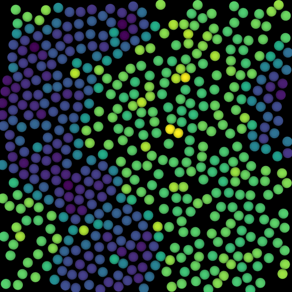

# Type-dependent Interactions

<script type="module">
import init from 'https://glotzerlab.github.io/hoomd-rs/mc-tutorial/type-dependent-interactions.js'
{{#include ../../scripts/init-wasm-canvas.js}}
</script>
{{#include ../../scripts/canvas.html}}

## Overview

Some models label each site with a **site type** and apply interactions as
a function of the site type. For example, you can model coarse-grained phase
separation with attractive *A-A* and *B-B* interactions and purely repulsive
*A-B* interactions. This tutorial shows you how to define **site types** and
compute type-dependent pairwise interactions.

* Objectives:
  * Show how to use an `enum` to name the possible **site types**.
  * Define a custom **site properties** struct that includes the **site type**.
  * Show how to compute type-dependent pairwise interactions.
  * Demonstrate phase separation of *A* and *B* **site types**.
* File: `hoomd-rs/examples/mc-tutorial/type-dependent-interactions.rs`
* Run (interactively):
  ```shell
  cargo run --release --features "bevy" --example type-dependent-interactions
  ```
* Run (in batch mode):
  ```shell
  cargo run --release --example type-dependent-interactions
  ```

## Use Declarations

```rust,ignore
{{#rustdoc_include ../../../examples/mc-tutorial/type-dependent-interactions.rs:use}}
```

## Type Aliases

Create type aliases for your model's *vector* and *body properties* so that you
don't need to repeat the full generic type names throughout the code:
```rust,ignore
{{#rustdoc_include ../../../examples/mc-tutorial/type-dependent-interactions.rs:type_aliases}}
```

The **sites** are in this tutorial are placed at points in space and interact via
an isotropic interaction. Therefore, use `Point` for the **body** properties.

## Site Properties

You might be familiar with simulation tools where you assign types to sites
based on a numerical index or string name. In *hoomd-rs*, you can assign
the **site type** (and any other site-specific parameter(s)) using any Rust
datatype.

### SiteType `enum`

Using an enum ensures that every site *always* has a well-defined **site type**.
If you fail to assign a type or set an invalid one, Rust will issue an error *at
compile time*. In this example, `SiteType` enumerates all the site types:
```rust,ignore
{{#rustdoc_include ../../../examples/mc-tutorial/type-dependent-interactions.rs:type}}
```

### Define `SiteProperties`

Previous tutorials used one of the built-in structures (`Point` or
`OrientedPoint`) to represent the **site properties**. These types are limited
as they represent only a site's position (or position and orientation). This
tutorial defines a new `SiteProperties` struct that gives each site a position
in space and a given **site type**:
```rust,ignore
{{#rustdoc_include ../../../examples/mc-tutorial/type-dependent-interactions.rs:site_properties}}
```

Initialization, MC, and MD methods operate on a generic site properties type
`S` with *trait bounds* set as needed. The `derive` macro implements the
listed traits for `SiteProperties` automatically. All the types listed in the
above code block are required by at least one method in this example. Rust
provides the `Clone`, `Copy`, `Default` traits (and their `derive` macros).
`hoomd_microstate` defines `Position` and `Orientation` along with their
corresponding `derive` macros.

> [!NOTE]
> You can add any fields to your `SiteProperties` type and use those fields when
> computing interactions. `position` is the only required field.

### Transforming Sites

*Body* stores each of its **sites** in the *body frame* of reference. The
`Transform` trait (implemented for the **body properties** type) transforms
site properties from the *body frame* to the *system frame*. You must implement
`Transform<SiteProperties>` for the body properties type to use `Microstate`:
```rust,ignore
{{#rustdoc_include ../../../examples/mc-tutorial/type-dependent-interactions.rs:site_transform}}
```

This implementation is suitable for point bodies with point sites in Euclidean
space as it transforms from one frame to the other by vector addition and copies
all other fields. See the `hoomd_microstate::property` module documentation for
code that works with oriented bodies and/or sites.

## Site-site Interactions

For demonstration purposes, this tutorial shows you how to implement a coarse-grained
model where *A-A* interactions attract via the Lennard-Jones potential, *B-B* interact
via the sum of a power law and a Gaussian, and *A-B* interact with the
Weeks-Chandler-Anderson potential.

### Define `SitePairInteraction`

Define a new struct to hold the interaction parameters. Use the provided
types for the `LennardJones` and `WeeksChandlerAnderson` interactions:
```rust,ignore
{{#rustdoc_include ../../../examples/mc-tutorial/type-dependent-interactions.rs:interaction_type}}
```
Every site-site interaction type must implement `MaximumInteractionRange`
which sets the distance above which the interactions go to zero. You can implement
this trait directly, or add the `maximum_interaction_range` field and
`#derive[(MaximumInteractionRange)]` as shown here.

### Implement `SitePairEnergy`

`PairwiseCutoff` uses the `SitePairEnergy` trait to calculate the interaction
energy that each pair of sites contributes to the total. Implement the trait
and compute the type-dependent interactions:
```rust,ignore
{{#rustdoc_include ../../../examples/mc-tutorial/type-dependent-interactions.rs:interaction_impl}}
```
First, compute the distance between the two sites. Then use Rust's `match`
expression to compute the desired potential as a function of the two **site
types**. Rust will produce a compile error should you miss one or more cases.
You can compute interactions that are not included in `hoomd-interaction` by
writing the expression directly, as demonstrated in the B-B case.

> [!IMPORTANT]
> Ensure that `site_pair_energy(i,j)` computes the same energy as
> `site_pair_energy(j,i)`. Rust does not enforce this symmetry and *hoomd-rs*
> cannot detect when there is a problem.

## Construct the Simulation Model

The `new()` method constructs a new simulation model:
```rust,ignore
{{#rustdoc_include ../../../examples/mc-tutorial/type-dependent-interactions.rs:simulation_new}}
```

### Parameters

Assign all the model parameters in one code block:
```rust,ignore
{{#rustdoc_include ../../../examples/mc-tutorial/type-dependent-interactions.rs:parameters}}
```

`initial_packing_fraction` is the volume of the disks divided by the volume
of the simulation boundary in the initial state. Choose this value so
that disks can be placed easily in the microstate. During the `Initialize`
phase, the microstate will be compressed until it reaches the packing
fraction `target_packing_fraction`. `n_disks` is the number of disks to add,
`maximum_distance` is the largest distance a translation trial move can take
(initially), `sigma` is the disk diameter, and `macrostate` holds the current
temperature set point (in units of energy).

### Hamiltonian

Construct the `SitePairInteraction` type and use it with `PairwiseCutoff` to
form the system's Hamiltonian:
```rust,ignore
{{#rustdoc_include ../../../examples/mc-tutorial/type-dependent-interactions.rs:hamiltonian}}
```

### Overlap Penalty Hamiltonian

Even though `SitePairInteraction` treats all sites as points with well-defined
potentials at all distances $` r \ne 0 `$, it is helpful to place sites where
$` r \ge \sigma `$ as it can take many steps to relax high energy states.
Use the hard disk `OverlapPenalty` as a Hamiltonian when initializing:
```rust,ignore
{{#rustdoc_include ../../../examples/mc-tutorial/type-dependent-interactions.rs:compress_hamiltonian}}
```

### Construct the Boundary

Place all bodies in periodic square boundary conditions at the chosen packing fraction:
```rust,ignore
{{#rustdoc_include ../../../examples/mc-tutorial/type-dependent-interactions.rs:boundary}}
```

### Place A and B bodies with `QuickInsert`

Use one `QuickInsert` to place half of the bodies with **site type** *A* and a
second to place the remainder with **site type** *B*:
```rust,ignore
{{#rustdoc_include ../../../examples/mc-tutorial/type-dependent-interactions.rs:quick_insert}}
```

## Initialization and Simulation

The remaining initialization and simulation code is very similar to that in the
[Hard Ellipse Self-Assembly] tutorial. The differences are that rotation moves
are not present here and there are two `quick_insert` methods to apply instead
of one (see also the [complete code] below).

[Hard Ellipse Self-Assembly]: hard-ellipse-self-assembly.md
[complete code]: #complete-code


## Execute the Simulation in Batch Mode

### Implement `AppendMicrostate`

[Patchy Particle Self-assembly] and previous tutorials could call:
`hoomd_gsd_file.append_microstate(&simulation.microstate)` and it just worked.
*hoomd-rs* has implemented the `AppendMicrostate` trait for typical combinations
of `Point` and `OrientedPoint` site properties (in 2D and 3D) and various
boundary conditions.

When you customize the *site properties* and/or *boundary* types, you also need
to implement `AppendMicrostate` to write GSD files. Your implementation must
to append a frame at the current step, transform your boundary to a GSD box
definition, write particle positions projected to Cartesian 3-vectors, and can
also write any other data chunks you would like in the frame:
```rust,ignore
{{#rustdoc_include ../../../examples/mc-tutorial/type-dependent-interactions.rs:append_microstate}}
```

`append_frame` returns a `Frame` type. You write data to the current frame by
adding methods to the call chain. Notice how the code above calls
```
.configuration_box()?
.configuration_dimensions()?
.particles_position()?...`)
```
The frame ends once the call chain completes and the `Frame` is dropped.
The arguments of each method pass the data to write. For example,
`configuration_dimensions` takes the number of dimensions (2 or 3). The
`particles_position` method takes an `IntoIterator` that produces
`Cartesian<3>` vectors. Use Microstate's `iter_sites_tag_order` to ensure that
all sites are written to the file in increasing tag order.

Enumerations in Rust internally number the variants starting at 0 (by default).
This conveniently allows us to convert a site's type to a 0-based type id
with the cast: `s.properties.site_type as u32`. We also need to write the
string type names to the file. Rust itself doesn't provide any mechanism
to do so. This example uses the `strum` crate's `#[derive(VariantNames)]`
macro on the `SiteType` type to create the `SiteType::VARIANTS` array
of string type names.

> [!TIP]
> Use a built-in implementation in [`hoomd-microstate/src/append.rs`]
> as a starting point when you need to implement `AppendMicrostate` for your
> custom site and/or boundary types.

[Patchy Particle Self-assembly]: patchy-particle-self-assembly.md
[`hoomd-microstate/src/append.rs`]: https://github.com/glotzerlab/hoomd-rs/blob/trunk/hoomd-microstate/src/append.rs

### Implement `main()`

To run the simulation, construct the `TypeDependentInteractions` simulation model.
Then call `advance()` many times:
```rust,ignore
{{#rustdoc_include ../../../examples/mc-tutorial/type-dependent-interactions.rs:main}}
```

See [Applying Interactions](applying-interactions.md) for a step-by-step explanation
of this code.

> [!NOTE]
> This `main()` function runs in batch mode. There is a different `main()` (not
> shown here) used in the interactive example. The interactive example does *not*
> write the GSD file.

### Log to the GSD File

To log custom quantities to the GSD file, add `.log_scalar`, `.log_scalars` and/or
`.log_arrays` to the call chain after `.append_microstate`:
```rust,ignore
{{#rustdoc_include ../../../examples/mc-tutorial/type-dependent-interactions.rs:log_gsd}}
```

The given quantities are stored in the frame alongside the particle properties.
Log names that start with "particles/" store per-particle values. This tutorial
logs the energy each site contributes to the total computed by the `site_energy`
helper method:
```rust,ignore
{{#rustdoc_include ../../../examples/mc-tutorial/type-dependent-interactions.rs:site_energy}}
```
The method computes the negative of the energy delta that results when removing
the site's parent body. The bodies in this tutorial are all single-site bodies,
so this is equivalent to the site's contribution. You can use any of the APIs in
*hoomd-rs* to compute and log any site-specific quantity you are interested in.

> [!NOTE]
> Use GSD to log per-particle quantities. Parquet and other column-oriented
> formats cannot easily store thousands of scalar columns.
>
> Prefer parquet when logging a few scalar quantities over large numbers of
> frames. GSD uses 32 bytes of overhead per data chunk per frame, so a GSD
> file with *only* scalar log quantities will be about 5 times larger than an
> equivalent Parquet file.

### Run the Simulation

In a terminal, execute the following command to run the simulation in batch mode:
```shell
cargo run --release --example type-dependent-interactions
```

### Visualize the Simulation Results

Open the generated `type-dependent-interactions.gsd` in [Ovito] or another
visualization tool to see the simulation results. By default. Ovito displays
the A particles with an appropriate size, but the B particles are too large.
To fix this and color the sites by the logged `site_energy` quantity, import
this [modifier snippet] (use the copy button to copy the entire text to your
clipboard):
```
{"description": "OVITO Modifier Snippet: Edit types (Particle Type) | Color coding (site_energy)", "payload": "AAAHinjafRTLThNR9LS0pS2FykOQRwxqTNyIIrJiAQKNYUFAwC7YkMvMZTownWnmAcGY6ELjwo3xB/wA+QCWbtzAzi/AjQtd6AeY6DkzZ9pbGJjkzL33vN/lo6+fi39PNgGCOQDII/TBClRhCTbwHIdVcMFBbAdCGaKvBFMwAZMwjf+HjEsjpBAy0ZH+wO/bEQ5GEAbBAxN8kLCFYCO4YMChIh2aCS8ZBqJkybPZf4/fGbJUxXuO3l/uvX91/7RwChe/To4kFcsivGFdL/ksEX7VdRrS9cmDCWiAQH989FADC33z4AFG344bx6wcIqdEiUcXqB6M3/oY5uxyqfgrkG+xg0VCpObufprRN8eO8NFFXqaA/Uyn6NrdxPXEsp1cFJRtab7GiIEXZxGil1OZDYuLYSuG+sN3S3ggTPVZ8329aX4QYTg1+yfCz/44fvbr7c3j+ETUEDkU1h7m8X8DYYYtT3HSKYTCqnB9U7OkF3bFVbkaJjVXWBzhXogMjrIxcmGsSZlsxUZhpH8zR4/nBK4mlQ6IeCijIvCdJ/pu4PlrwjakSuvek7KxLi2p+aZjt1E0x3Lcp67QTWn7oLQfnXlp61VhBW3Kip6PuWhDU/93Sd30pb5x2AhzFNY8x7RL3Ka4h7SarJuasCqWrKMLW1teTejOATdRyFOqC89LIgwjqiGfe3JZerUFiiSJ607INS+0vR2hyYXAskzbqNhi25J6Ev9ozTRqFoK/ToIV3ZCJ1rtDvUmU3n39YA1TGiTK9biXksrnsqFmKkNZUBGFphUVm3PbUFSCskwONtdsgCRKyRZ1mSjiHNjSPV9MomRDZXh5HWMypERlKdhBXbqmtqSre69o6hituWNKV93M09xHNCT9YX0XHB2Lt4x/5s0zC23sEYWlarqmbnpKZ2eZk+azt4LNGraqoqrADLRNSvG8E1PkeqIniv4is9By6uL6sXQnk2iPFReFL1a2d3EWFSFaCn2LOKGG8NsDjL2iBZlX8LEk7cnCmtzZEK4h/dY8whzPa4ozuslZTfP7hBumg9/fePAzPOr7XIifvJmI/J3XPsV0k3j/A200N3Q="}
```

Alternately, you can:
1) Add an [Edit types] modification to the Ovito pipeline.
2) Select type *B*.
3) Set the *Display radius* to 0.5.
4) Add a [Color coding] modification to the pipeline.
5) Set the `site_energy` *Input property* and choose the `Viridis` *Color gradient*

[Ovito]: https://www.ovito.org/
[Edit types]: https://www.ovito.org/docs/current/reference/pipelines/modifiers/edit_types.html
[Color coding]: https://www.ovito.org/docs/current/reference/pipelines/modifiers/color_coding.html
[save the session state]: https://docs.ovito.org/usage/miscellaneous.html#usage-saving-loading-scene
[modifier templates]: https://docs.ovito.org/reference/app_settings/modifier_templates.html#modifier-templates
[modifier snippet]: https://docs.ovito.org/advanced_topics/modifier_snippets.html#modifier-snippets

Render with Tachyon, and you should see something like:


## Conclusion

This tutorial showed you how to implement custom site properties and
site-site interaction types. Specifically, it demonstrated the addition
of a site type field and showed how you can use that when computing
the interaction energies.

Navigate to the top of the page to see the simulation in action. Notice that
the sites quickly phase separate. Wait long enough and the system should form
two stripes. Due to the differently shaped potentials, the *A* and *B* domains
are distinct. The *A* sites form a hexagonal solid and *B* form a lower density
fluid.

## Complete Code

```rust,ignore
{{#rustdoc_include ../../../examples/mc-tutorial/type-dependent-interactions.rs:all}}
